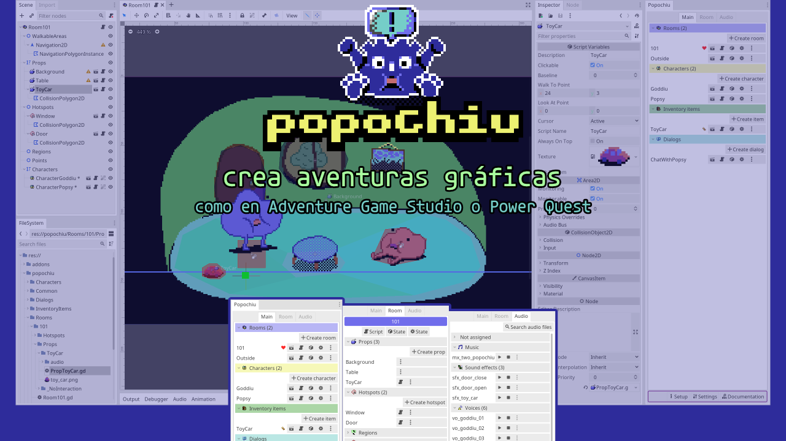

### 🌎💬 [Read this in English](./README.md) 💬🌎



<!-- no toc -->
Plugin de Godot para crear juegos de aventura de manera similar a herramientas como [Adventure Game Studio](https://www.adventuregamestudio.co.uk/) y [Power Quest](https://powerhoof.itch.io/powerquest).


### 🧠 Si quieres saber de las últimas actualizaciones, revisa la [rama de desarrollo](https://github.com/mapedorr/popochiu/tree/dev) 🧠


## ¿Qué es?

Esta herramienta consta de dos partes: el núcleo (Popochiu) y el dock que facilita la creación de los Objetos que hacen uso de dicho núcleo. Está inspirado en como se desarrollan las aventuras gráficas en Adventure Game Studio y en el plugin de Unity de Power Hoof: PowerQuest. Esto es, utilizando Habitaciones (Room) como escenarios donde los Personajes (Character) pueden moverse e interactuar con Props y Hotspots, y proporcionando un sistema de inventario y de gestión de diálogos.

Popochiu (el núcleo (**E**)) es un singleton que proporciona un par de métodos para ejecutar instrucciones puestas en cola que facilitan el manejo de eventos entre el Personaje Jugable y el mundo del juego. También tiene otros singletons para hacer que los personajes se muevan y digan cosas (**C**), para manejar el inventario (**I**), para disparar conversaciones (**D**), usar la interfaz gráfica (**G**) y reproducir audio (**A**).

El dock facilita la creación de las escenas, los recursos (.tres) y los scripts necesarios para usar dichos objetos (Habitaciones, Personajes, Elementos de inventario, Diálogos, etc.). Pero también ayuda a clasificar los archivos de audio (Música, SFX, Voz, UI) y dar a cada uno de ellos propiedades de volumen y tono (ambas con aleatorización).


## Instalación

**Popochiu puede usarse con Godot 3.3.x y 3.4.x.**

1. [Descarga el ZIP](https://github.com/mapedorr/popochiu/archive/refs/heads/main.zip).
2. Extra su contenido y copia la carpeta `addons` dentro de la carpeta de tu proyecto.
3. Abre tu proyecto en Godot y habilita el plugin Popochiu: `Project > Project Settings... > Plugins (the tab on the top)`.
4. Reinicia Godot.
5. Verás el dock de Popochiu a la derecha del editor. Haz clic en el botón **Move folders** y listo.


## Video de introducción 🎥

[En este video de YouTube (¡en Español!)](https://www.youtube.com/watch?v=kS9mrP0tgUw) puedes ver una introducción rápida de cómo usar Popochiu para crear una habitación con un personaje que se mueva en ella.


## El plugin 🔌


- En la pestaña principal se pueden ver (y crear) las habitaciones, personajes, objetos de inventario y diálogos.
- En la pestaña de habitación se pueden ver (y crear) objetos con interacción (props), zonas con interacción (hotspots), regiones y puntos de la habitación abierta en el editor.
- En la pestaña de audio se pueden ver los archivos de audio y asignarlos a una categoría: música, efectos de sonido, voces e interfaz gráfica.


## Proyecto de ejemplo 👩‍🏫

Mientras trabajo en la documentación y algunos videos tutoriales, [aquí](https://github.com/mapedorr/popochiu_powerquest) podrás ver lo que se puede hacer (y cómo hacerlo) con Popochiu.


<!-- ## Características 📃


- Se pueden encadenar instrucciones fácilmente usando la función E.run([...]):
  ```gdscript
  func _on_room_transition_ended() -> void:
    # Así puede crearse una conversación entre el personaje jugable y el
    # personaje no jugable Paco.
    E.run([
      'Player: Hola',
      'Paco: Hola',
      'Player: ¿Esto es una isla?',
      'Paco: No. Un juego de aventura.',
      C.player.face_right(),
      C.player.face_left(),
      '...',
      'Player: Ah bueno.',
    ])
  ```
- Acceso rápido a las funciones del plugin:
  
  **E (para acceder a Popochiu.gd (singleton))**
    ```gdscript
    E.goto_room('Cave')
    yield(E.wait(3), 'completed')
    ```
  **C (para acceder a ICharacter.gd (singleton))**
    ```gdscript
    # El personaje controlado por el jugador dice Hola
    C.player.say('Hola')
    # Un personaje llamado Barney se pone grosero
    C.character_say('Barney', '¡Cállese maricón!')
    # El personaje controlado por el jugador se pone grosero también
    C.player_say('Qué malparido tan grosero')
    ```
  **I (para acceder a IInventory.gd (singleton))**
    ```gdscript
    # Añade el ítem Bucket al inventario
    I.add_item('Bucket')
    # Añade el ítem Bucket al inventario y lo hace, automáticamente, el ítem activo
    I.add_item_as_active('Bucket')
    ```
  **D (para acceder a IDialogTree.gd (singleton))**
    ```gdscript
      func on_interact() -> void:
	      yield(D.show_dialog('ChatWithBarney'), 'completed')
    ```
  **G (para acceder a IGraphicInterface.gd (singleton))**
    ```gdscript
    # Muestra un mensaje centrado, como una notificación.
    G.display('Usa clic izquierdo para interactuar y clic derecho para examinar')
    # En la parte inferior de la pantalla se puede ver el nombre del objeto sobre el que está el cursor
    G.show_info('Llave')
    ``` -->
