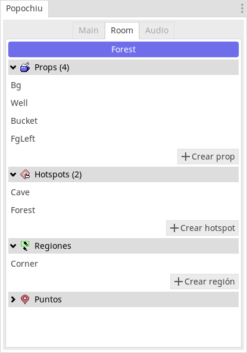
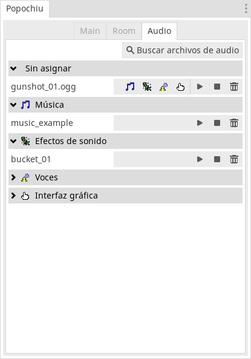

<!-- no toc -->
Godot plugin to make point n' click games in a similar way to tools like [Adventure Game Studio](https://www.adventuregamestudio.co.uk/) and [Power Quest](https://powerhoof.itch.io/powerquest).


### 🌎💬 [Lee la versión en Español](./LEEME.md) 💬🌎


## Installation

1. [Download the ZIP](https://github.com/mapedorr/popochiu/archive/refs/heads/main.zip).
2. Extract it and copy the `addons` folder into your project folder.
3. Open your Godot project and enable the Popochiu plugin: `Project > Project Settings... > Plugins (the tab on the top)`.
4. Restart Godot.


## The dock 🔌

Tha *Main* tab shows (and allows the creation of) rooms, characters, inventory items and dialogs.


The *Room* tab shows (and allows the creation of) props, hotspots, regions and points.



The *audio* tab shows the audio files and allows to assign each one to a category: music, sfx, voice and graphic interface.




## Features 📃


- Use `E.run([...])` to queue instructions.
  ```gdscript
  func _on_room_transition_ended() -> void:
    # This will show a dialog between the player character and the NPC Paco.
    E.run([
      'Player: Hi',
      'Paco: Hi',
      'Player: Where are we?',
      'Paco: In a point n\' click game.',
      C.player.face_right(),
      C.player.face_left(),
      '...',
      'Player: Cool!',
    ])
  ```
- The added singletons give developers quick access to plugin functions:
  
  **E (to access the core (Popochiu.gd))**
    ```gdscript
    E.goto_room('Cave')
    yield(E.wait(3), 'completed')
    ```
  **C (to access characters (ICharacter.gd))**
    ```gdscript
    C.player.say('Hi')
    C.character_say('Barney', 'Hello!')
    ```
  **I (to access inventory items (IInventory.gd))**
    ```gdscript
    # Adds an item to the inventory
    I.add_item('Bucket')
    # Adds an item to the inventory and makes it the current one
    I.add_item_as_active('Bucket')
    ```
  **D (to access dialogs (IDialogTree.gd))**
    ```gdscript
      func on_interact() -> void:
        # Triggers a dialog with options
	      yield(D.show_dialog('ChatWithBarney'), 'completed')
    ```
  **G (to access the graphic interface (IGraphicInterface.gd))**
    ```gdscript
    # Shows a message in the center of the screen
    G.display('Use left click to interact and right click to look at')
    # Shows a message in the bottom-center of the screen
    G.show_info('An empty bucket')
    ```