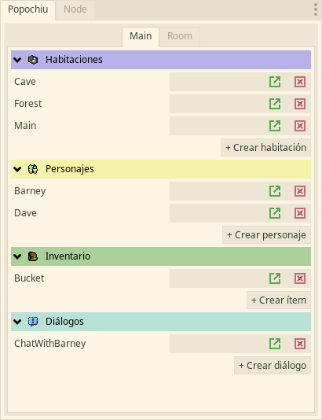
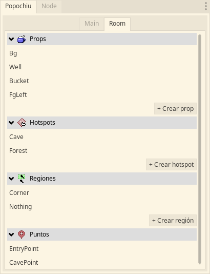

<!-- no toc -->
**[esp]** Plugin de Godot para crear juegos de aventura de manera similar a herramientas como [Adventure Game Studio](https://www.adventuregamestudio.co.uk/) y [Power Quest](https://powerhoof.itch.io/powerquest).

**[eng]** Godot plugin to make point n' click games in a similar way to tools like [Adventure Game Studio](https://www.adventuregamestudio.co.uk/) and [Power Quest](https://powerhoof.itch.io/powerquest).


- [Español](#español)
  - [🔌 El plugin](#-el-plugin)
  - [📃 Características](#-características)
- [English](#english)
  - [🔌 The dock](#-the-dock)
  - [📃 Features](#-features)


# Español

## 🔌 El plugin
En la pestaña principal se pueden ver (y crear) las habitaciones, personajes, objetos de inventario y diálogos.



En la pestaña de habitación se pueden ver (y crear) objetos con interacción (props), zonas con interacción (hotspots), regiones y puntos de la habitación abierta en el editor.



En la pestaña de audio se pueden ver los archivos de audio y asignarlos a una categoría: música, efectos de sonido, voces e interfaz gráfica.


## 📃 Características

- Se pueden encadenar instrucciones fácilmente usando la función E.run([...]):
  ```gdscript
  func _on_room_transition_ended() -> void:
    E.run([
      'Player: Hola',
      'Paco: Hola',
      'Player: ¿Esto es una isla?',
      'Paco: No. Un juego de aventura.',
      C.player.face_right(),
      C.player.face_left(),
      '...',
      'Player: Ah bueno.',
    ])
  ```
- Acceso rápido a las funciones de control del núcleo (E), personajes (C), inventario (I), diálogos (D), interfaz gráfica (G)
  **E (para acceder a Popochiu.gd (singleton))**
    ```gdscript
    E.goto_room('Cave')
    yield(E.wait(3), 'completed')
    ```
  **C (para acceder a ICharacter.gd (singleton))**
    ```gdscript
    # El personaje controlado por el jugador dice Hola
    C.player.say('Hola')
    # Un personaje llamado Barney se pone grosero
    C.character_say('Barney', '¡Cállese maricón!')
    # El personaje controlado por el jugador se pone grosero también
    C.player_say('Qué malparido tan grosero')
    ```
  **I (para acceder a IInventory.gd (singleton))**
    ```gdscript
    # Añade el ítem Bucket al inventario
    I.add_item('Bucket')
    # Añade el ítem Bucket al inventario y lo hace, automáticamente, el ítem activo
    I.add_item_as_active('Bucket')
    ```
  **D (para acceder a IDialogTree.gd (singleton))**
    ```gdscript
      func on_interact() -> void:
	      yield(D.show_dialog('ChatWithBarney'), 'completed')
    ```
  **G (para acceder a IGraphicInterface.gd (singleton))**
    ```gdscript
    # Muestra un mensaje centrado, como una notificación.
    G.display('Usa clic izquierdo para interactuar y clic derecho para examinar')
    # En la parte inferior de la pantalla se puede ver el nombre del objeto sobre el que está el cursor
    G.show_info('Llave')
    ```


# English

## 🔌 The dock
Tha *Main* tab shows (and allows the creation of) rooms, characters, inventory items y dialogs.


The *Room* tab shows (and allows the creation of) props, hotspots, regions and points.


The *audio* tab shows the audio files and allows to assign each one to a category: music, sfx, voice and graphic interface.


## 📃 Features

- Use `E.run([...])` to queue instructions.
  ```gdscript
  func _on_room_transition_ended() -> void:
    E.run([
      'Player: Hi',
      'Paco: Hi',
      'Player: Where are we?',
      'Paco: In a point n' click game.',
      C.player.face_right(),
      C.player.face_left(),
      '...',
      'Player: Cool!',
    ])
  ```
- The added singletons give developers quick access to plugin functions: core (E), characters (C), inventory items (I), dialogs (D) and graphic interface (G).
  **E (to access the core (Popochiu.gd))**
    ```gdscript
    E.goto_room('Cave')
    yield(E.wait(3), 'completed')
    ```
  **C (to access characters (ICharacter.gd))**
    ```gdscript
    C.player.say('Hi')
    C.character_say('Barney', 'Hello!')
    ```
  **I (to access inventory items (IInventory.gd))**
    ```gdscript
    # Adds an item to the inventory
    I.add_item('Bucket')
    # Adds an item to the inventory and makes it the current one
    I.add_item_as_active('Bucket')
    ```
  **D (to access dialogs (IDialogTree.gd))**
    ```gdscript
      func on_interact() -> void:
        # Triggers a dialog with options
	      yield(D.show_dialog('ChatWithBarney'), 'completed')
    ```
  **G (to access the graphic interface (IGraphicInterface.gd))**
    ```gdscript
    # Shows a message in the center of the screen
    G.display('Use left click to interact and right click to look at')
    # Shows a message in the bottom-center of the screen
    G.show_info('An empty bucket')
    ```