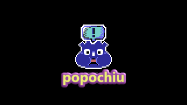
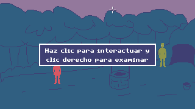

<!-- no toc -->
# Godot Adventure Quest<!-- omit in toc -->
Framework para crear juegos de aventura con Godot al estilo de [Adventure Game Studio](https://www.adventuregamestudio.co.uk/) y [Power Quest](https://powerhoof.itch.io/powerquest).




# Tabla de contenidos<!-- omit in toc -->
- [📃 Resumen y ejemplos de uso](#-resumen-y-ejemplos-de-uso)
- [🐞 Problemas](#-problemas)
- [🎮 Controles (en el juego)](#-controles-en-el-juego)
- [👨‍👩‍👦‍👦 Personajes](#-personajes)
- [🚪 Habitaciones](#-habitaciones)
  - [🪑 Props](#-props)
  - [👆 Hotspots](#-hotspots)
  - [Regiones](#regiones)
  - [Puntos (Position2D)](#puntos-position2d)
  - [🚶‍♀️ Áreas transitables (walkable areas)](#️-áreas-transitables-walkable-areas)
- [Interfaz gráfica](#interfaz-gráfica)
  - [Texto de descripción](#texto-de-descripción)
  - [Texto de diálogo](#texto-de-diálogo)
  - [Texto de aviso](#texto-de-aviso)
  - [Menú de opciones de diálogo](#menú-de-opciones-de-diálogo)
  - [Menú del juego (*Toolbar*)](#menú-del-juego-toolbar)
- [📦 Inventory](#-inventory)
- [💬 Árboles de diálogo](#-árboles-de-diálogo)
- [⚙ Godot Adventure Quest (núcleo)](#-godot-adventure-quest-núcleo)
- [🛠 Configuración](#-configuración)
- [📁 Estructura](#-estructura)
- [Nodos de un nivel más alto](#nodos-de-un-nivel-más-alto)
  - [Clickable](#clickable)

# 📃 Resumen y ejemplos de uso

El framework tiene unos script cargados en el Autoload para facilitar el acceso a funciones de uso global: CharacterInterface, Inventory, GraphicInterfaceEvents, Cursor, Utils, Data.

* C (para acceder a CharacterInterface.gd)
  ```gdscript
  # El personaje controlado por el jugador dice Hola
  C.player.say('Hola')
  # Un personaje llamado Barney se pone grosero
  C.character_say('Barney', '¡Cállese maricón!')
  # El personaje controlado por el jugador se pone grosero también
  C.player_say('Qué malparido tan grosero')
  ```
* G (para acceder a GraphicInterfadeEvents.gd)
  ```gdscript
  # Muestra un mensaje centrado, como una notificación.
  G.display('Usa clic izquierdo para interactuar y clic derecho para examinar')
  # En la parte inferior de la pantalla se puede ver el nombre del objeto sobre el que está el cursor
  G.show_info('Llave')
  ```
* I (para acceder a Inventory.gd)
  ```gdscript
  # Añade el ítem Bucket al inventario
  I.add_item('Bucket')
  # Añade el ítem Bucket al inventario y lo hace, automáticamente, el ítem activo
  I.add_item_as_active('Bucket')
  ```
* E (para acceder a GodotAdventureQuest.gd - la matrona)
  ```gdscript
  E.run([
    'Barney: Hola... maricón',
    'Coco: No existo, entonces no puedo decir ni mierda',
    C.player_say('No tiene que tratarme tan feo...'),
    E.wait(2),
    C.player_say('malparido'),
    G.display('En un futuro se podrá hacer controlable cualquier personaje')
  ], 'completed')
  ```
  > `E.run(instructions: Array)` Se encarga de activar la interfaz gráfica una vez se han completado todas las instrucciones recibidas.

# 🐞 Problemas
- No se puede pasar a la lista de instrucciones el llamado a `C.character_say(...)` o `C.player_say(...)` porque esas funciones pasan a `Character.say(...)` el segundo parámetro en `true`, lo que hace que éste no use el `yield()` que pausa el flujo del juego para que lo controle `E.run(...)`. Podría hacer que las funciones de `C` mencionadas reciban un parámetro adicional, pero creo que eso enredaría un poco la cosa... aunque tal vez termine siendo lo más mejor para la humanidad.


# 🎮 Controles (en el juego)
* Clic para interactuar con los objetos y personajes, para hacer mover al personaje jugable y para hace cualquier acción de inventario o menú. Si hay un ítem del inventario activo, esta acción hace que se use sobre el objeto o el personaje que esté bajo el cursor.
* Clic derecho para examinar los objetos y personajes. Si hay un ítem del inventario activo, esta acción lo desactiva. Se pueden examinar objetos del inventario.

---
---

# 👨‍👩‍👦‍👦 Personajes
`Character.tscn, Character.gd, CharacterTemplate.gd`

*Cualquier objeto que pueda hablar, caminar, moverse entre habitaciones, tener inventario, entre otras muchas cosas.*

**Por hacer**
- [ ] Que personaje pueda mirar en la dirección de un objeto específico (puede ser un personaje, un hotspot, un prop, etcétera).
- [ ] Crear máquina de estados.

**Hecho**
- [x] Que funciones de mirar en diferentes direcciones se puedan enviar a la cola de instrucciones.
- [x] Que la función caminar tenga una corrutina y no el CharacterInterface.gd.
- [x] Que personaje pueda mirar en la dirección del objeto al que se hizo clic.
- [x] Que la animación de hablar se haga en la última dirección en la que miró el personaje.
- [x] Que se dispare la animación de hablar y pase a idle cuando termine.
- [x] Que puedan caminar por el escenario.
- [x] Que puedan decir cosas al interactuar con objetos.

# 🚪 Habitaciones
`Room.tscn, Room.gd, RoomTemplate.gd`

*Las escenas del juego (por donde se moverá el personaje)*

**Por hacer**
- [ ] Que haya un Autoload para controlar eventos comunes a las habitaciones, sus props, sus hotspot, entre otros.

**Hecho**
- [x] Que se pueda hacer transición de una habitación a otra.
- [x] Que cuando una habitación haya entrado al árbol de nodos, se llame a `Room.on_room_entered`.
- [x] Que cuando el efecto de transición (*fade out* por ahora) para el cambio de habitación haya terminado, se llame al método `Room.on_room_transition_finished`.
- [x] Crear plantilla para facilitar la asignación de un script a cada habitación.

## 🪑 Props
`Prop.tscn, Prop.gd, PropTemplate.gd`

*Elementos visuales para las habitaciones. Pueden tener interacción.*
*Ej: las imágenes de fondo y primer plano, un objeto que se puede agarrar...*

**Por hacer**
- [ ] Crear un plugin para facilitar su creación.

**Hecho**
- [x] Que Prop herede de Clickable.
- [x] Crear plantilla para facilitar la asignación de un script a cada Prop creado en una habitación.
- [x] Crear nodo que permita definir un Sprite y un Area2D para crear un Prop.

## 👆 Hotspots
`Hotspot.tscn, Hotspot.gd, HotspotTemplate.gd`

*Áreas con las que se puede interactuar (clic izquierdo o clic derecho*
*Ej: El cielo, algo que haga parte de la imagen de fondo.*

**Por hacer**
- [ ] Crear un plugin para facilitar su creación.

**Hecho**
- [x] Que Hotspot herede de Clickable.
- [x] Crear plantilla para facilitar la asignación de un script a cada Hotspot creado en una habitación.
- [x] Crear nodo que permita definir un Area2D para controlar la interacción del mouse con ella.

## Regiones
*Áreas que pueden disparar eventos cuando un personaje entra en contacto con estas.*

**Por hacer**
- [ ] Crear *script_template* para facilitar la creación de las regiones.
- [ ] Que región se pueda desactivar una vez haya sido activada.
- [ ] Que se puedan crear regiones que reaccionen cuando un personaje entre en ellas.

**Hecho**
😖

## Puntos (Position2D)
*Posiciones que tienen un nombre y que pueden usarse para ubicar a los personajes.*

## 🚶‍♀️ Áreas transitables (walkable areas)
*Son `Navigation2D` que definen por dónde pueden moverse los personajes.*

# Interfaz gráfica
`GraphicInterface.tscn, GraphicInterface.gd, GraphicInterfaceEvents.gd`

_Controla lo elementos de la Interfaz Gráfica del Jugador (IGJ): mostrar textos de diálogo (DialogText), textos de aviso, o narrador, (DisplayBox), el inventario (InventoryContainer), el menú de opciones (Toolbar), el menú de diálogo (DialogMenu) y los textos de descripción (InfoBar), entre otros._

**Por hacer**
- [ ] Que haya algo que haga entender que se puede hacer clic para avanzar en el diálogo o saltar pasos de una escena cinemática (cutscene).

**Hecho**
- [x] Que se puedan ocultar sus elementos sin que ocurra la animación.
- [x] Refactorizar los nombres de algunas variables y métodos para que se entienda mejor lo que hacen.

## Texto de descripción
`InfoBar.tscn, InfoBar.gd`

*Muestra un texto en la parte inferior de la pantalla. Puede usarse para mostrar las descripciones de los objetos o la acción que se ejecutará sobre cada uno al usar cada clic.*

**Por hacer**
- [ ] Mover el elemento a una escena con su script propio.

**Hecho**
- [x] Que se pueda mostrar un texto de descripción cuando el cursor pasa sobre un objeto.

## Texto de diálogo
`DialogText.tscn, DialogText.gd`

*Es el que se encarga de mostrar lo que dicen los personajes. Se ubica encima del personaje que está hablando. En versiones posteriores del framework va a ser una de las opciones para mostrar el diálogo, porque también se podrá usar una caja de texto con el retrato del personaje que está hablando.*

**Por hacer**
- [ ] Calcular la altura del texto para que no se supoerponga al personaje que habla.
- [ ] Que al renderizarse en el borde el texto no se alinee al centro. Si se sale por la izquierda, alinearlo a la izquierda, si se sale por la derecha alinearlo a la derecha.

**Hecho**
- [x] Renombrar AnimatedRichText por DialogText.
- [x] Que nodo no se salga de la pantalla en los bordes. Si se sale por la izquierda, debería renderizarse a 4px del borde; igual para el borde derecho.
- [x] Que nodo tenga un ancho máximo y uno mínimo para controlar el Autowrap.
- [x] Actualizar Label por el AnimatedRichText creado para [Kaloche](https://quietgecko.itch.io/kaloche).
- [x] Que texto aparezca sobre el personaje que habla.
- [x] Que se pueda mostrar un texto dicho por un personaje.

## Texto de aviso
`DisplayBox.tscn, DisplayBox.gd`

*Sirve para mostrar mensajes del juego o un narrador. Se renderiza en el centro de la ventana.*

**Por hacer**
- [ ] Que la apariencia no esté definida por el estilo del `Label` sino por un NinePatchRect (o un TextureRect) que haga más fácil su personalización.

**Hecho**
- [x] Que tenga un ancho máximo definido para que empiece a hacer Autowrap.
- [x] Que vuelva a su tamaño original antes de mostrar el texto recibido.
- [x] Que se pueda mostrar un texto de aviso.

## Menú de opciones de diálogo
`DialogMenu.tscn, DialogMenu.gd, DialogOption.tscn`
*Muestra un menú de opciones vinculadas a un diálogo (ya sea uno almacenado en disco (.tres) o uno creado en tiempo de ejecución). La opción seleccionada se notifica a través de una señal para que sea controlada por el diálogo que esté activo en ese momento.*

**Por hacer**
- [ ] Que se puedan ocultar opciones.
- [ ] Que una opción pueda ser inmune a mostrarse como usada.
- [ ] Que se pueda mostrar el panel con una animación.
- [ ] Que sea fácil personalizar el menú para usar botones con iconos u otros elementos.

**Hecho**
- [x] Mover el DialogMenu a una escena independiente.
- [x] Que al seleccionar una opción se cierre el menú de opciones de diálogo y se envíe la opción seleccionada como parámetro de una señal.
- [x] Que haya un VBoxContainer para mostrar las opciones del diálogo.

## Menú del juego (*Toolbar*)
*Permite silenciar el juego, cambiar el idioma, activar los subtítulos, cerrar el juego...*

**Por hacer**
- [ ] Crear escena con botones para silenciar/activar sonido, cambiar idioma, activar/desactivar subtítulos, cerrar el juego.
- [ ] Hacer la funcionalidad para cada uno de esos botones.

**Hecho**
😖

# 📦 Inventory
`Inventory.tscn, Inventory.gd, Item.gd, InventoryItem.gd, ItemTemplate.gd`
*Controla qué objetos hay en el inventario (a futuro será por personaje) y qué objetos se pueden meter al inventario.*

**Por hacer**
- [ ] Que cada personaje pueda tener un inventario único.
- [ ] Que se pueda indicar la cantidad a guardar de un objeto en el inventario.
- [ ] Que se puedan mezclar objetos del inventario.

**Hecho**
- [x] Que se puedan eliminar ítems del inventario.
- [x] Que se puedan usar ítems del inventario.
- [x] Que se pueda agregar un ítem al inventario y que de una vez se convierta en el ítem activo.
- [x] Que se pueda "soltar" el ítem activo cuando se hace clic derecho al tener un objeto de inventario activo.
- [x] Que se pueda agregar un ítem (Item.gd) al inventario.

# 💬 Árboles de diálogo
`DialogTree.gd, DialogOption.gd, DialogTreeTemplate.gd, DialogTreeInterface.tscn`

*Los diálogos son árboles con ramificaciones. Cada árbol de diálogo necesita dos archivos: un `.tres` que permite definir las opciones que tendrá el diálogo y su ID (script_name); y un `.gd` que permite controlar la lógica de lo que pasará cuando inicie, cuando se seleccione una opción y, eventualmente, cuando termine. Cuando se cree un nuevo recurso de tipo **DialogTree.gd**, hay que asignarle un script que use como plantilla el **DialogTreeTemplate.gd**.*

**Por hacer**
- [ ] Que se puedan ocultar opciones de diálogo una vez hayan sido usadas.
- [ ] Que una opción de diálogo se pueda ocultar para siempre.
- [ ] Que se puedan apagar opciones de diálogo estando dentro de cualquier opción del mismo diálogo.

**Hecho**
- [x] Que opciones de diálogo se muestren de otro color cuando han sido usadas.
- [x] Actualizar script que escucha el cambio en el arreglo de opciones de un `DialogTree` para que se llenen algunas propiedades con valores por defecto: `id`, `text`, `script_name` y `resource_name`.
- [x] Actualizar la creación de opciones de diálogo en caliente para que sean un `DialogOption` y no un `Dictionary`.
- [x] Crear `DialogOption.gd` como Resource para manejar las opciones de diálogo.
- [x] Que las conversaciones (árboles de diálogo) queden separados por carpeta en **src/DialogTree**.
- [x] Que las conversaciones tengan un `.tres` para crear las opciones y un `.gd` que controle su lógica.
  > 💡✅ Las conversaciones podrían ser un `.tres` donde hay una función que muestra las opciones y otras funciones que se llaman cuando se seleccionan dichas opciones.
- [x] Que al seleccionar una opción del menú de diálogo este se cierre y se pase la opción seleccionada como parámetro de la señal que permite al juego continuar con el flujo de instrucciones.
- [x] Que se puede disparar un inline-dialog pasando las opciones como un arreglo de `String`.

# ⚙ Godot Adventure Quest (núcleo)
`GodotAdventureQuest.tscn, GodotAdventureQuest.gd`

**Por hacer**
- [ ] Que haya una máquina de estados.
- [ ] Que se puedan guardar variables globales para saber el estado de los objetos en las habitaciones.
- [ ] Que haya varios tipos de transición entre escenas.
- [ ] Ver si los datos cargados (habitaciones, personajes, ítems de inventario y árboles de conversación) se pueden pasar a sus autoload respectivos o si no tiene sentido hacer algo así.

**Hecho**
- [x] Que se cargue como una escena de Autoload que tenga adentro las escenas de interfaz gráfica y efectos de transición.
- [x] Que permita cambiar de habitación y llame a los métodos respectivos dependiendo del estado de la transición.
- [x] Que en este se registren todas las habitaciones, personajes, ítems de inventario y árboles de conversación del juego.

# 🛠 Configuración
- [ ] Que sea fácil indicarle al framework que el juego tiene controles de movimiento 2D (como casi todos los point n' click) o 1D (como [Short-term Battery](https://gamejolt.com/games/short-term-battery/340825) o [Loco Motive](https://robustgames.itch.io/loco-motive) o [iD](https://gamejolt.com/games/iD/256559)).

---
---
---

# 📁 Estructura
La estructura del proyecto toma como referencia los [lineamientos propuestos por GDQuest](https://www.gdquest.com/docs/guidelines/best-practices/godot-gdscript/#naming-conventions) para la nomenclatura de archivos y carpetas.

- `assets`
  - audio
  - fonts
  - images
  - localization
- `script_templates` Contiene archivos de script que servirán como plantilla para crear otros scripts que heredan de otros scripts. La idea con estos es reducir el tener que copiar y pegar código para crear objetos como personajes, hotspots, props, ítems, etcétera.
- `src`
  - `Autoload` Contiene los scripts que se cargarán en el Autoload (singleton) del proyecto.
  - `Characters` Contiene los personajes del juego separados cada uno por carpeta.
  - `DialogTree` Contiene los árboles de diálogo del juego separados por carpeta.
    - `ChatWithBarney`
      - **ChatWithBarney.tres** Define las opciones para el diálogo y tiene la referencia al script que se usará para controlar la lógica (ChatWithBarney.gd)
      - **ChatWithBarney.gd** Controla la lógica del diálogo (como lo que pasa al iniciar o cuando se selecciona una opción).
    - 📂++
  - `GraphicInterface` Contiene los nodos que se encargan de presentar y controlar la Interfaz Gráfica del Jugador (IGJ).
  - `Inventory` Contiene los ítems que se podrán añadir al inventario separados por carpeta.
  - `Nodes` Contiene nodos que podrán agregarse a las escenas para crear personajes, hotspots, props, entre otros.
  - `Resources` Contiene recursos (*.tres) creados para el proyecto.
    - **GAQTheme.tres** El tema (*theme*) de Godot para los elementos de interfaz gráfica del juego.
  - `Rooms` Contiene las habitaciones que podrán navegarse en el juego separadas por carpetas.<!-- omit in toc -->
---
---
---
# Nodos de un nivel más alto
Son nodos (o scripts) de los que heredan varios de los objetos que permiten construir las habitaciones.

## Clickable
_Nodo del que heredan todos aquellos objetos que vayan a tener interacción con clic izquierdo o derecho._
- [x] Crear Clickable.gd para que Character, Hotspot y Prop hereden de este.