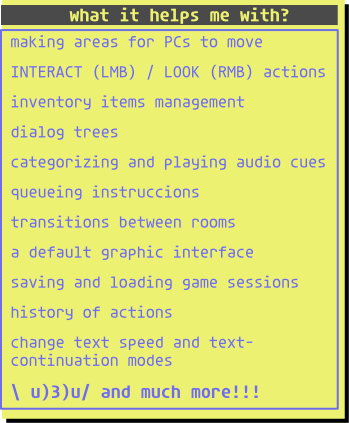
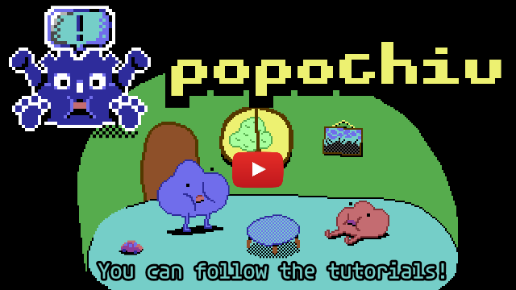

### 🌎 [Lee la versión en Español](./LEEME.md) 🌎

Godot plugin to make point n' click games in a similar way to tools like [Adventure Game Studio](https://www.adventuregamestudio.co.uk/) and [Power Quest](https://powerhoof.itch.io/powerquest).

---

🔍 Read the [Documentation](https://github.com/mapedorr/popochiu/wiki) (w.i.p.) to know what you can do with the plugin.

❤️ Join [Carenalga's Discord](https://discord.gg/Frv8C9Ters) to know about daily updates and releases.

🧠 Check the [development repository](https://github.com/mapedorr/popochiu-dev) to keep up with the latest changes.

▶️ Follow the [tutorials](https://www.youtube.com/playlist?list=PLH0IOYEunrBDz6h4G3vujEmQUZs8vLjz8) (English subs.) to learn how to use the plugin.

# About

This tool consists of two parts: the core (Popochiu) and the dock that helps with the creation of the Nodes that make use of that core. It is inspired in how graphic adventure games are created in Adventure Game Studio and Power Hoof's Unity plugin: Power Quest. This is, using Rooms as the scenes where Characters can move and interact with Props and Hotspots, and providing an Inventory system and Dialog trees.

<!--     -->

# Installation

**Popochiu works on Godot 3.3.x, 3.4.x and 3.5.x.**

1. [Download the ZIP](https://github.com/mapedorr/popochiu/archive/refs/heads/main.zip).
2. Extract it and copy the `addons` folder into your project folder.
3. Open your Godot project and enable the Popochiu plugin: `Project > Project Settings... > Plugins` (the tab on the top).
4. Restart Godot `Project > Reload Current Project`.
5. You'll see the Popochiu dock at the right. That's all!

# Tutorials

You can follow the tutorials (English subs. (English version will be uploaded soon!)) [in this list](https://www.youtube.com/playlist?list=PLH0IOYEunrBDz6h4G3vujEmQUZs8vLjz8) to learn:

- How to setup your project.
- How to create rooms where the player can walk around, and how to setup them if the exceed the limits of the game window.
- How to create characters and play their voices when they talk.
- How to create Props and Hotspots to interact with the environment.
- How to create Inventory items and how to add interactions between them and the Props, Hotspots and Characters of your game.
- How to create branching dialogs.
- How to add sound effects, music, voices, and graphic interface sounds.

More tutorials will come in the following weeks to learn:

- How to save/load the game state.
- How to work with Props that have more than one frame in their spritesheet.
- How to add animations to your Characters.
- How to use emotions when characters speak.
- And much more...

---

# Credits

Made by [Carenalga](https://mapedorr.itch.io).

Now with the collaboration of [StickGrinder](https://twitter.com/StickGrinder) ([itch.io](https://illiteratecodegames.itch.io))
