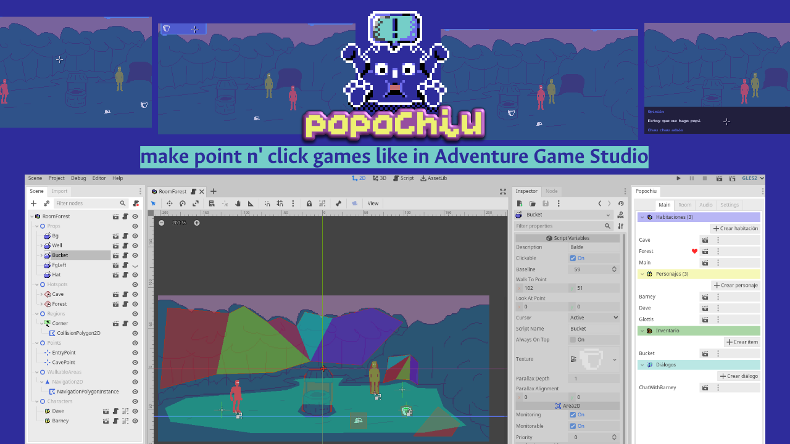
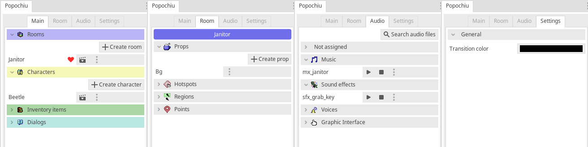

### 🌎💬 [Lee la versión en Español](./LEEME.md) 💬🌎



<!-- no toc -->
Godot plugin to make point n' click games in a similar way to tools like [Adventure Game Studio](https://www.adventuregamestudio.co.uk/) and [Power Quest](https://powerhoof.itch.io/powerquest).


### 🧠 To keep up to date with the latest updates, check the [development branch](https://github.com/mapedorr/popochiu/tree/dev) 🧠


## About

This tool consists of two parts: the core (Popochiu) and the dock that helps with the creation of the Objects that make use of that core. It is inspired in how graphic adventure games are developed in Adventure Game Studio and Power Hoof's Unity plugin: PowerQuest. This is, using Rooms as the scenes where Characters can move and interact with Props and Hotspots, and providing an Inventory system and Dialog management.

Popochiu (the core (**E**)) is a singleton that provides a couple of methods to run queued instructions that make it easier to handle behaviors between the PC and the game world. It also has other singletons to make characters move and say things (**C**), to handle the inventory (**I**), to trigger conversations (**D**), use the graphic interface (**G**) and trigger audio events (**A**).

The dock helps with the creation of the scenes, resources and scripts required to create such objects (Rooms, Characters, Inventory items, Dialogs, etc.). But it also helps to classify audio files (Music, SFX, Voice, UI) and give each one volume and pitch properties (both with randomization).


## Installation

**Popochiu works on Godot 3.3.x and 3.4.x.**

1. [Download the ZIP](https://github.com/mapedorr/popochiu/archive/refs/heads/main.zip).
2. Extract it and copy the `addons` folder into your project folder.
3. Open your Godot project and enable the Popochiu plugin: `Project > Project Settings... > Plugins (the tab on the top)`.
4. Restart Godot.
5. You'll see the Popochiu dock at the right. Click on the **Move folders** button. That's all!


## Intro video 🎥

[In this YouTube video (with English subs)](https://www.youtube.com/watch?v=kS9mrP0tgUw) you can see how to quickly make a room with a character moving through it with Popochiu.


## The dock 🔌



- Tha *Main* tab shows (and allows the creation of) rooms, characters, inventory items and dialogs.
- The *Room* tab shows (and allows the creation of) props, hotspots, regions and points.
- The *Audio* tab shows the audio files and allows to assign each one to a category: music, sfx, voice and graphic interface.


## Example project 👩‍🏫

While I work on the documentation and some tutorial videos, [here](https://github.com/mapedorr/popochiu_powerquest) you can check what Popochiu is capable of.


<!-- ## Features 📃


- Use `E.run([...])` to queue instructions.
  ```gdscript
  func _on_room_transition_ended() -> void:
    # This will show a dialog between the player character and the NPC Paco.
    E.run([
      'Player: Hi',
      'Paco: Hi',
      'Player: Where are we?',
      'Paco: In a point n\' click game.',
      C.player.face_right(),
      C.player.face_left(),
      '...',
      'Player: Cool!',
    ])
  ```
- The added singletons give developers quick access to plugin functions:
  
  **E (to access the core (Popochiu.gd))**
    ```gdscript
    E.goto_room('Cave')
    yield(E.wait(3), 'completed')
    ```
  **C (to access characters (ICharacter.gd))**
    ```gdscript
    C.player.say('Hi')
    C.character_say('Barney', 'Hello!')
    ```
  **I (to access inventory items (IInventory.gd))**
    ```gdscript
    # Adds an item to the inventory
    I.add_item('Bucket')
    # Adds an item to the inventory and makes it the current one
    I.add_item_as_active('Bucket')
    ```
  **D (to access dialogs (IDialogTree.gd))**
    ```gdscript
      func on_interact() -> void:
        # Triggers a dialog with options
	      yield(D.show_dialog('ChatWithBarney'), 'completed')
    ```
  **G (to access the graphic interface (IGraphicInterface.gd))**
    ```gdscript
    # Shows a message in the center of the screen
    G.display('Use left click to interact and right click to look at')
    # Shows a message in the bottom-center of the screen
    G.show_info('An empty bucket')
    ``` -->