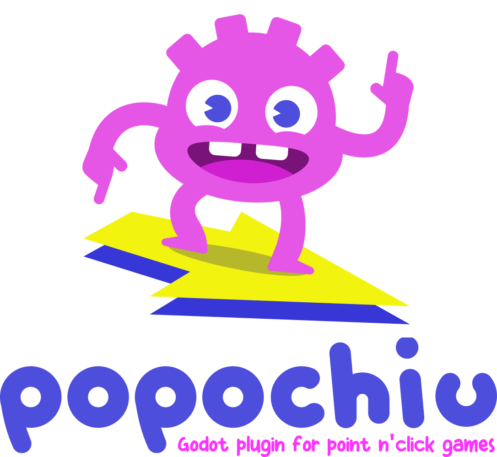

# Popochiu

 

A Godot plugin for making point-and-click adventure games, inspired by [Adventure Game Studio](https://www.adventuregamestudio.co.uk/) and [PowerQuest](https://powerhoof.itch.io/powerquest).

> 🌎👉🏽 [Lee la versión en Español](./LEEME.md) 👈🏽🌎

---

🔍 Read the [documentation](https://carenalgas.github.io/popochiu/) to learn what you can do with the plugin.

❤️ Join the [Carenalgas Discord](https://discord.gg/Frv8C9Ters) to keep up with updates and releases.

## About

Popochiu consists of two parts: the runtime engine and the editor plugin. Together, they help you create the nodes and resources needed to build classic adventure games in Godot.

It is inspired by well-established adventure game creation tools such as Adventure Game Studio and PowerQuest, a Unity plugin by Powerhoof. Popochiu organizes games into Rooms, where Characters can move around and interact with Props and Hotspots, and it also provides built-in Inventory and Dialogue systems.

## Features

### Engine

* Seamless support for retro-style, pixel-art, and high-resolution 2D games
* Character management, including support for different emotions during dialogues
* Tunable text speed and auto-advance
* Rooms filled with interactive props, hotspots, local characters, multiple walkable areas, reactive regions, and position markers
* Inventory management for your main character
* Script-based dialogues for complex cutscenes and interactions
* Save and load support for game sessions
* Actions history management
* Customizable room transitions
* Multiple out-of-the-box graphical interfaces, with the freedom to create your own
* Command-based GUI framework
* Easy management of background music and sound effects
* 100% pure Godot code and resources, with no lock-in

### Editor

* Popochiu Dock for easy access to all game elements
* Intuitive, modern GDScript-based scripting API, with autocomplete features
* Visual creation of all the game elements, with custom gizmos for special properties
* Dialogue tree management
* Audio management for background music and sound effects
* Import rooms, characters, and inventory items from [Aseprite](https://www.aseprite.org/) source files with their full structure

And much more is on the way. Popochiu is in active development, and we maintain a public [release roadmap](https://github.com/orgs/carenalgas/projects/1/views/1).

## Releases

The latest stable public release is **Popochiu 2.1.0**, which targets **Godot 4.6**.

Use the table below to determine which version to download for your Godot version:

| Required Godot version | Popochiu Release |
| --- | --- |
| 4.6 | [Popochiu 2.1.0](https://github.com/carenalgas/popochiu/releases/tag/v2.1.0) |
| 4.3 | [Popochiu 2.0.3](https://github.com/carenalgas/popochiu/releases/tag/v2.0.3) |

Support for Godot 3 is officially dropped. Releases are still available for legacy versions, but they won't receive any update or bugfix and usage is discouraged.

## Installation

1. Download the correct release for your Godot version.
2. Extract it and copy the `addons` folder into your project folder.
3. Open your Godot project and enable the Popochiu plugin: `Project > Project Settings` then select the `Plugins` tab on top.
4. You will see the game setup wizard. Follow the instructions and choose the options that best fit your project.
6. Once the setup is complete, you will see the Popochiu dock in the top-left area of the editor. That's it!

## Getting started

Once Popochiu is installed:

1. Run the setup wizard.
2. Create your first room.
3. Create a character and place it in the room.
4. If it is your first time using the plugin, follow the [getting-started guide](https://carenalgas.github.io/popochiu/how-to-develop-a-game/introduction/).

## Documentation

* Find the documentation for the latest version [here](https://carenalgas.github.io/popochiu/).

## Made with Popochiu

* [Gustavo the Shy Ghost](https://lexibobble.itch.io/gustavo-the-shy-ghost-project) - English.
* [Detective Paws](https://benjatk.itch.io/detective-paws) - English.
* [The Sunnyside Motel in Huttsville Arkansas](https://fgaha56.itch.io/the-sunnyside-motel-in-huttsville-arkansas) - English.
* [Zappin' da Mubis](https://carenalga.itch.io/zappin-da-mubis) - English.
* [Reality-On-The-Norm: Ghost of Reality's Past](https://edmundito.itch.io/ron-ghost) (password: `popochiu`) - English.
* [Breakout (demo)](https://rockyrococo.itch.io/breakout-demo) - English.
* [Poin'n'Sueldo](https://matata-exe.itch.io/pointnsueldo) - Spanish.
* [Dr. Rajoy](https://guldann.itch.io/dr-rajoy) - Spanish.
* [I'm Byron Mental](https://leocantus23.itch.io/im-byron-mental-colombia) - Spanish.
* [Benito Simulator](https://panconqueso94.itch.io/benito-simulator) - Spanish.
* [Pato & Lobo](https://perroviejo.itch.io/patolobo) - English and Spanish (this was the first game made with Popochiu!).

## Credits

Popochiu is a project by [Carenalga](https://carenalga.itch.io).
It is now maintained by [Carenalga](https://carenalga.itch.io) and [StickGrinder](https://twitter.com/StickGrinder), with many contributions from other members of our lovely community.

:heart::heart::heart: Special thanks to :heart::heart::heart:

* [Edmundito](https://github.com/edmundito), [Whyschuck](https://github.com/Whyshchuck), and **Turquoise** for their monthly contribution to our [Ko-fi](https://ko-fi.com/carenalga)
* [Illiterate Code Games](https://illiteratecodegames.itch.io), [@vonagam](https://github.com/vonagam), [@JuannFerrari](https://github.com/JuannFerrari), and [Whyschuck](https://github.com/Whyshchuck) for their many valuable contributions

## Contributing

Contributions are welcome. If you would like to help, please start with the documentation:

* [Contributing to Popochiu](https://carenalgas.github.io/popochiu/contributing-to-popochiu/)
* [Definition of Done](https://carenalgas.github.io/popochiu/project-management/definition-of-done/)

## License

This project is licensed under the terms of the [MIT License](LICENSE).
