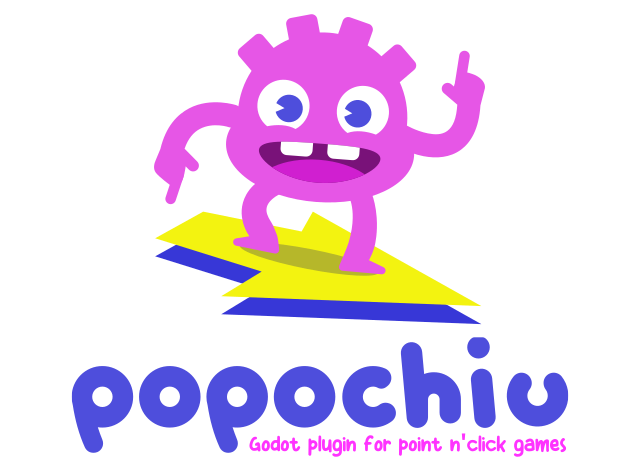

# Popochiu

  

A Godot plugin to make point n' click games, inspired by [Adventure Game Studio](https://www.adventuregamestudio.co.uk/) and [PowerQuest](https://powerhoof.itch.io/powerquest).

> 🌎👉🏽 [Lee la versión en Español](./LEEME.md) 👈🏽🌎

---

🔍 Read the [Documentation](https://carenalgas.github.io/popochiu/) to know what you can do with the plugin.

❤️ Join [Carenalgas Discord](https://discord.gg/Frv8C9Ters) to know about daily updates and releases.

▶️ Follow the [tutorials](https://www.youtube.com/playlist?list=PLH0IOYEunrBDz6h4G3vujEmQUZs8vLjz8) (English subs.) to learn how to use the plugin.

## About

This tool consists of two parts: the engine (Popochiu) and the editor plugin that helps with the creation of game elements (nodes and resources) that make use of the engine. It is inspired by well established graphics adventure games creation tools like Adventure Game Studio and PowerQuest (a Unity plugin by PowerHoof). It organizes the games in Rooms, the scenes where Characters can move and interact with Props and Hotspots. It also provides Inventory and Dialogue management systems.

## Features

### Engine

* Seamless support for retro-style, pixel-art or high resolution 2D games
* Characters management, with the support of different emotions during dialogues
* Tunable text speed and auto-advance
* Rooms full with interactive props, hotspots, local characters, multiple walkable areas, reactive regions and position markers
* Inventory management for your main character
* Scripting-based dialogs, enabling complex cutscenes and interactions
* Game sessions saving and loading
* Actions history management
* Customizable transition between rooms
* Multiple out-of-the-box graphics interfaces with the freedom to create custom ones
* Command-based GUI framework
* Easy background music and sound effects management
* 100% pure Godot code and elements, no lock-in

### Editor

* Popochiu Dock for easy access to all game elements
* Intuitive, modern GDScript-based scripting API, with autocomplete features
* Visual creation of all the game elements, with custom gizmos for special properties
* Dialog trees management
* Audio management for background music and sound effects
* Import Rooms and Character from [Aseprite](https://www.aseprite.org/) source files with full structure

And much more to come. Popochiu is in active development and we have a well maintained releases roadmap.

## Compatibility chart

Popochiu supports Godot 4 as well as Godot 3, but only the Godot 4 release is under active development, and the latest stable version of Popochiu requires Godot 4.3.

Please review this table to know which version to download, depending on the version of Godot you want to use:

| Required Godot version | Popochiu Release |
|---|---|
| 4.3 and above | [Popochiu 2.0](https://github.com/carenalgas/popochiu/releases/download/v2.0/popochiu-v2.0.0.zip) |
| 3.5 to 3.6 | [Popochiu 1.10.1](https://github.com/carenalgas/popochiu/releases/download/v1.10.1/popochiu-v1.10.1.zip) |
| 3.3 to 3.4.5 | [Popochiu 1.8.7](https://github.com/carenalgas/popochiu/releases/download/v1.8.7/popochiu-v1.8.7.zip) |

## Installation

1. Download the correct release for your Godot version.
2. Extract it and copy the `addons` folder into your project folder.
3. Open your Godot project and enable the Popochiu plugin: `Project > Project Settings` then select the `Plugins` tab on top.
4. Popochiu will show you a popup indicating it will restart the engine.
5. You'll see the Popochiu dock in the right-bottom editor area. That's all!

## Documentation

* Find [here the documentation for the latest version](https://carenalgas.github.io/popochiu/).
* Read [this wiki for legacy version 1.x](https://github.com/carenalgas/popochiu/wiki).

## Tutorials

Video Tutorials are available for legacy version:

You can follow the tutorials (English subs) [in this list](https://www.youtube.com/playlist?list=PLH0IOYEunrBDz6h4G3vujEmQUZs8vLjz8) to learn:

* [Install the plugin, create a room, a walkable area, and a character](https://youtu.be/-N62S1DHbcs).
* [Configure baselines, holes in walkable areas, and create Hotspots](https://youtu.be/5RbqbG3_0ak).
* [Create interactive Props and an inventory object](https://youtu.be/_an0YF3Bd50).
* [Create dialogues with options](https://youtu.be/Aql4wh2itF4).
* [Enable options within a dialogue and use inventory objects](https://youtu.be/Ad_YBG-_wYE).
* [Add another room and configure the camera to follow the character](https://youtu.be/YFEZaSty3aw).
* [Add audio](https://youtu.be/VF7V6BJmQVQ).

## Made with Popochiu

* [Gustavo the Shy Ghost](https://lexibobble.itch.io/gustavo-the-shy-ghost-project) - English.
* [Detective Paws](https://benjatk.itch.io/detective-paws) - English.
* [The Sunnyside Motel in Huttsville Arkansas](https://fgaha56.itch.io/the-sunnyside-motel-in-huttsville-arkansas) - English.
* [Zappin' da Mubis](https://carenalga.itch.io/zappin-da-mubis) - English.
* [Reality-On-The-Norm: Ghost of Reality's Past](https://edmundito.itch.io/ron-ghost) (password: `popochiu`) - English.
* [Breakout (demo)](https://rockyrococo.itch.io/breakout-demo) - English.
* [Poin'n'Sueldo](https://matata-exe.itch.io/pointnsueldo) - Spanish.
* [Dr. Rajoy](https://guldann.itch.io/dr-rajoy) - Spanish.
* [I'm Byron Mental](https://leocantus23.itch.io/im-byron-mental-colombia) - Spanish.
* [Benito Simulator](https://panconqueso94.itch.io/benito-simulator) - Spanish.
* [Pato & Lobo](https://perroviejo.itch.io/patolobo) - English and Spanish (this was the first game made with Popochiu!).

## Credits

Popochiu is a project by [Carenalga](https://carenalga.itch.io).
It is now maintained by [Carenalga](https://carenalga.itch.io) and [StickGrinder](https://twitter.com/StickGrinder) with many contributions by other members of our lovely community.

:heart::heart::heart: Special thanks to :heart::heart::heart:

* [Edmundito](https://github.com/edmundito), [Whyschuck](https://github.com/Whyshchuck), and **Turquoise** for their monthly contribution to our [Ko-fi](https://ko-fi.com/carenalga)
* [Illiterate Code Games](https://illiteratecodegames.itch.io)), [@vonagam](https://github.com/vonagam), [@JuannFerrari](https://github.com/JuannFerrari), [Whyschuck](https://github.com/Whyshchuck) for the many valuable contributions
