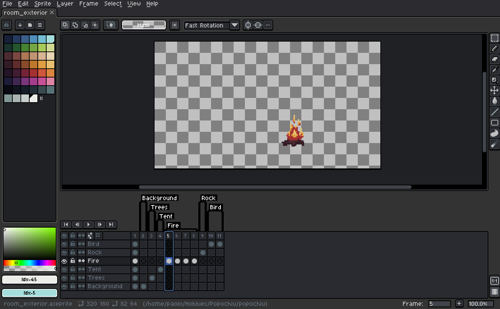
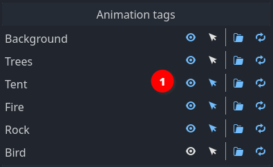

# Aseprite Importers

These tools enable a smooth workflow for the creation of graphical elements in the game.  
The main goal is to integrate with Aseprite in a way that promotes quick iterations, starting from a visual draft and evolving game scripting and graphics together as things take shape.

Importers are available for [Characters](./PopochiuCharacter.md) and [Rooms](./PopochiuRoom.md), allowing an almost one-click creation of the complete room structure.

Next releases will introduce an Importer for [Inventory items](./PopochiuInventoryItem.md) too.

## Basics

The plugin works by reading [tags](https://www.aseprite.org/docs/tags/) from a properly organized Aseprite source file and using that information to populate the target Popochiu Object in a single pass.

The result of the process differs depending on the target object type:

* For **Characters**, every tag represents a specific animation (ex. the talk animation), and when applicable, the animation direction (ex. up, down, left or right). So in a typical project of medium size, there will be specific tags for _talk up_, _talk down_, _walk left_, _walk right_, and so on, plus very specific tags for special cutscene animations (_eat multifolded pizza_, _brush alien dog hair_, _jump across cakes chasm_, etc).
* For **Rooms**, every tag represents a [Prop](./PopochiuProp.md) and for each tag, a new prop with its own animation is created and populated by the appropriate animation (or sprite). Background and foreground elements are props, of course, and it will be possible to configure each prop visibility and clickability at import.

Despite having slightly different outputs, the structure of a Character's or Room's Aseprite source file is basically the same.  
Let's see examples for both.

## Aseprite file organization

Please take a look at the following image:

First notable thing is, a single file contains all animations for the character, identified by tags (_marker 1_). Each tag will be used to create a single animation, named after the tag, for the Character.

!!! info "Under the hood"
    Popochiu Characters already embed a Sprite2D and an AnimationPlayer. The whole spritesheet is assigned as texture to the Sprite2D and every tag becomes a configured animation in the AnimationPlayer - even the single-sprite ones. They are then accessible by specific methods on the Character, as explained below.

Your file can also be organized in layers (_marker 2_). Layer names are completely up to you and you may create as many as you like. The importer has an option to import only visible layers, that's useful if you have reference or background layers that you don't want to be part of your sprite.

Layers are particularly useful in Rooms source files, because without them, isolating props tend to become pretty messy. Take a look at the following example.

To keep different props apart, the image is organized in layers (_marker 1_). In the specific case, layer names and tag names match, but you can of course have situations where more than one layer is necessary to render a specific tag (it's pretty common really); a typical example is the background: in the example above, we could have decided to have the trees on the background prop. The resulting Aseprite file would have looked like this then:

Notice how the _Tree_ tag disappeared and the _Tree layer_ is now present with the _Background_ one in the _Background_ tag.

On the other hand, you can have tags with many frames on the same layer. This is the most common case because you often wants your props to be animated, like in the case of our crackling bonefire (see _marker 2_ in the image above):

Here we have an isolated fire, composed by 4 frames, all grouped by the proper tag.

Basically all combinations of layers and frames are allowed: what you see in a specific animation if you play the tag in Aseprite, will be imported as is in the Prop.

!!! note
    Observant readers will have noticed that the first frame has no tag and of course, despite including all "props", it's not animated. Indeed it is there just as a reference frame for the artist to paint "in place". You may have as many untagged frames as you wont in your Room source files: they will be ignored by the importer and will never land into your Popochiu project. This makes things very convenient when composing the scene.

!!! info "Under the hood"
    As for Popochiu Characters, every Prop comes with a bundled Sprite2D and a dedicated AnimationPlayer. Each tag will be extracted as a spritesheet and imported as a single animation. **Yes**, this may seem overkill but this setup common to Props and Characters allows for easier maintenance and is there to support more functions in the future.

!!! note
    Even more observant readers will also have realized at this point, that by how things work, each prop sprite will be the size of the whole scene. That's right, but don't be horrified. This approach has a lot of advantages at the sole cost of asking a swift third-millenium game engine to render some more transparent pixels. What we gain is automatic placing of the visual in the scene at import time, and a common rect origin for each prop that will keep baselines and other coordinates consistent among them in the same scene.

Back to the tags: you can name them whatever you want, but to get the most out of this functionality, stick to the following conventions:

### Case style

You can use `snake_case` or  `PascalCase` to name your tags, as you prefer. They will be converted to `snake_case` anyway before creating animations. Since this can change in the future, **we strongly advise not to rely on case sensitivity to differentiate between animations**!  
Be explicit.

### Reserved animation names

The engine will automatically recognize the following reserved names and use them properly: `idle`, `walk`, `talk`, `grab`. All of them take for granted the character is facing right and it will be flipped to the left and used for up and down directions too, unless you don't provide...

### Directional suffixes

The engine supports directional suffixes for eight possible directions (up, up-left, left, down-left, down, etc). The complete list of suffixes is `_u`, `_ur`, `_r`, `_dr`, `_d`, `_dl`, `_l`, `_ul`. Every animation you want to create (not just the reserved ones) can be made direction-aware by creating it with the right suffixes.  

For example, to create a walk animation that supports the four main directions, you create `walk_u`, `walk_d`, `walk_r` and `walk_l`. If you don't create `walk_l`, `walk_r` will be automatically flipped.

!!! note
    As mentioned the importer will convert every animation name to `snake_case`. This means that the following tags are all equivalent: `talk_u`, `Talk_u`, `talkU`, `TalkU`.  
    The good: you can use the style you prefer and directions will be still recognized. The bad: if you have `Talk_u` and `TalkU` and they mean different things, you're out of luck. `Talk_u` and `Talku` works though.

### Single-animation file

If a file contains no tags, it will be imported as a single animation named `default`.

### Multiple source files

If you are in the need, you may want to separate your character animations over different source files. This is feasible, but keeping everything in a single file is the best option to speed up development by a great amount.  
The plugin allows you to set a single source file at a time, so if you have multiple sources, you have to constantly switch between source files, losing your preferences in the process. In addition, you have to trade the ability to reset all animations off for an incremental import (see below).

## Importer settings

The Aseprite Importer exposes its configuration under the **Popochiu -> Import** sections in both the **Editor Settings** and the **Project Settings**.

### Editor Settings

Editor Settings contain those configurations that may change between team members' local development environment, like the Aseprite command path, and/or that are valid across different projects.

* **Enable Aseprite Importer**: Allows the user to enable or disable the importer in their editor. Useful to avoid cluttering the inspector or getting errors for those who don't use Aseprite or don't have it available in a specific environment.
> !!! note
    This option is only available starting from Popochiu 2.0. In Popochiu 1.0 the importer can't be disabled.
* **Command Path**: This is the single most important setting to make the plugin work. On Windows, this field **must** contain the full path to Aseprite executable (having the command in `PATH` won't work due to some Godot limitations on command execution under Windows). In *nix systems (Linux and MacOS), you can choose to provide the Aseprite command (if in `PATH`) or the full path, as you prefer.  
Anyway, the plugin will check for the correct execution of the command before initializing itself. If something goes wrong, the output panel will give useful information to fix the problem.
* **Remove JSON file** When Aseprite is invoked by the importing procedure, it generates a JSON file with metadata that is necessary to complete the job, alongside the spritesheet PNG file. This file is then useless and can be safely erased, most of all if you are versioning your code (you are, aren't you?!). If for some reason you want to keep the output file, just unflag this setting.

!!! note
    In Popochiu 1.x for Godot 3, all these settings are found under "Project Settings" (see below).

### Project Settings

Among the Project Settings you'll find those you may want to share with your team, and that mostly impact the importing workflow, setting defaults shared by every instance of the plugin.

!!! note
    Since Godot 4, Project Settings have an "Advanced Settings" filter. Plugins can't declare their settings as _basic_, so please make sure you have the upper left toggle _activated_ or you won't see Popochiu's settings section.

* **Import Animation by Default**: When a source file is scanned, a list of the contained tags is populated. For each element in the list, you can choose if you want it imported or not. This is useful if you have half-baked animations or reference tags of some sort. When this setting is flagged, all new animations in the list will be automatically flagged as "to be imported". When this setting is off, they will be flagged as "not to be imported".
* **Loop Animation by Default**: When a source file is scanned, a list of the contained tags is populated. For each element in the list, you can choose if you want that animation to loop or if it has to be run a single time. Animations like talk or walk are usually looping, but animations specific for cutscenes or special cases may be single runs. When this setting is flagged, all new animations in the list will be automatically flagged as "looping". When this setting is off, they will be flagged as "non-looping".
* **New Props Visible by Default**: When a _Room_ source file is scanned, a list of the contained tags is populated. For each element in the list, which will be imported as a Prop, you can choose if you want the new prop to be created visible, or invisible (useful for props that have to be shown only at certain conditions). When this setting is flagged, all elements in the list will be automatically flagged as "visible". When this setting is off, they will be flagged as "hidden".
* **New Props Clickable by Default**: When a _Room_ source file is scanned, a list of the contained tags is populated. For each element in the list, which will be imported as a Prop, you can choose if you want the new prop to be interactive, or non-interactive. When this setting is flagged, all elements in the list will be automatically flagged as "interactive". When this setting is off, they will be flagged as "non-interactive".
* **Wipe old Animations**: This is the default value for the option with the same name that appears in the importer interface (see below for more information). Set this as you prefer so you don't have to do it all the times, depending on your workflow.

## Importer interface

The importer will show a slighlty different interface depending on the target Popochiu Object.

The following sections show examples for both Characters and Rooms, highlighting the small differences.

### Opening the Importer

The Character importer tool is visible in the inspector, when you select a [PopochiuCharacter](./PopochiuCharacter.md) object, opening the related scene.

You will not see the importer when you select a character instance in a specific room. To see the importer, you must open the character scene and select its root node.

Likewise, a Room importer is shown in the Room inspector, when you select the root node of an open Room scene.

!!! note
    If any error occurs when the plugin starts (for example if there are problems with the Aseprite command or missing dependencies in the scene tree), a warning will be visualized in place of the plugin. Head to the Output Panel to learn how to fix the error.

!!! note
    If you select a proper target node and no "Aseprite" section is shown in the inspector, maybe the functionality is disabled. Chech that `Popochiu -> Importer -> Enable Aseprite Importer` option is flagged in the **Editor Settings**.

### Using the Importer

When you select a [PopochiuCharacter](./PopochiuCharacter.md) node, you should see this interface in the node inspector, right after the script variables section:

Use **Aseprite file** field (_1_) to select the source file. When you do this, the plugin automatically scans the file and lists every tag found (_2_) (or none if the file is a single animation with no tags).

For each tag that is found and listed, two flags are available (_3_): **Import this animation** and **Set the animation as looping**. Deactivating them can prevent a specific animation to be imported or set the animation as a single-run.

For [PopochiuRoom](./PopochiuRoom.md) node, the interface is only slightly different, showing two more flags for each tag (_1_ below):

**This prop will be visible** and **This prop will be clickable** flags will make the imported prop visible and interactive, respectively.

!!! note
    Visibility and clickability can both be set at a later stage via script or interface, but these settings allow a one-time setting for frequent, iterative reimporting.

!!! note
    Visibility and Import flags are not to be confused. You may want to import an invisible prop that will be made visible during the course of the game (think two props for an open and a closed door, that you want to switch based on player's actions).

The **Rescan** button at the top allows you to refresh the tags list if you make any changes. It will be your quick-iteration best friend. Rescanning the tags will **not** overwrite the preferences you already selected for each tag. It will anyway update the frame count references for each animation, get rid of tags that are no more available, and add new ones.

!!! note
    You **must** rescan your source file before reimporting it, if you change the frame count for already available animations, or your imported animations will miss some frames or be all messed-up.

In the **Options** dropdown (_4_), you can set some parameters for the importer:

* **Output Folder**: This refers to the folder in which the _TextureAtlas_ PNG file will be created. If unset, it defaults to the same folder as the scene (in case of a Room Prop, each atlas will be put into the related prop's folder). This helps in case you want to enforce a specific file structure.
* **Output File Name**: If empty, this will default to the Aseprite original source file name. Should you want to select a different file name for your atlas, specify it here.
* **Only visible layers**: This flag allows you to ignore hidden layers. Useful if you have reference layers or backgrounds that you don't want to appear in your sprite.
> !!! tip
      Remember to hide reference layers before saving the source file!
* **Wipe old animations**: When flagged, all the animations already imported for a Character will be wiped before re-importing them.  
  You typically want to keep this setting flagged when you are iterating over a character's graphics and you want to make sure that if you move or rename animations, every possible leftover is removed and the final result is always coherent with the source file, 1-on-1.  
  You typically want to unflag this when you are working with multiple source files for a single character, and you want to import animation from a file without getting rid of the animations you have already imported before.
  Beware that animations with the same name will **always** be overwritten. If you keep this setting unflagged and you have leftover animations saved for a character you will need to remove them by hand.

All these preferences are automatically saved with the target [PopochiuCharacter](./PopochiuCharacter.md) or [PopochiuRoom](./PopochiuRoom.md) node, so they are persisted between sessions, and different for each single element.  
If for some reason you want to completely reset an Importer anew, just use the **Reset preferences** button at the very bottom (confirmation required).

### Importing animations

Finally, if everything is set up correctly, you can hit the **Import** button. The importer will do its magic (beware: very large files with hundreds to thousands of frames will take a while to load, manly due to Aseprite exporting them).  
When the procedure is over a popup message will report the status and processed tags count.

* **For Characters**, you will find all your animations in the [AnimationPlayer](https://docs.godotengine.org/en/3.6/classes/class_animationplayer.html) of your character.  
All reserved animations (`idle`, `walk`, `talk`, `grab`) will automagically be available in your game and used by the engine.  
You can use `play_animation()` method to play any other animation by passing its name (without directional suffixes) as a parameter.
* **For Rooms**, you will see a set of props have been created automatically and populated with the correct sprites. If you have animated props (like the fire in this page's example), starting the scene in the player will show the animation running. You can check the animation is correctly looping, if that's the case.  
Note that existing props with the same name will have their animations seamlessly updated by the procedure, preserving any other properties or configuration they may have.  
The Room importer is not yet tracing colliders automatically, but each Prop has an embedded polygon. To edit it, select the Prop in the room tree (or in the Popochiu panel room tab) and click the _Interaction Polygon_ button in the toolbar.
