# Custom Transitions

## Overview

Popochiu has a Transition Layer component that manages so called [luma fade transitions](https://www.adobe.com/creativecloud/video/hub/features/why-use-a-luma-fade.html) with custom textures when a cutscene starts or ends, or when the player moves from one room to another.

The Transition Layer component has a library of predefined transitions that the user can select.

Users can create their own custom transitions using custom textures and parametrizing the transition layer shader.

## How To Add a Custom Transition

If you need a fade-in and a corresponding fade-out kind of transition, we recommend creating only a fade-in transition that you can then easily play in reverse to get a fade-out kind of transition for free. Or you can do the opposite if you like. However, if your texture is non-symmetric, this approach won't probably get you exactly what you want and in that case the best option is to create separate fade-in and fade-out transitions.

### General Procedure

- Open the Transition Layer scene and make sure everything is visible.

    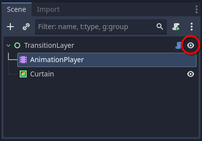

- Click on the *Animation* tab in the Bottom Panel at the bottom of the screen.

    

- Click on *Animation -> Manage Animations* in the Animation Bottom Panel.

    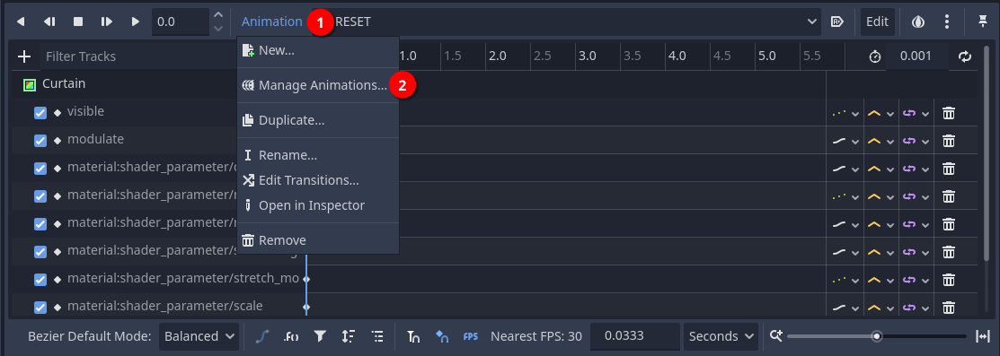

- If you don't have a custom library, we recommend creating one so that you can easily save your custom transitions in bulk in a resource for backup. Click on *New Library* and enter the name for your custom library.

    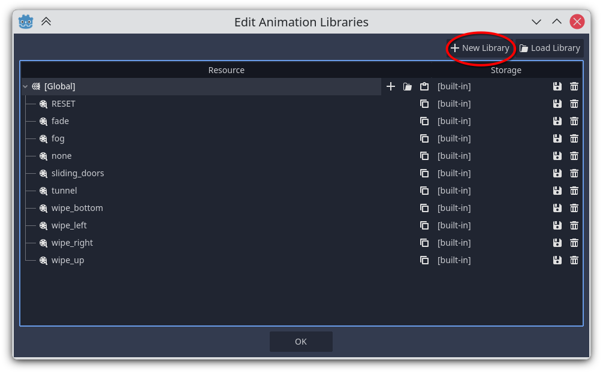

    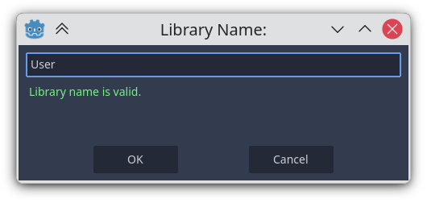

- Now click on the **+** (plus) icon to add a new animation name to your library.

    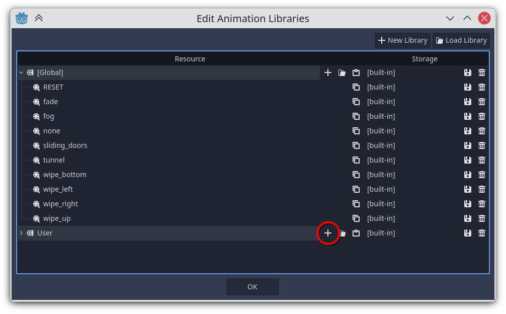

    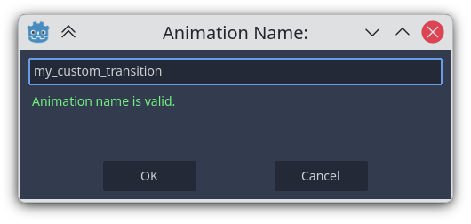

- Go back to the *Animation Panel*. Now you should see the animation you've just created in the animation list. Select it.

    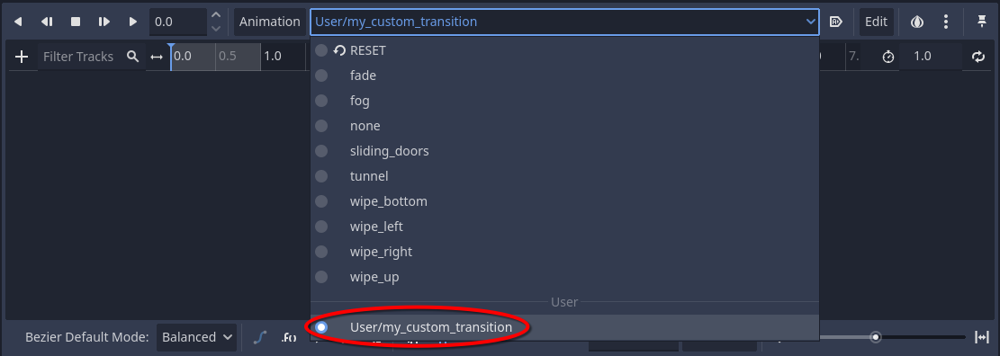

- You need to populate the animation tracks. To do so, click on the Curtain node in the Transition Layer scene.
- Scroll down to the *Material* section in the inspector, click on *Material* (3) and on *ShaderMaterial* (4), so that you can see the shader parameters. Next to every shader parameter you should see a key-shaped button (if you don't see it, click on the *Animation* tab in the bottom panel).

    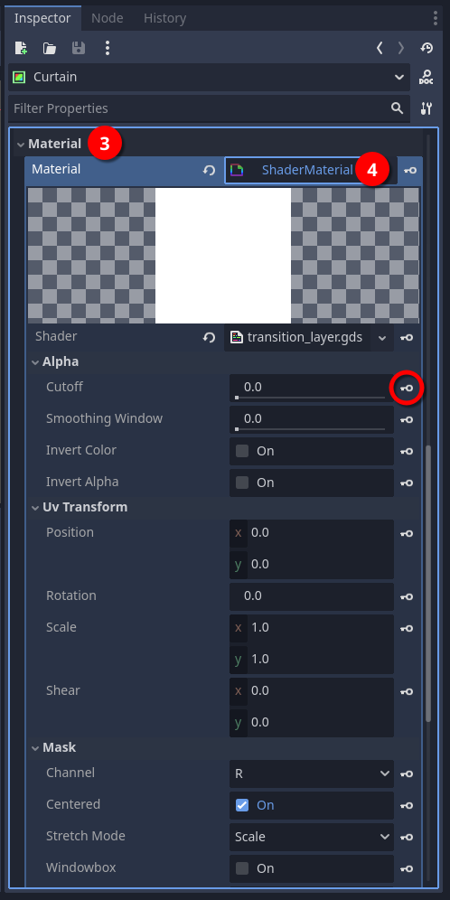

- Clicking on that key button adds a property track to the animation you opened earlier in the Animation Panel.
- Every time you add a property track to an animation, you'll be asked if you want to add that property to the `RESET` track. It's advisable to do that.
- You need to set an initial and, if needed, a final value for the property based on what you want to achieve. The two most common shader parameters you'll find yourself using in property tracks are:
  - *Mask*: this selects the texture (5). Always key the Mask at time 0s, even if you don’t animate it, so the correct texture is guaranteed at playback start.
  - *Cutoff*: this manages a transparency threshold and should most likely have an initial and final value to be interpolated over time (6). Most likely, you'll want this property *Update Mode* set to *Continuous* (9).
- Additionally, for testing purposes, you can add the following *Curtain* properties:
  - *Visible*: set the initial and final value to `true` (7).
  - *Modulate*: set the initial and final value to the desired color (8).

    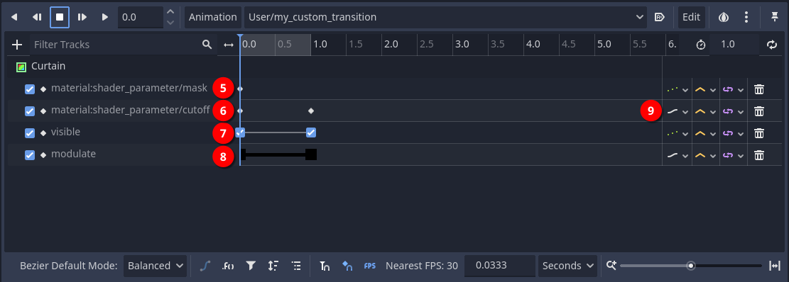

### An Example

We're going to create a custom transition with this [texture](https://store.kde.org/p/1675120).

We're assuming you've already created your custom library according to the general procedure described earlier (not strictly necessary, but recommended).

Let's add a new animation named `horizontal_paint_brush_wipe_in` with a duration of 2s.

Now we are going to add the necessary property tracks to the animation. To do that, we need to key the following shader parameters:

- *Cutoff*: let's add an initial value equal to the minimum possible value. Then we duplicate the key, move it to the final time and set it to the maximum possible value. Make sure the *Update Mode* is set to *Continuous*.

    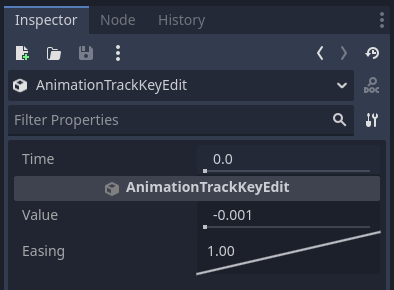
    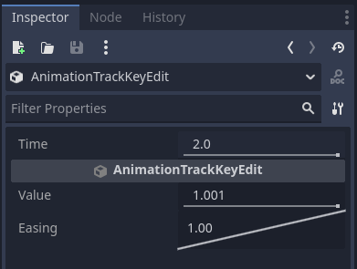

- *Mask*: let's add an initial value by selecting the desired texture. The final value is not necessary unless you plan to play the animation in reverse.

    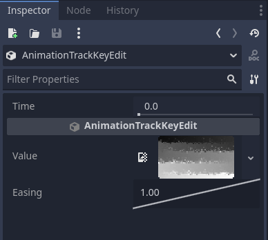

And, for testing purposes, we add the following Curtain properties:

- *Visible*: set the initial and final value to `true`.
- *Modulate*: set the initial and final value to the desired color.

    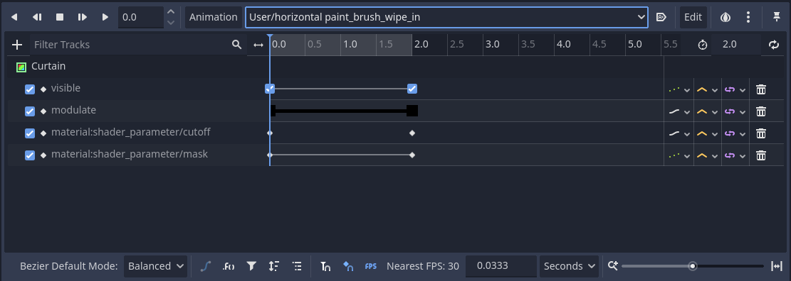

Now we can hit *Play* and see what happens. You should see horizontal brush strokes revealing the scene, proceeding in a zig-zag pattern from the top left corner to the bottom right corner.

Suppose now you want a fade-out transition based on the one we've just created. Playing the transition in reverse won't do the trick, as the strokes will start at the bottom right corner.

To achieve our goal let's duplicate the animation and rename it to `horizontal_paint_brush_wipe_out`.

Then:

- add the *Invert Color* property track to it and set the initial value to `true`.
- Invert the initial and final *Cutoff* values.

    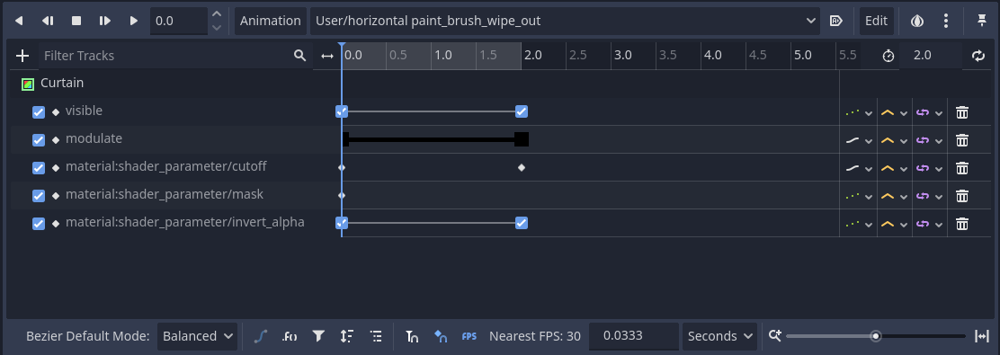

Now we can hit *Play* and see what happens. You should see horizontal brush strokes hiding the scene, proceeding in a zig-zag pattern from the top left corner to the bottom right corner.

### Common Pitfalls

While testing animations in the editor:

- Toggling a property track on and off does not reset the value of that property. To make sure the value is properly reset, you can either play the `RESET` track or manually reset the value in the inspector.
- If you press the play button and you can't see anything happening, make sure the *TransitionLayer* node and the *Curtain* node have their visibility toggled on in the scene tree.

While in game:

- if a transition works fine in the editor, but behaves weirdly in game, check if you have the *Modulate* and/or *Visible* property tracks enabled in the animation. If that's the case, disable those tracks.

Before using your transition in-game, follow this final checklist:

- Remove or disable *Visible* and *Modulate* tracks, unless you want it that way.
- Make sure the texture specified in the *Mask* parameter is actually loaded.
- Verify *Cutoff* animates from the minimum desired value to the maximum desired value for fade-in (or the opposite for fade-out).
- Optionally save your animation library as a .tres file.
- Test the transition in a real scene change.

## The Transition Layer Shader in Detail

The shader is divided into sections to make it easy to parametrize.

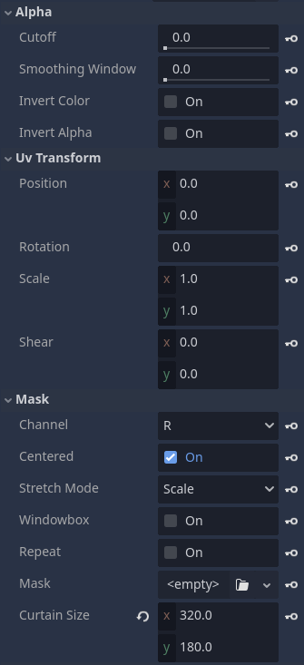

### Alpha Section

In this section, you can adjust how the texture color values are managed. The shader uses the texture color values of the selected [channel](#channel) as alpha values. Color values are normalized in the `[0; 1]` range.

- **Cutoff**: this is the opacity cutoff threshold. It's a [step](https://docs.godotengine.org/en/stable/tutorials/shaders/shader_reference/shader_functions.html#shader-func-step) function: every value below the cutoff threshold becomes `0` (full transparency) while every value above the cutoff threshold becomes `1` (full opacity). Caveat: due to the way the cutoff works, in order to ensure complete transparency, you need to go slightly above `1`.
- **Smoothing Window**: this applies a [smoothstep](https://en.wikipedia.org/wiki/Smoothstep) to the cutoff threshold. Every value in the range between the cutoff threshold and the cutoff threshold plus the smoothing window gets interpolated between `0` and `1`. Values outside that range either become `0` if they lie below the range or `1` if they lie above the range. So, if Smoothing Window = `0`, the transition is hard-edged (binary alpha). A small value (e.g., `0.05`) creates soft edges.
- **Invert Color**: this turns the texture into its negative (`color = 1 - color`).
- **Invert Alpha**: opacity becomes transparency and vice versa (`alpha = 1 - alpha`).

### UV Transform Section

In this section, you can adjust the 2D transformations for the texture. The texture coordinates are normalized UV coordinates, with the top-left corner being at `(0, 0)` and the bottom-right corner being at `(1, 1)`.

- **Position**: shifts the texture origin.
- **Rotation**: rotates the texture by the specified amount in degrees.
- **Scale**: scales (uniformly or non-uniformly) the texture. You can easily flip the texture horizontally or vertically by using a value of `-1.0` in the x or y coordinates.
- **Shear**: [shear](https://en.wikipedia.org/wiki/Shear_mapping) deformation.

### Mask Section

In this section, you can adjust the texture parameters.

- **Channel**: this selects which texture channel will be used: `R` (default), `G`, `B`, `A`. This way, you can even pack multiple textures in a single file in separate channels.
- **Centered**: this moves the texture to the center of the curtain, otherwise the texture will be placed in the top left corner.
- **Stretch Mode**: this tells the shader how the texture will be adapted to the curtain size. Available modes:
  - `Scale`: scale to fit the curtain.
  - `Keep Aspect`: scale the texture to fit the curtain, but maintain the texture's aspect ratio.
  - `Keep Aspect Covered`: scale the texture so that the shorter side fits the curtain. The other side clips to the curtain's limits.
- **Window Box**: this enables/disables the [windowboxing](https://en.wikipedia.org/wiki/Windowbox_(filmmaking)) ([pillarboxing](https://en.wikipedia.org/wiki/Pillarbox) and [letterboxing](https://en.wikipedia.org/wiki/Letterboxing_(filming))) for the texture.
- **Repeat**: this enables/disables texture tiling to fill the curtain.
- **Mask**: this is the texture that will be used in the transition. The most useful types are:
  - [`CompressedTexture2D`](https://docs.godotengine.org/en/stable/classes/class_compressedtexture2d.html): a custom texture file.
  - [`GradientTexture1D`](https://docs.godotengine.org/en/stable/classes/class_gradienttexture1d.html): a 1D gradient resource generated with Godot. This could be useful if you need 1D patterns (e.g., for wipe kind of transitions).
  - [`GradientTexture2D`](https://docs.godotengine.org/en/stable/classes/class_gradienttexture2d.html): a 2D gradient resource generated with Godot. This could be useful if you need 2D patterns.
  - [`CurveTexture`](https://docs.godotengine.org/en/stable/classes/class_curvetexture.html): a curve resource generated with Godot. This could be used instead of `GradientTexture1D`.
  - [`NoiseTexture2D`](https://docs.godotengine.org/en/stable/classes/class_noisetexture2d.html): a noise texture resource generated with Godot.
- **Curtain Size**: this parameter should be ignored as it is automatically populated by the engine. You can alter the values for testing purposes during editing.

## Useful Resources

Besides creating textures by yourself, you can find ready-made textures for custom luma fade transitions here:

- [Luma files for video transitions in Shotcut and other video editors](https://github.com/Jonray1/Luma-files-for-video-transitions-in-Shotcut-and-other-video-editors)
- [Kdenlive Lumas](https://store.kde.org/browse?cat=185&ord=latest)
