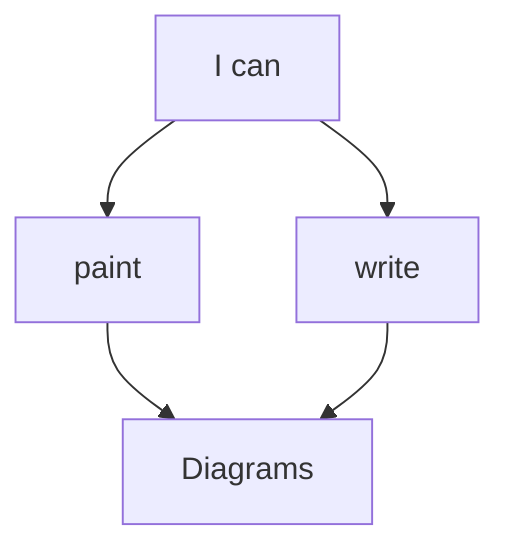

# Contributing documentation

Contributing to Popochiu's documentation is as important as contributing to the codebase itself. An accessible, clear, well-maintained and up-to-date documentation eenables game makers can make the most out of the project. If you are not so much into code (or even if you are) you can give back to the project by helping us with this vital aspect of Popochiu.

The documentation maintainer is **@stickgrinder**.

## Basic rules

1. **Tools**: Take the time to get familiar with [MkDocs](https://www.mkdocs.org/) and Markdown format.
2. **Language**: Documentation must be written in clear and grammatically decent English.
3. **Tone**: Maintain an informal but clear and accessible tone. Humor is great, but avoid unnecessary jokes or digressions.
4. **Respectfulness**: Content and examples must be respectful and appropriate for all audiences (keep it safe for both family and work).
5. **Use of AI Tools**: While LLMs can be used for grammar checking, improving phrasing or generating examples, they must **never** be used to generate or expand content from scratch. Also, the contributor must **always** check the generated content and make sure it's fit for purpose.

## Previewing the documentation locally

To contribute to the documentation, the first essential step is to make sure you can preview your changes locally. A Docker-based environment is available for this purpose. This setup allows you to test your changes in real-time and ensures the output matches what will be published.

For instructions on setting up the local preview environment, refer to the specific [Run the documentation locally](../toolchain-and-dependecies#run-the-documentation-locally) section.

!!! note
    If you're not familiar with Docker and have never installed it before, this step may seem like a bit of a pain, but trust us: it's a _do once and forget_ process and it will make everything easier.

## When to Contribute to Documentation

Documentation contributions are critical whenever:

1. A **new feature** is developed.
2. The **public interface** of an existing feature is modified, including GUI changes in the plugin or public methods in the engine.

The rule of thumb is that, if you add or change something that game developers will have to know, than you have to document it!

!!! tip "Documenting the Engine API"
    Documenting Engine API elements like functions, signals, and variables is often as simple as adding a well formatted and complete [documentation comment](../conventions#code-documentation-comments) to your public code. Of course, from time to time, it may require some more work, like updating an existing guide or tutorial.

!!! tip "Updating visual assets"
    When the editor interface changes or get some new feature, screenshots or other visuals may need to be updated.  
    Taking consistent screenshots is a tough job: we recommend using the **Popochiu Sample Game**. Clone the repo and update the `addons/popochiu` folder with your changes.

    Remember to annotate the screenshots if it adds to clarity and readability of your explanation. If possible use Godot dark theme and red annotations for consistency.

## Understanding Documentation Types

Before you start writing, it's important to understand what type of documentation you’re contributing to. Popochiu’s documentation broadly follows the categories defined by the [Diátaxis framework](https://diataxis.fr/), by which content fall into one of four types (each with a specific _user's main goal_ in brackets):

- **Tutorials**: Step-by-step guides that show how stuff work (**learning**)
- **How-to Guides**: Focused, task-oriented instructions to achieve a certain goal . think recipes (**achieving a goal**).  
- **Explanations**: Conceptual overviews and background information (main goal: **understanding**)
- **Reference**: Well-organized list of techical details and descriptions (main goal: **finding information**)

### Documentation Sections and Content Types

Each section in Popochiu's documentation aligns with a type from the Diátaxis framework. Here's a quick overview:

| **Section**              | **Content types**        | **Purpose**                                                                                                               |
|--------------------------|--------------------------|---------------------------------------------------------------------------------------------------------------------------|
| Getting Started          | Tutorials, Explanations  | Provides the basics for installing Popochiu, taking first steps, and joining the community.                               |
| The Editor Handbook      | References, Tutorials    | Showcases the functionality of the Popochiu plugin, explains how it works, and serves as a go-to guide for its use.       |
| The Engine Handbook      | References, Explanations | Explains the plugin's architecture and provides a comprehensive API reference for game developers.                        |
| How to Develop a Game    | Tutorials, How-To        | Guides users through setting up their first game, learning by doing, and building confidence to explore advanced features. |
| Advanced Techniques      | Tutorials, How-To        | Offers in-depth guides and practical examples for getting the most out of Popochiu (and beyond).                          |
| Contributing to Popochiu | Explanations, References | Provides all the information contributors need to get involved in Popochiu development.                                    |

If you add new stuff, make sure you put in in the right place. If in doubt, reach out for **@stickgrinder**.

## Contributing to missing documentation

Some areas of the documentation are marked as **TODO**. If you think you know how to complete them (yay!):

1. Draft an outline for the missing content.
2. Commit the outline and open a draft PR.
3. Assign **@stickgrinder** as a reviewer.
4. Incorporate feedback and proceed with the full write-up.

If you can't - or don't want to incorporate all the feedback (for example if we ask you to expand the docs too much and you are unable to provide all the necessary work), we can still cooperate to complete it together.

## Conventions

When working on the documentation, please follow these conventions:

### Markdown Coding Standards

Refer to the [Conventions](../conventions#markdown-code) section for guidelines on the Markdown coding standards that we use.

MkDocs use front-matter to add metadata to pages. We use it to sort the pages order, and to hide index pages away from the sections (so that they don't have a front page themselves).

Trailing whitespace is allowed only to add a newline (`<br>`) tag in a paragraph. No whitespace characters on empty lines. All files must end with a newline.

### Markdown extensions

The documentation uses several Markdown extensions for enhanced functionality. Find an overview below:

#### Admontions

Used to create highlight boxes of specific types, for important information. Valid types are: `note`, `info`, `tip`, `warning`, `danger` and `success`. They support custom titles and formatting.

```markdown
!!! tip "Make your info stand out!"
    Indent with two tabs and **use formatting** for style galore!

    * Empty lines are supported (indent on the new line!)
    * Lists are there as well
    * _You_ **can** do what you want!
```

becomes

!!! tip "Make your info stand out!"
    Indent with two tabs and **use formatting** for style galore!

    * Empty lines are supported (indent on the new line!)
    * Lists are there as well
    * _You_ **can** do what you want!

#### Attributes list

This allows to add HTML attributes like id or classes to parts of your Markdown, without littering it with hard-to-read HTML tags.

We use it for _fanced codeblocks_, to add a color code to them:

`````markdown
```{.gdscript .code-example-bad}
print("I'm a bad boy!")
```

```{.gdscript .code-example-good}
print("I'm a good one!")
```
`````

becomes

```{.gdscript .code-example-bad}
print("I'm a bad boy!")
```

```{.gdscript .code-example-good}
print("I'm a good one!")
```

#### FontAwesome support

You can print FontAwesome icons in your text in a markdown-ish format:

```markdown
I :fa-heart: coffee in large :fa-mug-hot:
```

becomes

I :fa-heart: coffee in large :fa-mug-hot:

#### Definition lists

Another way to avoid HTML in source code, this extension allows the creation of `<dl>` tags from simpler markdown:

```markdown
**This is a term or question**
: This is it's definition or answer.  
Multiple lines are supported (notice the double space in the line above, to create a newline character)

**Can I do more?**
: Sure, you are supposed to!
```

becomes

**This is a term or question**
: This is it's definition or answer.  
Multiple lines are supported (notice the double space in the line above, to create a newline character)

**Can I do more?**
: Sure, you are supposed to!

#### Mermaid diagrams

We support all types of [Mermaid charts](https://mermaid.js.org/intro/) by using simple fenced codeblocks:

`````markdown

`````

becomes


### File naming and page titles

When naming Markdown files and directories, clarity is key. Names should follow a "slug format" that corresponds to the page's title, such as `new-section/my-awesome-tutorial.md`. Always use hyphens, never underscores!

To comply with Markdown formatting and ensure proper integration with MkDocs, the first element of each page **must** be a first-level header (`#`), reflecting the page's title. For example:

```markdown
# My Awesome Tutorial
```

This header will be used by MkDocs as the sidebar menu title for that page, overriding the file name.

In certain cases, the file name may differ from the page title for simplicity, as long as the relationship between the two remains clear. For instance, the file named `qna.md` has the title `Contributions Q&A` as its first header.

### Images and assets naming conventions

Images that appear in the documentation pages must be placed in the `docs/src/assets/images` folder, keeping them into a subfolder named as the main category they belong.

Each file (prefer PNG over JPG when possible), must be named accordin to this format: `subsection_name-sorting_number-brief_description.png`.

This will ensure that we have them all grouped in a file browser, and we can always track them back to the section they belong to.

### Sorting pages and sections

Every page must include a **front-matter block** to specify its weight and determine its position in the documentation hierarchy:

```yaml
---
weight: XXXX
---
```

The weight is always at least a four-digit number:

- **Thousands** represent the section's weight (we may end up having tens of thousands, if we exceed ten main sections).
- **Hundreds** are used for subsections, if any.
- **Tens** determine the order of pages within the section.
- **Units** are reserved for fine adjustments, such as inserting new pages between existing ones using a dichotomic approach.

For example, if you need to add a page between `7070` and `7080`, use `7075`. This leaves room for future additions like `7073` or `7077`. Although changing weights later is possible (and sometimes required), it implies updating all adjacent pages to maintain the proper order.

Take a look to how other sections of the documentation are organized and copy from them.

Sorting sections require to create an empty `index.md` for them and use something like this in its front-matter.

```yaml
---
weight: X000
empty: true
---
```

Only the thousands digit must be populated, so the section will always appear on top of their subsections and content.  
In addition, the `empty` attribute must **always** be `true` so that the section has no page by itself and opens to show its subsection.

As explained, the only purpose of this index file is to sort the sections in the navigation bar.

### Page lenght and menu depth

Long pages with lots of paragraphs should be broken down into subsections. This makes them easier to find (by navigating the side menu) and to digest.

There are exceptions to the rule, like large portions of an already-sliced tutorial. Use your own judgement or ask for maintainers' feedback when in doubt.
