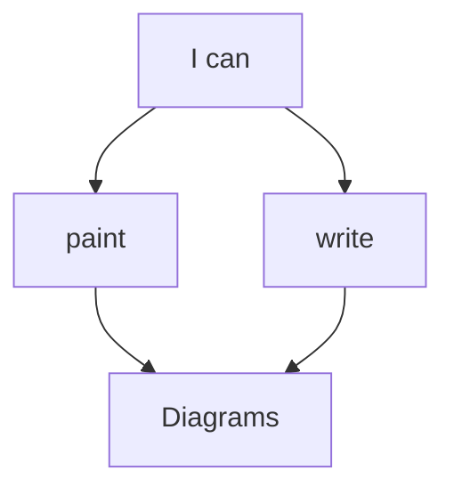

# Conventions

When working on the documentation, please follow these conventions:

## Markdown Coding Standards

Refer to the [Conventions](../../conventions/coding-standards#markdown-code) section for guidelines on the Markdown coding standards that we use.

MkDocs use front-matter to add metadata to pages. We use it to sort the pages order, and to hide index pages away from the sections (so that they don't have a front page themselves).

Trailing whitespace is allowed only to add a newline (`<br>`) tag in a paragraph. No whitespace characters on empty lines. All files must end with a newline.

---

## Markdown styleguide

To maintain consistency and clarity in our documentation, please adhere to the following style conventions:

- Use double asterisks for **bold text** (e.g., `**bold**`).
- Use underscores for _italic text_ (e.g., `_italic_`, not `*italic*`).
- When referring to numbered markers in screenshots, follow the format `(_<marker_number>_)` (e.g., `(_1_)`, `(_2_)`, `(_32_)`).
- Always link **Godot classes and nodes** to the [official documentation](https://docs.godotengine.org/). For example: [Sprite2D](https://docs.godotengine.org/en/stable/classes/class_sprite2d.html).
- Write class names, functions, variables, file paths, and file names using inline code blocks (e.g., `path/to/file.gd`, `PopochiuCharacter`, `say()`).
- Node names in a scene should always be written in **bold** (e.g., **WalkableAreas**) and, when appropriate, can also be links - always in bold.
- For template code snippets that contain variable elements, enclose the variable part in `<` and `>` markers (e.g., `Popochiu<CharacterName>`). Use the appropriate naming convention for the context (e.g., PascalCase, snake_case, etc).
- Code examples should always be placed in fenced code blocks, specifying the language for syntax highlighting when possible.
- Monospaced text should be placed in fenced code blocks with the `text` or `plaintext` language specified to neutralize the syntax highlighter.
- Emphasis (`_`) can be used freely and is generally preferred over quotation marks for titles or proper names (e.g., `_Day of the Tentacle_` rather than "Day of the Tentacle"), though this is not a strict rule.

---

## Markdown extensions

The documentation uses several Markdown extensions for enhanced functionality. Find an overview below:

### Admontions

Used to create highlight boxes of specific types, for important information. Valid types are: `note`, `info`, `tip`, `warning`, `danger` and `success`. They support custom titles and formatting.

```markdown
!!! tip "Make your info stand out!"
    Indent with two tabs and **use formatting** for style galore!

    * Empty lines are supported (indent on the new line!)
    * Lists are there as well
    * _You_ **can** do what you want!
```

becomes

!!! tip "Make your info stand out!"
    Indent with two tabs and **use formatting** for style galore!

    * Empty lines are supported (indent on the new line!)
    * Lists are there as well
    * _You_ **can** do what you want!

### Attributes list

This allows to add HTML attributes like id or classes to parts of your Markdown, without littering it with hard-to-read HTML tags.

We use it for _fanced codeblocks_, to add a color code to them:

`````markdown
```{.gdscript .code-example-bad}
print("I'm a bad boy!")
```

```{.gdscript .code-example-good}
print("I'm a good one!")
```
`````

becomes

```{.gdscript .code-example-bad}
print("I'm a bad boy!")
```

```{.gdscript .code-example-good}
print("I'm a good one!")
```

### FontAwesome support

You can print FontAwesome icons in your text in a markdown-ish format:

```markdown
I :fa-heart: coffee in large :fa-mug-hot:
```

becomes

I :fa-heart: coffee in large :fa-mug-hot:

### Definition lists

Another way to avoid HTML in source code, this extension allows the creation of `<dl>` tags from simpler markdown:

```markdown
**This is a term or question**
: This is it's definition or answer.  
Multiple lines are supported (notice the double space in the line above, to create a newline character)

**Can I do more?**
: Sure, you are supposed to!
```

becomes

**This is a term or question**
: This is it's definition or answer.  
Multiple lines are supported (notice the double space in the line above, to create a newline character)

**Can I do more?**
: Sure, you are supposed to!

#### Mermaid diagrams

We support all types of [Mermaid charts](https://mermaid.js.org/intro/) by using simple fenced codeblocks:

`````markdown

`````

becomes


---

## File naming and page titles

When naming Markdown files and directories, clarity is key. Names should follow a "slug format" that corresponds to the page's title, such as `new-section/my-awesome-tutorial.md`. Always use hyphens, never underscores!

To comply with Markdown formatting and ensure proper integration with MkDocs, the first element of each page **must** be a first-level header (`#`), reflecting the page's title. For example:

```markdown
# My Awesome Tutorial
```

This header will be used by MkDocs as the sidebar menu title for that page, overriding the file name.

In certain cases, the file name may differ from the page title for simplicity, as long as the relationship between the two remains clear. For instance, the file named `qna.md` has the title `Contributions Q&A` as its first header.

---

## Images and assets naming conventions

Images that appear in the documentation pages must be placed in the `docs/src/assets/images` folder, keeping them into a subfolder named as the main category they belong.

Each file (prefer PNG over JPG when possible), must be named accordin to this format: `subsection_name-sorting_number-brief_description.png`.

This will ensure that we have them all grouped in a file browser, and we can always track them back to the section they belong to.

---

## Sorting pages and sections

Every page must include a **front-matter block** to specify its weight and determine its position in the documentation hierarchy:

```yaml
---
weight: XXXX
---
```

The weight is always at least a four-digit number:

- **Thousands** represent the section's weight (we may end up having tens of thousands, if we exceed ten main sections).
- **Hundreds** are used for subsections, if any.
- **Tens** determine the order of pages within the section.
- **Units** are reserved for fine adjustments, such as inserting new pages between existing ones using a dichotomic approach.

For example, if you need to add a page between `7070` and `7080`, use `7075`. This leaves room for future additions like `7073` or `7077`. Although changing weights later is possible (and sometimes required), it implies updating all adjacent pages to maintain the proper order.

Take a look to how other sections of the documentation are organized and copy from them.

Sorting sections require to create an empty `index.md` for them and use something like this in its front-matter.

```yaml
---
weight: X000
empty: true
---
```

Only the thousands digit must be populated, so the section will always appear on top of their subsections and content.  
In addition, the `empty` attribute must **always** be `true` so that the section has no page by itself and opens to show its subsection.

As explained, the only purpose of this index file is to sort the sections in the navigation bar.

---

## Page lenght and menu depth

Long pages with lots of paragraphs should be broken down into subsections. This makes them easier to find (by navigating the side menu) and to digest.

There are exceptions to the rule, like large portions of an already-sliced tutorial. Use your own judgement or ask for maintainers' feedback when in doubt.
