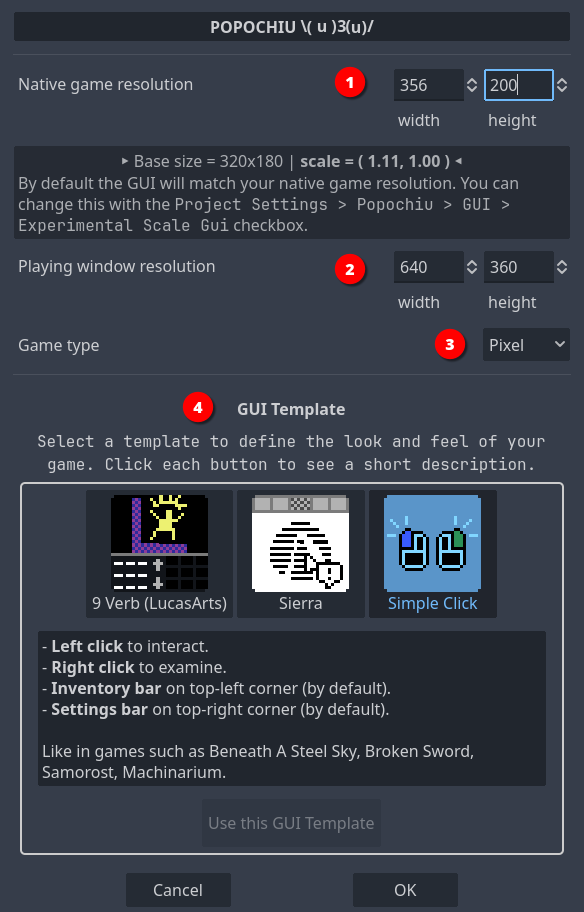
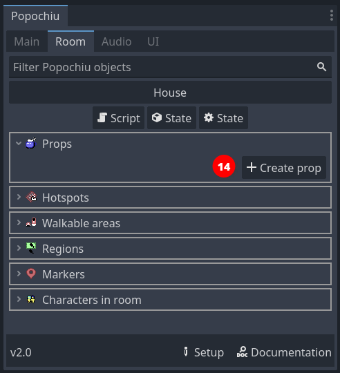
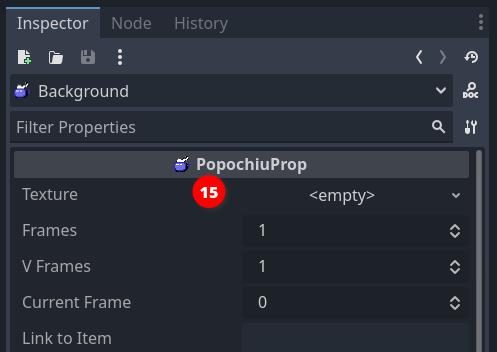
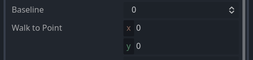
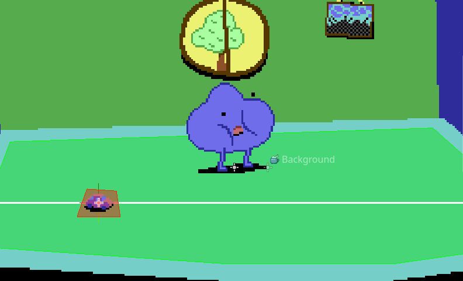
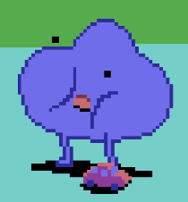
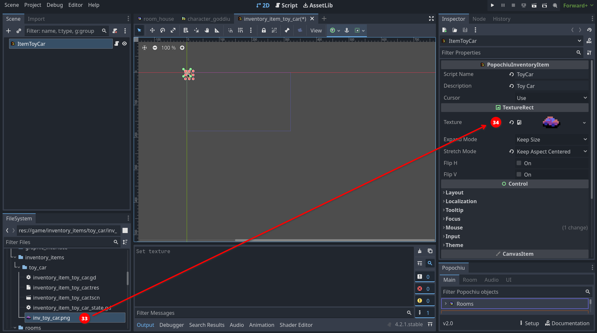

# Creating a game stub

This page will guide you through the process of creating a very small stub for a game.

You will set up a quick game with a single location, a couple of interacting characters and items, plus dialogs and inventory.

You can use the resulting stub to experiment and tinker as you read the documentation. If you are already familiar with Popochiu and have already created your project, you can jump to the [Tutorials](/getting-started/tutorials) section to learn more about more advanced features.

!!! info
    If you are moving your first steps in Adventure Games development, or just evaluating if Popochiu is for you, you may want to download the [Example Game Assets [Pack](/getting-started/example-resources#example-assets), which contains all the assets used in this tutorial.

    If you just want to tinker with Popochiu or experiment on a throw-away project, you can just clone the [Example Game](/getting-started/example-resources#example-game), that's already complete and ready to run.

## Table of contents

!!! warning
    To follow this introductory guide you must have already created a new Godot project and [installed Popochiu](/getting-started/installing-popochiu).  

To create our game stub we will:

- [Game setup](#game-setup)
    - [Set game resolution](#set-game-resolution)
    - [Select game GUI](#select-game-gui)
- [Create characters](#create-characters)
    - [Add another character](#add-another-character)
    - [Select the main character](#select-the-main-character)
- [Create the first room](#create-the-first-room)
    - [Add a Walkable Area](#add-a-walkable-area)
    - [Add a hotspot](#add-a-hotspot)
    - [Scripting our first interaction](#scripting-our-first-interaction)
    - [Add a prop](#add-a-prop)
- [Add an inventory item](#add-an-inventory-item)
- [Script your first dialogue](#script-your-first-dialogue)
    - [Script a dialog](#script-a-dialog)
- [Use inventory items](#use-inventory-items)
- [Conclusions](#conclusions)
- [Homeworks](#homeworks)
    - [Add a prop and an inventory item](#add-a-prop-and-an-inventory-item)
    - [Prevent losing the key](#prevent-losing-the-key)
    - [Solve a problem with the implemented dialog](#solve-a-problem-with-the-implemented-dialog)
- [What's next](#whats-next)

There is more to Popochiu, but this will showcase the fundamental building blocks of how the engine works.

Let's start!

## Game setup

When you first start your project, you are greeted with the **Setup** popup, where you can define the base parameters of your game.



Using this window will take care of configuring Godot project with a coherent preset of parameters so that your game looks good in all situations.  
Also, it will preconfigure the Game User Interface (GUI) of your choice, so that you don't have to.

### Set game resolution

The **Native game resolution** (_1_) is the actual resolution of your assets (i.e. background). This resolution will be scaled up or down to match the actual display resolution (see below). Usually, you want to set this to the size of a full-game background that fills the entire "screen".

For example, if you plan to create a retro-vibes pixel-art adventure game like the early ones by Sierra or LucasArts, you may want to keep this resolution down to `320x200`, which was the native resolution of VGA displays back then.  
If you want to create a high-res game like the modern Deponia series, with beautifully painted art, you may want to bring this up to `1920x1080`, which is a modern Full-HD display resolution.

!!! tip
    If you plan to develop a pixel-art game for widescreen displays, these are common resolutions that can work on a modern PC:

    * `320x180`: vertically very small, good to emulate pioneering 80s games like Sierra's _King's Quest_ or similar.
    * `356x200`: more vertical space, this is a "widescreen" version of the 320x200 that games like _The Secret of Monkey Island_ or _King's Quest V_ had on an IBM PC or Amiga, back then.
    * `384x216`: there were no games back then featuring this resolution, but it can be used if you want to have a bit more vertical space for higher sprites or to accommodate a bulky interface like the 9-verbs one, without ruining the _retro-vibe_.

Some prefer not to play adventure games in full-screen so, once you've set the native resolution for your game, you may use the **Playing window resolution** (_2_) values to set the size your game will have when played in windowed mode. For low-res games, you want to provide a larger window than the native resolution, or on most modern displays, it will be very tiny.  

!!! note
    The provided default is a good fit for most Full-HD displays, and the player will be able to resize the window anyway. Probably it's worth adjusting the window size only if you know your game will be played in specific contexts.

Finally, the **Game type** (_3_) select box will set a bunch of project settings that are better kept coherent, from sprite importing to scaling algorithms, etc. The options are:

* **Custom**: This does nothing, leaving all the settings to the developer.
**2D**: Choose this for high-res games, that may benefit from anti-aliasing when scaled up or down.
**Pixel**: Choose this for low-res and pixel-art games, so that your graphics remain crisp when scaled up or down.

!!! info "Under the hood"
    For the more technical readers, what the **Game type** options do is preconfigure the **Stretch mode** to `canvas_item` and **Stretch aspect** to `keep` for you. The `Pixel` mode also sets textures using the `Nearest` filter, so that no anti-alias or blurring happens when the game is scaled.

!!! note
    Nowadays there are so many different display aspect ratios, that making assumptions about how your game will be played is futile. Nonetheless, the vast majority of devices out there (mobile or PCs) have displays close enough to `16:9` that you will probably end up keeping this ratio into consideration. That's the reason why Popochiu default values are set to `320x180`: it is an old-style resolution, with the aspect ratio of a modern display.

### Select game GUI

Since version 2.0, Popochiu comes with a preset of different GUI templates, and a set of features to create your own custom one.  
GUI templates will contain everything you need, from assets to logic, to mimic one of the most common game interfaces of the Adventure genre.

In the **GUI Template** (_4_) section of the Setup popup, you can click on a GUI icon to select which template to apply:

* **Custom**: select this if you want to create your GUI. That's the "No template, please" option.
* **9 Verbs**: inspired by the original SCUMM interface, first seen in _Monkey Island 2: LeChuck's Revenge_.
* **Sierra**: inspired by the early 90s SCI interface, common to _King's Quest_ and _Space Quest_ games in the early 90s.
* **2-Click Context-sensitive**: the most basic interface for an Adventure Game, common to many modern titles like _Deponia_ - left-click to walk and interact, right-click to examine.

!!! warning
    You can change your mind and apply a different template later during the development of your game, but mind that doing this will **replace** your GUI (and all the custom logic or graphics) with a new template.

    Also, keep in mind that some GUIs will take up space on the screen (like the 9 Verbs one), and this will impact your backgrounds.

!!! note
    You can go back and review your game setup choices at any moment, by clicking the "Setup" button at the bottom of the [Popochiu Main Dock](#TODO).

    

## Create characters

Characters are one of the basic elements of Popochiu, being the bread and butter of every adventure game.

Let's start creating the player character. In the Popochiu main dock, click the **Create character** button (_1_).


A popup will appear, asking for the character name. This is the machine name of your character, not the one the player will see ingame, and it needs to be written in `PascalCase` (no spaces or punctuation and all capitalized words).  
Once you entered the name, click the **OK** button (_2_).


As you can see the editor is giving you a preview of the files and assets that will be created. If everything went well, your editor should look like this now:


The new character appears in the main dock list (_3_) and the related scene is open in the editor (_4_).

Now click on the scene's root node (it should be named `Character<YourCharacterName>`) to access the character's properties in the inspector:


Set the **Flips when** parameter (_5_) to `Looking Left`, and leave the rest untouched.

!!! warning
    The suggested value is based on the example sprite direction (right). If you are using a self-made sprite for your character and it's facing left, you should set this property to `Looking right` instead.

The character scene shows nothing. That's because we've set no sprite for our character. Popochiu characters support a full set of standard and custom animations, but since we are only stubbing the game, we'll just set a static sprite for now.

If you don't have a sprite sheet ready for your character, you can download [this one](https://github.com/carenalgas/popochiu-sample-game/blob/16fc323f1c63388e6b97a30d678aa71e6e1d9db9/game/characters/goddiu/goddiu.png) from the demo game.  
Save it into your project, in the `game/characters/<your character name>/` folder, and rename it as you see fit.

!!! tip
    You can save the spritesheet anywhere in your project, but keeping it in the Character folder makes the project structure more tidy and maintainable. You may want to create subfolders to organize assets, but we strongly advise starting simple and reorganizing only when it's necessary.

To set the character sprite, go back to your editor and select the **Sprite2D** node in your character's scene (_6_), then locate your sprite sheet filename in your file manager (_7_). Select and drag it to the **Texture** property in the inspector (_8_).


You can see from the screenshot that the entire image is now visible in the Character scene. Of course, we want to select just a single sprite from the sprite sheet. For that, head to the **Animation** section in the inspector and set **Hframes** and **Vframes** values to match the number of sprites in the sprite sheet, like this (_9_):


Now the sprite on the scene should be OK, showing your character in the standing position. We just miss a little change to make things work as intended: when a new character is created, its sprite is centered on the scene origin:


This is a problem because the scene origin point is the one that the engine will check to understand if the character is still inside a walking area, or if it reached a certain position when moving around the scene. In short, the scene origin should be where the character's feet are.  
Fixing this is as simple as selecting the **Sprite2D** node in the character scene (_10_), and moving it so that the origin is in between the two feet, like in the image below.


!!! tip "Tips for great character sprite positioning"
    Most game characters' idle position is depicted in a three-quarter view. In this type of shot, the foot facing the camera will be slightly lower than the foot pointing to the side of the sprite (look at Goddiu above). To achieve perfect results when positioning your sprite, you should position the side-facing foot on the zero line, and the camera-facing foot toe should be a bit lower.

    In the case of floating characters (ghosts, fairies, anti-gravity-powered mad scientists, etc), you should leave some vertical space between the scene's center and your character. Try to envision the scene line as the "floor" and decide how high above the floor the character should float.

The last thing to do is to position the place where the dialog text will be shown for the talking character. Popochiu can be customized to show dialog lines in many different positions or fashions, but its default is to show the dialogue lines somewhere above the character's head. Since the engine doesn't know how high your sprite is (see "Under the hood" note below), that's for you to decide.

Just select the **DialogPos** node in the scene tree (_11_). A small cross will be highlighted in the scene's origin. Drag it somewhere above the character's head (or wherever makes sense to you).


This may require a bit of experimentation, but for now, this will do.

!!! info "Under the hood"
    You may be wondering how exactly the text is positioned in relation to the **DialogPos** node. Here is an explanation of how Popochiu decides how your text is rendered.

    1. The baseline of the text will always match the vertical position of **DialogPos**, so the text will be rendered vertically **right above** that point.
    2. The dialog line length is calculated and the text is centered on the horizontal position of **DialogPos**, so the text will be rendered horizontally **around** that point.
    3. If the text spans multiple lines, Popochiu will expand it **towards the top**, so that it doesn't cover your character (this means if you want your text under the character for some reason, multiple lines will cover your character).
    4. If the character is near the window or screen border, the text will be repositioned so that it will be entirely visible, so you don't have to worry about it becoming unreadable. This is true both for horizontal and vertical coordinates.

### Add another character

We are almost done creating our player character. Before moving on, follow [the same steps](#create-characters) to create another one, to keep our main character company and test some interaction.

!!! tip
    In the example game, the second character is named _Popsy_ and [its sprite can be found here](https://github.com/carenalgas/popochiu-sample-game/blob/16fc323f1c63388e6b97a30d678aa71e6e1d9db9/game/characters/popsy/popsy.png).

### Select the main character

Now that we have two characters, it's time to tell Popochiu which one will be our main character. That's the one that will be used by the player.  
To do this, locate the first character you have created in Popochiu main dock (in our example it was _Goddiu_), open the drop-down menu, and select `Set as Player Character` (_12_).


!!! info "Multiple character games"
    Even if we are not going to cover this detail, Popochiu supports multiple player characters in the style of _Maniac Mansion_ or _Day of the Tentacle_. It's as easy as programmatically changing a variable from your scripts.

Pat yourself a shoulder! You have successfully created your first characters.

## Create the first room

Now that we have two characters, it's time to create a location for them to interact with.

In Popochiu, game locations are referred to as _rooms_. More broadly, a room can serve as any game screen, including splash screens, menus, or close-ups. Not all rooms need to feature characters, and the main character may be rendered invisible in specific rooms.

To create our first room, just click the **Create room** button in Popochiu's main dock (_13_).


A popup will appear, very similar to the one to create a new character. This time, an additional checkbox is available.
This allows us to set the newly created room as the main scene of the Godot project. Check it out so we don't have to do it later. This scene will also be the only room in this game stub.


Name the new room whatever you want. If you want to follow along, let's name this room "_House_" and make it the main scene.  
Popochiu will create the new room, open the room scene in the editor, and open the corresponding [Room tab](#TODO) in the plugin interface.

Much like a character, a room needs a sprite to represent the background of the location. We are going to use [this background](https://github.com/carenalgas/popochiu-sample-game/blob/16fc323f1c63388e6b97a30d678aa71e6e1d9db9/game/rooms/house/props/background/house_bg.png) from the example game.

But hey! The room has nothing like a sprite in it! Quite the opposite, the scene tree seems to be pretty empty:


<a name="intbkmk-props-explanation"></a>
Unlike other objects in Popochiu, rooms are containers for other more specialized objects, the most important of which are **Props**. Props are every visible part of a location, used to make the environment believable. They can go from a small collectable item, all the way to location backgrounds.

!!! info "Under the hood"
    Popochiu makes no distinction based on the prop function in the game, it knows little about that. You add as many as you want into a scene and interact with them via your game script.  
    The only thing the engine knows about props is their **visibility** and their **clickability**. By flagging those two properties on or off, you can switch objects in and out of a location, and make them interactive.

Armed with this knowledge, it's now clear we must create a prop to hold our background. That's easy. If you followed the steps above, Popochiu dock should be showing the **Home** room tab.



Click the **Create prop** button and as usual, a new window will pop up:


Name the new prop "_Background_" and leave the "Will have interaction?" option unchecked. You don't want all of your screen to react to clicks when you move around.

!!! note
    Moving around the screen doesn't require the background or anything else to be interactive. Popochiu will take care of moving the character for you when you click on a non-interactive area.  
    Go on to learn how to constraint character movement to the right zones.

Click OK and your prop will be created. You should see it in the scene tree, under the **Props** grouping node. The inspector should look something like this:



Now you can see the Prop has a **Texture** parameter. By this time you should be able to figure out what to do. Save the downloaded background sprite in the `game/rooms/house/props/background/` folder, then drag it from Godot Editor file manager to the field in the inspector.  
Your scene should now show the background image.

At this point you have a main character and a main scene defined. These are the minimum steps needed to run a Popochiu game. Treat yourself after all this effort, by hitting the **Run** button at the top right of the editor and seeing your game in action.

If you did everything right, you should see your main character standing in the center of the room. Clicking on the screen will flip the character so that it faces the cursor coordinates.

!!! note
    If you followed this tutorial from the start, when you run the game Popochiu will complain about not found animations. Don't worry about those errors, we didn't include animations to keep this introduction short.  
    Rest assured though that Popochiu has full animation support: it already manages standard animations (for an idle character, for walking and for talking), without having to write any code. A game dev can add a full set of custom animations to play during cutscenes or to support different emotions in dialogues, and so on.

    For those who work with [Aseprite](https://www.aseprite.org/), Popochiu also provides a powerful automated importer that will make creating rooms and characters a breeze and will enable a fast iterative development workflow.

    * Learn more about [animations](/how-to-develop-a-game/playing-animations).
    * Learn more about the [Aseprite importers](/the-editor-handbook/importers)

### Add a Walkable Area

Our character is standing there in the middle of the room, doing nothing. If we click on the screen we would expect it to walk to the clicked location, but that's not happening.

The reason is that we defined no areas in which the character is allowed to move. Popochiu refers to those elements as **Walkable Areas**. They are objects that can live only inside rooms, and each room can have more than one (see the box below for an explanation).

For now, let's create a single walkable area representing the room floor.

In the Room tab of Popochiu dock, click the **Create walkable area** button (_16_).


In the popup window, just name your new walkable area "_Floor_" (or whatever you find descriptive enough). Click **OK** and a new element will be added to the scene.


Selecting the **Perimeter** node in the scene tree (_17_) to highlight a squared polygon in the center of the scene. Now you have to adjust the vertices of that polygon (_18_) to whatever makes sense.

!!! tip
    To adjust the polygon, just click and drag the vertice handles around.  
    It's quite intuitive, but you can add vertices to the polygon by clicking anywhere along a segment.

When you have adjusted your walkable area, it should look something like this:


Save the project and run your game. Your character should now be able to move around the room, without leaving the area you defined.

!!! note
    If you aren't new to Godot, you may think we forgot to mention the **Bake** NavigationPolygon** button in the toolbar (_19_). That's not the case, Popochiu bakes the polygon for you.

!!! tip
    You usually don't want your walkable area to cover the entire floor that you painted, or your character will be able to stand on the very border of it, too near the wall, creating a terrible effect.  
    Remember that Popochiu will stop the movement as soon as the origin point of your character scene reaches one of the walkable area borders.

!!! info "Additional walkable areas"
    It may not be obvious but you may want (or need) a room to have more than a single walkable area. Here are some example cases:

    * A location with two areas separated by an obstacle (like a chasm), that the character can enter both sides.
    * A location with different levels, the character can climb to or reach depending on the game script or specific conditions.
    * A location with a large prop that can be removed (like a pile of fallen rocks): when the prop is removed a larger walkable area is used in place of the smaller one.

    Since you can define which walkable area is the active one for the character from your scripts, having multiple walkable areas unlocks a lot of possibilities for complex locations.

### Add a hotspot

Our character can now move around the room, but there is little it can do. It is time to add some interaction.

A **hotspot** is the most basic form of interaction you can have in a room. It is just an area of the screen, delimited by a polygon drawn at a specific position, that has a name and a script attached to it. It has no sprite of its own, it just sits there on top of other elements, waiting to react to the cursor.

By means of its script, it can react to events like mouse clicks. That's exactly what we're going to do.

Creating a hotspot is much like creating a walkable area. In the Room tab of Popochiu dock, click the **Create hotspot** button (_20_).


In the popup window, just name your new hotspot "_Window_" (or whatever you find descriptive enough). Click **OK** and a new element will be added to the scene.


When you select the new hotspot in the scene tree (_21_), a bunch of gizmos are shown in the scene preview. We are going to interactively edit three important properties of the hotspot (the _interaction polygon_, the _baseline_ and the _walk-to point_) by using the dedicated buttons in the toolbar (_23_).

!!! info
    _Walk-to point_, _Baseline_ and _Interaction Polygon_ properties are all common to clickable objects like Hotspots, Props and Characters.

First of all, click the _Interaction Polygon_ button to show the handles of the standard square polygon for the hotspot. This is basically the same as the walkable area polygon but instead of limiting the character movements, this polygon will just react when the cursor hovers it.  
Let's draw a shape around the window on the wall:


No need to be too precise or polished, rough edges won't be perceivable while playing your game. You just need to avoid, if possible, overlapping with other hotspots (see "_Baseline_" below, to understand how polygon overlapping works).

Another important property of the hotspot is the "_Walk to point", which is the coordinates that the character will reach when you click over the hotspot.  
You can set these coordinates interactively by clicking on the "_Walk-to point_" button in the toolbar. A squared marker will appear in the center of the screen. You can drag the marker wherever you want in the room.

For our example room, we'll set the following coordinates for the `Window` hotspot:

* `x`: `-30`
* `y`: `-10`

so that our main character will walk beside the window.

The last property that you want to set is the _Baseline_. The baseline is simply a coordinate on the `Y` axis, that represents a point in the imaginary space of the room. If the main character walks **above** the baseline (_above_ means the character's origin has a `Y` coordinate that's lower than the baseline value), it is considered **behind** the object (in this case the hotspot). If the character origin is **below** the baseline, it is considered **in front of** the object.  

!!! warning
    This becomes evident when you have a prop or a character in a room, and you want your main character to walk behind them when its feet are "farther away" from the camera, but a hotspot has no sprite to walk behind, so you may think setting the baseline is useless.  

    That's not the case at all. If you don't set your baseline the right way, the polygon-delimited area of the hotspot may remain clickable even when the character is in front of it; or the other way around, a hotspot that should always be in front of the scene, may be covered by your character, making it unreachable. So, **always** set your baseline.

Our window is in the back of the room and the main character has no way to be placed behind it, so we'll set the hotspot baseline to `0` (zero). This means that the baseline is "as high as the scene". The character has no way to walk so high.  

!!! info
    Note that you can set the baseline even to negative values. This is what Popochiu automatically does when you name your prop `Background` or `bg`, to make sure your background is always at the very back of the scene. Keep this in mind too, if you change the baseline of other elements programmatically (via a script).

!!! tip
    If you need pixel-perfect precision, you can set the baseline and the hotspot's _Walk to point_ coordinates by inputting them in the inspector.

    

With the hotspot properly configured, we can now run a quick test. Start your game, move the cursor over the window and you should see the name of the hotspot in the action bar (_24_).


Clicking on the hotspot, the character will move to the point we defined and face the window.

!!! info "Under the hood"
    Remember that we set our character so that its origin is between its feet. When your character moves toward a point, Popochiu will make sure the origin of the character matches the destination point's coordinates.

    What if the destination coordinates lie outside of the walkable area? In this case, Popochiu will trace the path toward the coordinates but will stop the movement as soon as the character reaches the walkable area's borders. Despite this being a safe scenario, placing a _Walk-to point_ inside the walkable polygon always gives the best results, making the movement predictable. Keep this in mind.

### Scripting our first interaction

If you ran the game, you may have seen that, while the character moves towards the window, a message is printed on top of the scene: `Can't INTERACT with it`.  
That's because we didn't define what should happen when we interact with the window. Remember, in [the GUI we selected](#select-game-gui), clicking on an object will trigger an interaction while right-clicking on an object will trigger an examination.

We are now going to script our first interaction, using Godot **GDScript** language and the very convenient [engine API](/the-engine-handbook/scriting-overview) that Popochiu provides to make our life easier.

!!! info "Help! I'm not a developer!"
    "API" stands for "Application Programming Interface" and in our context, it's the set of objects and functions that makes it really easy to implement all those behaviors common to most adventure games (like making a character talk, or adding an item to the inventory), without knowing the ins and outs of the underlying Godot game engine.

In the room tab of the Popochiu dock, locate the "_Open Script_" icon for the `Window` hotspot (_25_):


This will open the GDScript connected to this hotspot in the Godot scripting editor (_26_):


!!! info "Under the hood"
    Every clickable object that Popochiu creates for you comes with an attached script. Those scripts do nothing by themselves but are based on commented templates that will make it easier to implement the desired behaviors, by editing and filling out some predefined functions.

We will now add some interaction to the script. So far it will be simple stuff: we'll make our main character say something meaningful when we examine the window, and - in the absence of other elements in the room - act a bit weird when we try to interact with the window.

Locate the `_on_click()` function in the script. It should read something like this:

```gdscript
# When the node is clicked
func _on_click() -> void:
	# Replace the call to E.command_fallback() with your code.
	E.command_fallback()
	# For example, you can make the player character walk to this hotspot, gaze at it, and then say
	# something:
#	await C.player.walk_to_clicked()
#	await C.player.face_clicked()
#	await C.player.say("What a nice view")
```

Popochiu automatically executes this function when you click over the `Window` hotspot. We just need to put something meaningful into it. Let's try something. Change the function so it looks like this:

```gdscript
# When the node is clicked
func _on_click() -> void:
	await C.player.walk_to_clicked()
	await C.player.face_clicked()
	await E.wait(0.5)
	for n in 3:
		await C.player.face_left()
		await E.wait(0.3)
		await C.player.face_right()
		await E.wait(0.3)
	await C.player.face_clicked()
	await C.player.say("I wanted to open the window but I can't find the handle")
```

Save the script (`ctrl/cmd + s`) and run your game.  
Now when you click the window, the character will walk to it, turn around three times like it is looking around for something, then face the window and say a phrase.

**Yay!** You reached an important milestone! Now your game feels more alive, isn't it?

Let's see what happened, breaking the function down to pieces. Ignore for a moment the `await` keyword.

```gdscript
    await C.player.walk_to_clicked()
	await C.player.face_clicked()
```

These two lines use the `C` Popochiu object. It holds a reference to every character in the game. Our character is called `Goddiu`, so `C.Goddiu` allows us to give commands to that character. But since Goddiu is also the character that the player controls, we can use the shortcut `C.player`.

This comes in very handy for those games that have more player-controlled characters, like _Maniac Mansion_, or _Day of the Tentacle_. You can change the active character as the game progresses but your scripts will point to the current active character, sparing you the effort to duplicate the code for each and every playable character.

```gdscript
	await E.wait(0.5)
	for n in 3:
		await C.player.face_left()
		await E.wait(0.3)
		await C.player.face_right()
		await E.wait(0.3)
```

Here we are literally waiting for some time to pass. `E` is the object representing the game engine (Popochiu!) and we are asking it to wait for half a second.
After that, we use the `for`` GDScript keyword to repeat the same code three times.

!!! info
    This is not a feature of Popochiu, it is standard Godot language. All Popochiu objects and functions are standard Godot functions.  
    As Popochiu matures, it will take care of more and more work in a standardized and simplified way. Stuff like translations, dynamic lightning and music, parallax, and more.  
    In the meantime, since its language is standard GDScript, you have all the power of Godot at your fingertips and you can customize your game the way you want.

The executed code just flips the character left and right after a small pause, as it is looking around.

```gdscript
	await C.player.face_clicked()
	await C.player.say("I wanted to open the window but I can't find the handle")
```

These last two lines make sure the character finally looks towards the window and says its line.

!!! info "Help! I'm not a developer!"
    As the `for` keyword, `await` is provided by Godot out of the box. Without going too deep into technical details, what it does is make sure that while the subsequent function is executed, no other things will happen. In our example, if we omitted the `await` keyword in every line, the character would have started walking to the window, while flipping frantically left and right and talking at the same time (but finishing printing the line in a strange way).

    There are times you want this to happen, like a character who talks in the background without "blocking" the game flow, but omitting `await` usually leads to strange, unexpected behaviors and should be done only on purpose.

Now let's provide an _examine_ interaction. Edit the `_on_right_click()` function you can find further down the script so it looks like this:

```gdscript
# When the node is right clicked
func _on_right_click() -> void:
	await C.player.face_clicked()
	await C.player.say("The weather is so nice today")
	await C.player.say("I may as well open that window!")
```

By this time, you should be able to figure out what will happen by yourself. Run the game and see your masterpiece in action.

### Add a prop

We already encountered props, when we [added our background](#intbkmk-props-explanation) to the game's first room. It's now time for a bit more information.

Props are arguably the most important elements in a room. Like hotspots, they can be interactive; they have a baseline and a _walk-to point_; the shape of the interaction area is represented by a polygon. Unlike hotspots they have their own **Sprite2D** node and an internal **AnimationPlayer**. Simply put, props can represent visible (an animated, if necessary) items on the scene. Since they have a baseline, characters can walk behind them, creating a deep, interesting gaming world.

But the real boon is that their visibility and "clickability" can be turned on and off by code, allowing you to articulate their presence or their function as the game progresses.

Enough talk, let's see them in action.

Since we already created a "_Background_" for our scene, you should know at this point how to create a new prop. Click on the **Create Prop** button in the tab room of the Popochiu dock, name it "_ToyCar_" and this time, check out the **Will have interaction** option (_27_).


!!! note
    If you forget to check this mark, don't worry. You can always make your prop interactive from the inspector.

Your new prop will be added to the scene tree as a child of the **Props** node (_28_). You should also notice a squared area in the center of the scene (_29_). That's the new prop's interaction polygon, set to the default squared shape.


Our prop is very much like a hotspot at the moment, since it has no texture. Let's add one.

If you don't have a sprite ready for your prop, you can download [this one](https://github.com/carenalgas/popochiu-sample-game/blob/801bdbb5cdc9139e05e496e7a703f5f4e37bc861/game/rooms/house/props/toy_car/toy_car.png) from the demo game.  
Save it into your project, in the `game/rooms/<your room name>/props/<your prop name>/toy_car.png` folder, and rename it as you see fit.

Now we can set the **Texture** property in the prop inspector, by dragging the image from the **FileSystem** in place (_30_).


Make sure your prop is selected in the scene tree and drag it somewhere to the left part of the walkable area. Then select the **Interaction Polygon** button in the toolbar, like you did for the hotspot and change the shape of the polygon so that it matches the one of the sprite.  
Your scene should look more or less like this:



Since the baseline is in the middle of the prop, it is already correctly positioned so the character can walk behind it. You can run the game and test that's the case.



!!! tip
    This prop is pretty small and it can be difficult to position your character's feet behind it, without triggering the script of the prop itself. One possible trick is to edit the polygon so that it stays out of the way if you click on the prop itself. But there is a simpler and less destructive way to achieve that. Locate the **PopochiuClickable** section in the prop inspector, and uncheck the **Clickable** property (_32_) for the toy car.

    

    This will render the prop non-interactive. The **Clickable** property can also be set on or off in a script, nice when the nature of the prop depends on your game's status.

    **Remember to turn on this property** to follow up with this tutorial!

Eventually, we want to enable our main character to pick up the toy car and add it to the inventory. For that though, we need some more elements, so we'll get back to that later.  
For the moment, we'll just script a simple "examine" interaction, but we'll seize the opportunity to learn something new.

Click the **Open in Script** icon that you can find on the prop line in the Popochiu dock to edit the prop script. If you skim through it, you will notice it's very similar to the script for a hotspot. This makes sense since the interaction part is mostly the same.

Our GUI dictates that the character examines the surroundings by clicking the right mouse button, so let's make our `_on_right_click()` function like this:

```gdscript
func _on_right_click() -> void:
	await C.player.face_clicked()
	await C.player.say("Popsy leaves his toys everywhere!")
	await C.player.say("I have to pay attention or I will step on it.")
```

At this point, you should be familiar with those instructions. Run the game and see how the main character comments on the mess left by its younger friend.  
This comment conveys some lore about the game world, telling the player something about Popsy's personality (we added Popsy as a second character earlier), but it's pretty long and we may want to put our accent on the second part: paying attention before stepping over it. This may be a signpost to suggest to the player that it's better to pick the toy car up.

To achieve our design goal, we'll add a bit of logic to our interaction, leveraging the power of GDScript.  
We will create a boolean property for the toy car  (boolean means the property can be either `true` or `false`, no other values are allowed), and will use it like a switch, to know if we already examined the prop at least one time. This way we'll make the main character say only the second line if the player examines the prop more than once.

It takes longer to say it than to do it. First of all, we'll add a property to the prop. Scroll up to the top of the script, and add the highlighted line to create a boolean variable, assigning it the `true` value.

```gdscript
@tool
extends PopochiuProp
# You can use E.queue([]) to trigger a sequence of events.
# Use await E.queue([]) if you want to pause the excecution of
# the function until the sequence of events finishes.

var first_time_seen := true   # <--- add this instruction

#region Virtual ####################################################################################
```

The assignment of the `true` value happens only when the prop is created, as soon as you start the game.

!!! tip
    You may be asking yourself if the name of the variable has to be exactly that one. That's not the case: this property is completely custom and Popochiu doesn't care about its name, and not even about its value actually, it doesn't even want you to use it.  
    You can name your variables whatever you want, but it's a best practice to have names that reflect their purpose. You don't want to end up with scripts full of `a`, `b`, `c`, `x` or `my_var`... they will be a mess to maintain!

Now that we have a way to know if it's the first time we examined the prop, let's change the `_on_right_click()` like this:

```gdscript
# When the node is right clicked
func _on_right_click() -> void:
	await C.player.face_clicked()
	if first_time_seen:
		await C.player.say("Popsy leaves his toys everywhere!")
		first_time_seen = false
	await C.player.say("I have to pay attention or I will step on it.")
```

You can see we are now testing the value by using an `if` statement. It almost reads like plain English, right? If it's the first time that we examine the prop, we say the first phrase, **then we change the value of the `first_time_seen` variable**.  
As long as we run the game, the value won't change back so the next time you examine the prop, the `if` statement is skipped and the execution will jump to the last line.

!!! info
    If the variable is reset to true every time the game is started, what happens when I restore a saved game?  
    Saving your game is not part of this introductory guide, but don't worry! Popochiu automatically saves the values of all custom properties and restores them for you when you load a saved game.

Run the game and test it.  
Done, we have a prop in the scene! It's now time to learn how to use the character's inventory.

## Add an inventory item

The inventory is where your player will collect all items that will be useful to progress in your game.  
In Popochiu, inventory items are global objects, like rooms or characters. They have a script, to hold all the game logic related to them, and a texture, so that they can be rendered somewhere in the GUI.

To create a new inventory item click on the **Create Inventory Item** button in the tab room of the Popochiu dock (_32_), and name the new item in the popup window that appears.


We'll name our new inventory item "_ToyCar_", because we are going to make the prop we just created collectible. Go on and click OK. Popochiu will open the new inventory item's scene in the editor.

Inventory items are very simple. They have no interaction polygons or similar because representing them in an interactive grid of sorts is the responsibility of the GUI.  
The only thing we need to do is to assign a texture to them, that will be painted in the inventory GUI by Popochiu.

If you don't have a sprite ready for your inventory item, you can download [this one](https://github.com/carenalgas/popochiu-sample-game/blob/801bdbb5cdc9139e05e496e7a703f5f4e37bc861/game/inventory_items/toy_car/inv_toy_car.png) from the demo game.  
Save it into your project, in the `game/inventory_items/<your inventory item name>/inv_toy_car.png` folder, and rename it as you see fit.

Assigning the texture to the inventory item is done the same as props, by dragging the image from the **FileSystem** to the **Texture** property in the inspector (_33_).



That's it. Your inventory item is configured and it is now possible to add it to the main character's inventory.  
We are going to script this part by interacting with the toy car prop we placed in our room.

Go back to the room scene (you can press the **Open in Editor** button on the "_House_" room row in Popochiu's main dock) and use the room tab to open the "_ToyCar_" prop script.

If you've followed along, you will see that we just scripted the _examine_ interaction for it, implementing the `_on_right_click()` function. It's now time to write an `_on_click()` function that allows us to pick the prop up and add it to the inventory.

```gdscript
# When the node is clicked
func _on_click() -> void:
	await C.player.walk_to_clicked()
    await C.player.face_clicked()
	await C.player.say("Better picking them up, before I trip over it!")
	R.get_prop("ToyCar").hide()
	I.ToyCar.add()
```

Save the project and run the game. Now if you click on the toy car on the floor, the main character will say its line, and then the item will disappear from the scene and appear in the inventory.

!!! warning
    It's worth clarifying a couple of things that may be misleading.

    1. The fact that the inventory item exists in Popochiu catalog **does not mean** it is automatically available in the character's inventory: quite the opposite, we want to create many inventory items that the character will collect as the player makes progress throughout the game.
    2. If you paid attention to the code, you should have noticed that there is no connection between the **_ToyCar_ prop** and the **_ToyCar_ inventory item**. Since they represent the same object in the game world, they have the same name and a very similar texture. This makes sense to us as human beings, but **for Popochiu the two objects are completely unrelated**.

    Indeed, our script is telling the engine to **hide a prop** that's in the room, and then to **add an inventory item** to the character's inventory. The prop is still there, just disabled.

    But why not just have a "collectible" prop? Well, the reason is that, although the most common way to collect objects is "picking them up", there are so many other ways. You may want to add an item to the inventory when the character opens a drawer (implying that he found something in there), or maybe during a dialog with another character (implying that it has been given by someone for a reason). Or maybe you just want the character to win loot after a successful action.

    Popochiu does not force a specific game structure on you. Of course, it provides sensible defaults for the staples of the genre, but it gives you the tools to build the adventure **you** want to build.

!!! tip
    Despite what we just said Popochiu **does** provide a way to automatically hide a prop when it's collected. Populate the **Link to item** property in the inspector with the name of the inventory item that corresponds to that prop. When the item is added to the character's inventory, the engine will remove the corresponding prop from the stage for you.  
    Magic!

!!! note
    See how the last two lines of the `_on_click()` function are not `await`-ed? The reason is that those functions are just changing the state of the game, without triggering animations, or dialogs.

    To learn if a function must be awaited, the best option is to check in the [API reference](/the-engine-handbook/scripting-reference) section. As a rule of thumb, if the function "is not making something happen on the screen as it was in a movie" (animating, moving stuff around, printing text... everything that needs time to be seen), then it probably doesn't need to be awaited.

## Script your first dialogue

The last very common case we want to cover with this introductory guide is the interaction with another character.

If you followed this tutorial from the start, [you should have created two characters](#add-another-character). Popochiu adds our main character to the room for us when the game starts, so we don't need to do it manually. On the other hand, as we are the directors of our own game, it leaves us to place non-player characters where they belong.

We will then add Popsy (or whatever you named your secondary character) to our sole room, and script some interactions.

To add the character to the room, click on the **Add character to room** button in the tab room of the Popochiu dock (_34_), then select Popsy from the dropdown list.


The character will be added in the center of the scene. Move it somewhere to the right, so the scene looks like this:


Now that we have a character to talk to, let's create our first dialog.

Dialogs in Popochiu are managed by _Dialog trees_, global objects like characters, rooms and inventory items. Each dialog tree is a catalog of lines that will be shown by the dialog GUI when that specific dialog tree is started. When the user selects one of the lines, a script is triggered. Simple and effective.

!!! info
    Lines in a specific dialog tree can be turned on and off, and you can start a different dialog tree from scripts, so you can branch out of a dialog into another one, and back to writing simple wiring code.

To create a new dialog tree, click on the **Create dialog tree** button in the main tab of the Popochiu dock (_36_), and name the new dialog in the popup window that appears.


We'll name our new dialog tree "_PopsyHouseChat_".

!!! tip
    Keep your dialog tree names clear and meaningful. Medium to large games, with several characters that may appear in different locations, or in different moments along the story, will soon become a mess if every dialog is named like `PirateDlg`, `Dialog1`, `FirstTalkTentacle` or similar.

    You may want to find a pattern that makes it easier to remember what's the dialog content, participants and place, like `CharacterPlaceTopic` or whatever makes sense to you. This will also make the list easier to navigate and will help with autocomplete in scripts.

Now that we have a dialog tree, we want to add options for the player to choose from. To edit the "_PopsyHouseChat_" dialog tree, click the **Open in Editor** icon (locate the dialog tree in the main tab list and find the icon on the entry row).

!!! info "Under the hood"
    While most of the Popochiu objects we have encountered so far are Godot [Scenes](https://docs.godotengine.org/en/stable/getting_started/step_by_step/nodes_and_scenes.html#scenes), dialog trees are Godot [Resources](https://docs.godotengine.org/en/stable/tutorials/scripting/resources.html).

    Scenes are edited in the "scene preview" area, in the center of the editor. Resources are edited in the inspector, so when you click the **Open in Editor** icon for a dialog tree, nothing will happen in the center.

Head to the inspector panel and you will see something like this:


To add a dialog option, click the **Options** property (_37_), then the **Add Element** button that appears.  
An option named "_Opt1_" is added to the list (_38_) (you can see the **Size** of the **Options** property is now `1`). Click on the **Opt1** field to open the drop-down and you should see something like this:


Every dialog option in a tree has many different properties (_39_):

* **ID** is a unique handler that will make it easier to manipulate that option from your scripts.
* **Text** is the text that is shown in the GUI when the dialog is started, and the user is asked to select the options.
* **Icon** is useful if you want to use an image-based interface for your dialogs instead of a text-based one (an example of this can be found in LucasArts classic _Sam & Max Hit the Road_)
* **Visible** is a flag by which you can turn specific options on and off, for example, if you consider a topic explored and no more useful in the context of the game.
* **Disabled** means this option is "consumed". It is made invisible and can't be made visible anymore.
* Options flagged as **Always on** can't be disabled. This is useful if you have some bulk logic to disable more options in a dialog tree, and don't want to cherry-pick the important ones in your script. This is also useful to avoid soft-lock situations due to a mistake in a script (it may happen, most of all if you work in a team).

Let's create a first line of dialog about the toy car that Popsy left on the floor. Populate "_Opt1_" as follows:

* **ID**: `MessyRoom`
* **Text**: `Popsy, I told you to put your toys away when you're done!`

Leave the rest untouched.

Create other two options by clicking the "Add Element" button (_40_) and populate them like this:

* Second option
    * **ID**: `AskBored`
    * **Text**: `Are you bored?`
    * **Visible**: `Off` (uncheck it)
* Third option
    * **ID**: `Bye`
    * **Text**: `Bye, Popsy!`

This will do for now. Hit `ctrl/cmd-s` to save your project and the dialog tree resource.

!!! tip
    It may be useless to say at this point, but keep your options IDs meaningful and "talking" (no pun intended). Find your own conventions, but remember you will have to navigate your dialogs in scripts by these identifiers, so choose names that are love letters to your future self.

To see our dialog in action, we need to start it somehow. In the context of our game, we'll simply start the dialog when we click on our companion character in the room.

Locate the secondary character in Popochiu main dock, and open its script by clicking on the **Open in Script** icon.  
Find the `_on_click()` function and edit it like this:

```gdscript
# When the node is clicked
func _on_click() -> void:
	await C.player.face_clicked()
	D.PopsyHouseChat.start()
```

Run the game and click on the secondary character. Your dialog should start and you should see the first and last options only:


### Script a dialog

We have a dialog in place, but so far, no matter which option we choose, the dialog ends abruptly. This is because the script template works like this. We are going to change the script to implement some meaningful dialog.

Go back to Popochiu main dock and open the script by clicking on the **Open in Script** icon on the dialog tree row (_41_).


The dialog script contains a small number of functions. The one we are going to change is `_option_selected()`. As the name implies, it is invoked by the engine when the user selects an option. The engine will pass the selected option as the argument of the function, so we can inspect it and decide what to do.

Let's change the function like this:

```gdscript
func _option_selected(opt: PopochiuDialogOption) -> void:
	# Use match to check which option was selected and excecute something for
	# each one
	match opt.id:
		"MessyRoom":
			await D.say_selected()
			await C.Popsy.say("Errr... sorry, I forgot to tidy up!")
			await C.player.say("OK, but it's better not to leave toy cars around.")
			await C.player.say("Someone can step over them and fall.")
			await C.Popsy.say("Can you help me tidy up?")
			await E.wait(1.0)
			await C.player.say("You little lazy rascal!")
			turn_off_options(["MessyRoom"])
			turn_on_options(["AskBored"])
		"AskBored":
			await D.say_selected()
			await C.Popsy.say("Yes! I want my toy car!")
		"Bye":
			await D.say_selected()
            stop()
		_:
			# By default close the dialog. Options won't show after calling
			# stop()
			stop()
	
	_show_options()
```

In this function, we are using the `match` construct of the GDScript language to do something different for each option of our dialogue.

We are going to match against the dialog option **ID** (we told you that would have come in handy). For each one, we execute a script that in this case works as a short cutscene.

!!! warning
    Please note that the `turn_off_options()` function takes an array as a parameter. In the example code, we are always passing a one-element array to it. Don't be tricked into feeding it a string.

When the dialog starts, we only have one option (plus the exit line to stop the dialog). This first option starts an exchange that goes for some lines. At the end of the exchange, that option is turned off, and another one is turned on, with a signpost to a possible goal for the player (find the toy car for Popsy).

The scope of this small game is too narrow for this to make sense, but that's an example of how dialogs can be shaped to follow the story flow.

!!! info "Help! I'm not a developer!"
    The `match` keyword is a GDScript powerful tool when you have a single variable that can assume a large number of known values. Basically, you ask the language to inspect the variable and only execute the lines of code that are in the block that is nested inside a specified value.

    Since we are matching against the option ID, and we populated the option IDs as strings, we expect that variable to have one of the values we choose at design time.

    The `_` value at the end is a fallback one. If none of the above matches, this block of code is executed. It's smart to always leave a fallback here, that calls the `stop()` function because if someone adds an option and forgets to code a block for it, the game won't block.

!!! tip
    This function can grow very long in the case of articulated dialogs. The best option is to create private functions in the dialog tree script to isolate particularly long branches. Of course, don't forget to `await` for them when you write your call!

The savvy reader may have understood at this point, how powerful this dialog system is. Since you execute a full script when the user selects an option, the sky is the limit here. You may play animations, populate the inventory, change the game state in different locations, trigger cutscenes (flashbacks?), switch the player character, or do something really strange like saving the game during a dialog (hardly seen in point-and-click games, but why not?).

Other engines describe dialogs as declarative, nested lists of lines that the characters can say. Popochiu takes a more dev-oriented road and leaves the developer in total control.

We're almost done. Since Popsy wants its toy car, let's make it happy!

## Use inventory items

The last common task in an adventure game is to use inventory items. Giving them to characters, combining them together or with elements in the game world.

We are going to give the item we collected earlier to our secondary character. This will disable the dialog line forever and remove the item from our inventory.

Fortunately, we already have all the elements we need to achieve this. Every Popochiu clickable object (characters, props, hotspots, and inventory items) exposes a function named `_on_item_used()`, that is invoked by the engine when the player tries to combine an inventory item with that object. Of course, the engine passes the inventory item that the player is using as a parameter so that the target object can react differently to different items.

We'll give the toy car to Popsy, so open the script of the secondary character, locate the `_on_item_used()` function and change it like this:

```gdscript
# When the node is clicked and there is an inventory item selected
func _on_item_used(item: PopochiuInventoryItem) -> void:
	if item == I.ToyCar:
		await C.player.walk_to_clicked()
		await C.player.face_clicked()
		await C.player.say("Honey, here is your toy car!")
		await C.Popsy.say("YAY! Thanks a lot!!!")
		I.ToyCar.remove()
		D.PopsyHouseChat.turn_off_options(["AskBored"])
```

Save the script and run the game. Pick the toy car up, select it from the inventory (note how the cursor takes the shape of the item) and click on Popsy.

You should see the dialog happen, and the car is removed from your inventory.

**Congratulations! You've got to the end of this introductory guide!**

## Conclusions

It has been a long journey, and we learned a lot.

We know how to:

* **Setup a game** in Popochiu
* **Select a GUI** among the available ones
* **Create locations** for our characters to explore
* **Add characters** to our game and make them interact with dialogues and actions
* **Move and control** our game character
* **Add interactions** to our locations, both via **hotspots** and actual **props**
* Collect and get rid of stuff in **the inventory**
* We can create interesting, dynamic **dialogues**

These are the basics of every adventure game and an inch of what Popochiu can do for you.  
We hope that this appetizer was enough to understand if Popochiu is the game engine that you need for your project, and that you are enticed to learn more!

## Homeworks

If you want to tinker with this first game a bit, get your hands dirty and learn by doing, here is a list of assignments you can try to solve by yourself, with some hints in case you get lost.

### Add a prop and an inventory item

Add a cabinet with a drawer to the scene and a key as an inventory item. When the character interacts with the cabinet, it says something about having found a key in the drawer and the key is added to the inventory

!!! tip "Hint"
    Find the sprites for [the key](https://github.com/carenalgas/popochiu-sample-game/blob/801bdbb5cdc9139e05e496e7a703f5f4e37bc861/game/inventory_items/key/key.png) and [the cabinet](https://github.com/carenalgas/popochiu-sample-game/blob/801bdbb5cdc9139e05e496e7a703f5f4e37bc861/game/rooms/house/props/drawer/house_drawer.png) in the example project GitHub repository.

### Prevent losing the key

If the player tries to give the key to Popsy, the main character will say something to make clear it doesn't want to give away the key.

!!! tip "Hint"
    Introduce another block dedicated to the new inventory item in `_on_item_used()` for Popsy character.

### Solve a problem with the implemented dialog

If you start the game, give the toy car to Popsy, then talk to him and select the line about the messy room, the line "Popsy, are you bored?" will appear again. That's a bug, Popsy already has its toy. Find a way to fix this.

!!! tip "Hint"
    You can tie the "give toy car" action to the state of the second dialog line (so that the main character refuses to give Popsy the toy unless it **knows** that the little one is bored). Or you can disable the second line forever so even after exploring the first line of dialogue, it will never pop up again; there is a way to achieve this, find it ;)

## What's next

Now that you've broken the ice with the basic concepts, you can learn more.

* Go and get our [example resources](/getting-started/example-resources) to learn directly from code and find a quick start in your experimentation.
* Throughout this guide, we've given you a taste of the plugin interface, but you may want to learn everything there is to know about Popochiu's editor functions, by reading [the editor handbook](/the-editor-handbook).
* At the same time, the engine (the part of Popochiu that will ship with your game) deserves its own deep dive. Read [the engine handbook](/the-engine-handbook) and keep [the scripting API reference](/the-engine-handbook/scripting-reference) at hand while you code your game.
* This tutorial overlooks many important parts, among which [animations](/how-to-develop-a-game/playing-animations) and [audio management](/how-to-develop-a-game/adding-sounds) certainly stand out. The [How to Develop a Game](/how-to-develop-a-game) section contains basics and advanced techniques that will help you get the most out of Godot and Popochiu.
* Last but not least, Popochiu is a community effort. Learn [how to get help](/getting-started/getting-help) and, if you feel like contributing, read our [contribution guidelines](/contributing-to-popochiu).