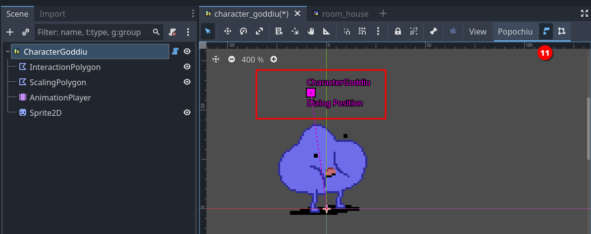
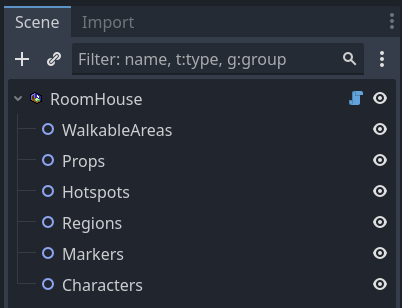
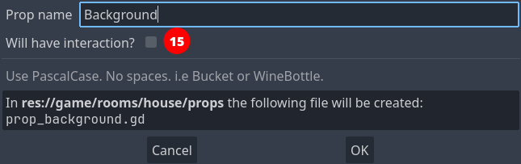
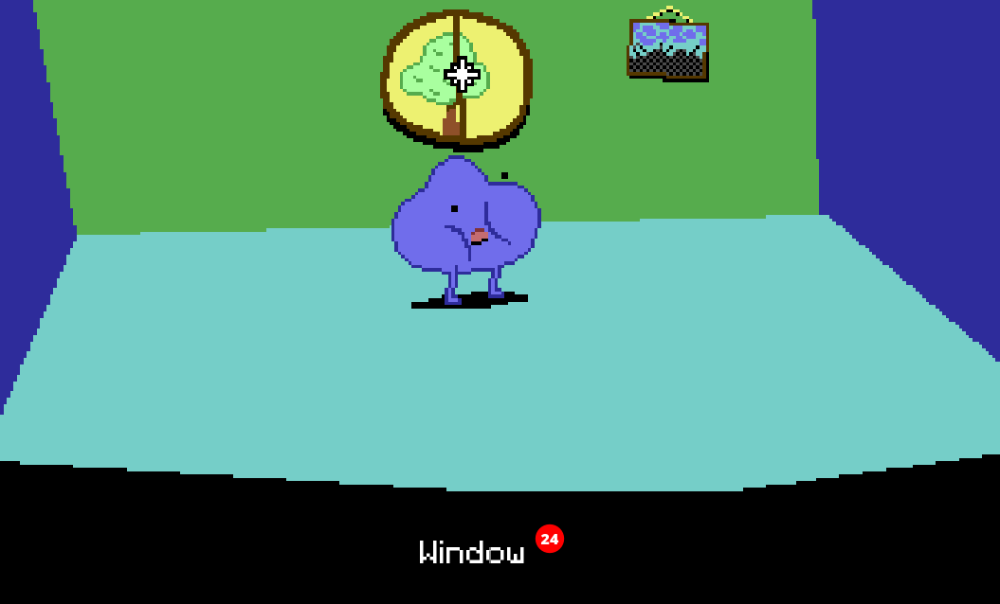

# Creating a game stub

This page will guide you through the process of creating a very small stub for a game.

You will set up a quick game with a single location, a couple interacting characters and items, plus dialogs and inventory.

You can use the resulting stub to experiment and tinker as you read the documentation. If you are already familiar with Popochiu and have already created your project, you can jump to the [Tutorials](/getting-started/tutorials) section to learn more about more advanced features.

!!! info
    If you are moving your first steps in Adventure Games development, or just evaluating if Popochiu is for you, you may want to download the [Example Game Assets Pack](/getting-started/example-resources#example-assets), that contains all the assets used in this tutorial.

    If you just want to tinker with Popochiu or experiment on a throw-away project, you can just clone the [Example Game](/getting-started/example-resources#example-game), that's already complete and ready to run.

## Table of contents

!!! warning
    To follow this introductory guide you must have already created a new Godot project and [installed Popochiu](/getting-started/installing-popochiu).  

To create our game stub we will:

1. [Setup a new adventure game in your Godot project](#game-setup)
2. [Select the game user interface](#select-game-gui)
3. [Create two Characters with static sprites](#create-characters)
4. [Set a character as a player character](#select-the-main-character)
5. Create a Room, that's a game location
6. Create key elements in the room: a Walkable Area, a Prop and an Hotspot
7. Make the Characters have a quick dialogue
8. Collect a prop and add it to the inventory

There is more to Popochiu, but this will showcase the foundamental building blocks of how the engine works.

Let's start!

## Game setup

When you first start your project, you are greated with the **Setup** popup, where you can define the base paramenters of your game.


Using this window will take care of configuring Godot project with a coherent preset of paramenters so that your game looks good in all situations.  
Also, it will preconfigure the Game User Interface (GUI) of your choice, so that you don't have to.

### Set game resolution

The **Native game resolution** (_1_) is the actual resolution of your assets (i.e. background). This resolution will be scaled up or down to match the actual display resolution (see below). Usually you want to set this to the size of a full-game background tha fills the entire "screen".

For example, if you plan to create a retro-vibes pixel-art adventure game like the early ones by Sierra or LucasArts, you may want to keep this resolution down to `320x200`, that was the native resolution of VGA displays back then.  
If you want to create a high-res game like the modern Deponia series, with beautifully painted art, you may want to bring this up to `1920x1080`, that's a modern Full-HD display resolution.

!!! tip
    If you plan to develop a pixel-art game for widescreen displays, these are commond resolutions that can work on a modern PC:

    * `320x180`: vertically very small, good to emulate pioneering 80s games like Sierra's _King's Quest_ or similar.
    * `356x200`: more vertical space, this is a "widescreen" version of the 320x200 that games like _The Secret of Monkey Island_ or _King's Quest V_ had on an IBM PC or Amiga, back then.
    * `384x216`: there were no games back then featuring this resolution, but it can be used if you want to have a bit more vertical space for higher sprites, or for a bulky interface like the 9-verbs one, without ruining the _retro-vibe_.

Some prefer not to play adventure games in full-screen so, once you've set the native resolution for you game, you may use the **Playing window resolution** (_2_) values to set the size your game will have when played in windowed mode. For low-res games, you want to provide a larger window than the native resolution, or on most modern displays, it will be very tiny.  

!!! note
    The provided default is a good fit for most Full-HD displays, and the player will be able to resize the window anyway.Probably it's worth adjusting the window size only if you know your game will be played in specific contexts.

Finally, the **Game type** (_3_) select box will set a bunch of project settings that are better kept coherent, from sprite importing, to scaling algorithms, etc. The options are:

* **Custom**: This does nothing, leaving all the settings to the developer.
* **2D**: Chose this for high-res games, that may benefit from anti-aliasing when scaled up or down.
* **Pixel**: Chose this for low-res and pixel-art games, so that you graphics remain crisp when scaled up or down.

!!! info "Under the hood"
    For the more technical readers, what the **Game type** options do is pre-configuring **Stretch mode** to `canvas_item` and **Stretch aspect** to `keep` for you. The `Pixel` mode also sets textures use the `Nearest` filter, so that no anti-alias or blurring happens when the game is scaled.

!!! note
    Nowadays there are so many different display aspect ratios, that doing assumptions on how your game will be played is futile. Nonetheless, the vast majority of devices out there (mobile or PCs) have displays close enough to `16:9` that you will probably end up keeping this ratio into consideration. That's the reason why Popochiu default values are set to `320x180`: it is an old-style resolution, with the aspect ratio of a modern display.

### Select game GUI

Since version 2.0, Popochiu comes with a preset of different GUI templates, and a set of features to create your own custom one.  
GUI templates will contain everything you need, from assets to logic, to mimic one of the most common game interfaces of the Adventure genre.

In the **GUI Template** (_4_) section of the Setup popup, you can click on a GUI icon to select which template to apply:

* **Custom**: select this if you want to create your own GUI. That's basically the "No template, please" option.
* **9 Verbs**: inspired by the original SCUMM interface, first seen in _Monkey Island 2: LeChuck's Revenge_.
* **Sierra**: inspired by the early 90s SCI interface, common to _King's Quest_ and _Space Quest_ games in early 90s.
* **2-Click Context-sensitive**: the most basic interface for an Adventure Game, common to many modern titles like _Deponia_ - left-click to walk and interact, right-click to examine.

!!! warning
    You can change your mind and apply a different template later during the development of your game, but mind that doing this will **replace** your GUI (and all the custom logic or graphics) with a new template.

    Also, keep in mind that some GUIs will take space on screen (like the 9 Verbs one), and this will impact your backgrounds.

!!! note
    You can go back and review your game setup choices at any moment, clicking the "Setup" button at the bottom of the [Popochiu Main Dock](#TODO).

    

## Create characters

Characters are one of the basic elements of Popochiu, being the bread and butter of every adventure game.

Let's start creating the player character. In the Popochiu main dock, click the **Create character** button (_1_).


A popup will apper, asking for the character name. This is the machine name of your character, not the one the player will see in game, and it needs to be written in `PascalCase` (no spaces or punctuation and all capitalized words).  
Once you entered the name, click the **OK** button (_2_).


As you can see the editor is giving you a preview of the files and assets that will be created. If everything went well, your editor should look like this now:


The new character appears in the main dock list (_3_) and the related scene is open in the editor (_4_).

Now click on the scene's root node (it should be named `Character<YourCharacterName>`) to access the character's properties in the inspector:


Set the **Flips when** parameter (_5_) to `Looking Left`, and leave the rest untouched.

!!! warning
    The suggested value is based on the example sprite direction (right). If you are using a self-made sprite for your character and it's facing left, you should set this property to `Looking right` instead.

The character scene shows nothing. That's because we've set no sprite for our character. Popochiu characters support a full set of standard and custom animations, but since we are only stubbing the game, we'll just set a static sprite for now.

If you don't have a spritesheet ready for your character, you can download [this one](https://github.com/carenalgas/popochiu_2-sample_project/blob/16fc323f1c63388e6b97a30d678aa71e6e1d9db9/game/characters/goddiu/goddiu.png) from the demo game.  
Save it into your project, in the `game/characters/<your character name>/` folder, and rename it as you see fit.

!!! tip
    You can actually save the spritesheet anywhere in your project, but keeping it in the Character folder makes the project structure more tidy and maintainable. You may want to create subfolders to organize assets, but we strongly advice to start simple and reorganize only when it's necessary.

To set the character sprite, go back to your editor and select the **Sprite2D** node in you character's scene (_6_), then locate your spritesheet filename in your file manager (_7_). Select and drag it to the **Texture** property in the inspector (_8_).


You can see from the screenshot that the entire image is now visible in the Character scene. Of course we want to select just a single sprite from the spritesheet. For that, head to the **Animation** section in the inspector and set **Hframes** and **Vframes** value to match the number of sprites in the spritesheet, like this (_9_):


Now the sprite on the scene should be OK, showing your character in the standing position. We just miss a little change to make things work as intended: when a new character is created, its sprite is centered on the scene origin:


This is a problem, because the scene origin point is the one that the engine will check to understand if the character is still inside a walking area, or if it reached a certain position when moving around the scene. In short, the scene origin should be where the character's feet are.  
Fixing this is as simple as selecting the **Sprite2D** node in the character scene (_10_), and move it so that the origin is in between the two feet, like in the image below.


!!! tip "Tips for great character sprite positioning"
    Most game characters' idle position is depicted in a three-quarter view. In this type of shots, the foot facing the camera will be slightly lower than the foot pointing to the side of the sprite (look at Goddiu above). To achieve perfect results when positioning your sprite, you should position the side-facing foot on the zero line, and the camera-facing foot toe should be a bit lower.

    In case of floating characters (ghosts, fairies, anti-gravity-powered mad scientists, etc), you should leave some vertical space between the scene's center and your character. Try to envision the scene line as the "floor" and decide how high above the floor the character should float.

The last thing to do is to position the place where the dialog text will be shown for the talking character. Popochiu can be customized to show dialog lines in many different positions or fashions, but it's default is to show the dialogue lines somewhere above the character's head. Since the engine doesn't know how high your sprite is (see "Under the hood" note below), that's for you to decide.

Just select the **DialogPos** node in the scene tree (_11_). A small cross will be highlighted in the scene's origin. Drag it somewhere above the character's head (or wherever makes sense to you).



This may require a bit of experimentation, but for now, this will do.

!!! info "Under the hood"
    You may be wondering how exactly the text is located in relation to the position of the **DialogPos** node. Here is an explanation on how Popochiu decides how your text is rendered.

    1. The baseline of the text will always match the vertical position of **DialogPos**, so the text will be rendered vertically **right above** that point.
    2. The dialog line length is calculated and the text is centered on the horizontal position of **DialogPos**, so the text will be rendered horizontally **around** that point.
    3. If the text spans multiple line, Popochiu will expand it **towards the top**, so that it doesn't cover your character (this means if you want your text under the character for some reason, multiple lines will cover your character).
    4. If the character is near the window or screen border, the text will be repositioned so that it will be entirely visible, so you don't have to worry about it becoming unreadable. This is true both for horizontal and vertical coordinates.

### Add another character

We are almost done creating our player character. Before moving on, follow [the same steps](#create-characters) to create another one, to keep our main character company and test some interaction.

!!! tip
    In the example game, the second character is named _Popsy_ and [its sprite can be found here](https://github.com/carenalgas/popochiu_2-sample_project/blob/16fc323f1c63388e6b97a30d678aa71e6e1d9db9/game/characters/popsy/popsy.png).

### Select the main character

Now that we have two characters, it's time to tell Popochiu which one will be our main character. That's the one that will be used by the player.  
To do this, locate the first character you have created in Popochiu main dock (in our example it was _Goddiu_), open the drop-down menu, and select `Set as Player Character` (_12_).


!!! info "Multiple character games"
    Even if we are not going to cover this detail, Popochiu supports multiple player character in the style of _Maniac Mansion_ or _Day of the Tentacle_. It's as easy as programmatically change a variable from your scripts.

Pat yourself a shoulder! You have succesfully created your first characters.

## Create the first room

Now that we have two characters, it's time to create a location for them to interact with.

In Popochiu, game locations are referred to as _rooms_. More broadly, a room can serve as any game screen, including splash screens, menus, or close-ups. Not all rooms need to feature characters, and the main character may be rendered invisible in specific rooms.

To create our first room, just click the **Create room** button in Popochiu's main dock (_13_).


A popup will appear, very similar to the one to create a new character. This time, an additional checkbox is available.
This allows us to set the newly created room as the main scene of the Godot project. Check it out so we don't have to do it later. This scene will also be the only room in this game stub.


Name the new room whatever you want. If you want to follow along, let's name this room "_House_" and make it the main scene.  
Popochiu will create the new room, open the room scene in the editor, and open the corresponding [Room tab](#TODO) in the plugin interface.

Much like a character, a room needs a sprite to represent the background of the location. We are going to use [this background](https://github.com/carenalgas/popochiu_2-sample_project/blob/16fc323f1c63388e6b97a30d678aa71e6e1d9db9/game/rooms/house/props/background/house_bg.png) from the example game.

But hey! The room has nothing like a sprite in it! Quite the opposite, the scene tree seem to be pretty empty:



<a name="intbkmk-props-explanation"></a>
Unlike other objects in Popochiu, rooms are basically containers for other more specialized objects, the most important of which are **Props**. Props are every visible part of a location, used to make the environment believable. They can go from a small collectable item, all the way to location backgrounds.

!!! info "Under the hood"
    Popochiu makes no distinction based on the prop function in the game, he knows little about that actually. You add as many as you want into a scene and interact with them via your game script.  
    The only thing the engine knows about props is their **visibility** and their **clickability**. By flagging those two properties on or off, you can switch objects in and out of a location, an make them interactive.

Armed with this knowledge, it's now clear we must create a prop to hold our background. That's easy. If you followed the steps above, Popochiu dock should be showing the **Home** room tab.


Click the **Create prop** button and as usual, a new window will pop up:



Name the new prop "_Background_" and leave the "Will have interaction?" option unchecked. You don't want all of your screen to react to clicks when you move around.

!!! note
    Moving around the screen doesn't require the background or anything else to be interactive. Popochiu will take care of moving the character for you when you click on a non-interactive area.  
    Go on to learn how to constraint character movement to the right zones.

Click OK and your prop will be created. You should see it in the scene tree, under the **Props** grouping node. The inspector should look something like this:


Now you can see the Prop has a **Texture** parameter. By this time you should be able to figure out what to do. Save the downloaded background sprite in the `game/rooms/house/props/background/` folder, then drag it from Godot Editor file manager to the field in the inspector.  
Your scene should now show the background image.

At this point you have a main character and a main scene defined. This is the minimum steps needed to run a Popochiu game. Treat yourself after all this effort, by hitting the **Run** button at the top right of the editor and seeing you game in action.

If you did everything right, you should see your main character standing in the center of the room. Clicking on the screen will flip the character so that it faces the cursor coordinates.

!!! note
    If you followed this tutorial from the start, when you run the game Popochiu will complain about not found animations. Don't worry about those errors, we didn't include animations to keep this introduction short.  
    Rest assured though that Popochiu has full animations support: it already manages standard animations (for an idle character, for walking and for talking), without having to write any code. A game dev can add a full set of custom animations to play during cutscenes, or to support different emotions in dialogues, and so on.

    For those who work with [Aseprite](https://www.aseprite.org/), Popochiu also provides a powerful automated importer that will make creating rooms and characters a breeze, and will enable a fast iterative development workflow.

    * Learn more about [animations](/how-to-develop-a-game/playing-animations).
    * Learn more about the [Aseprite importers](/the-editor-handbook/importers)

### Add a Walkable Area

Our characters is standing there in the middle of the room, doing nothing. If we click on the screen we would expect it to walk to the clicked location, but that's not happening.

The reason is that we defined no areas in which the character is allowed to move. Popochiu refers to those elements as **Walkable Areas**. They are objects that can live only inside rooms, and each room can have more than one (see the box below for an explanation).

For now, let's create a single walkable area representing the room floor.

In the Room tab of Popochiu dock, click the **Create walkable area** button (_16_).


In the popup window, just name your new walkable area "_Floor_" (or whatever you find descriptive enough). Click **OK** and a new element will be added to the scene.


Selecting the **Perimeter** node in the scene tree (_17_) to highlight a squared polygon in the center of the scene. Now you have to adjust the vertices of that polygon (_18_) to whatever makes sense.

!!! tip
    To adjust the polygon, just click and drag the vertice handles around.  
    It's quite intuitive, but you can add vertices to the polygon by clicking anywhere along a segment.

When you have adjusted your walkable area, it should look something like this:


Save the project and run your game. You character should now be able to move around the room, without leaving the area you defined.

!!! note
    If you aren't new to Godot, you may think we forgot mentioning the **Bake NavigationPolygon** button in the toolbar (_19_). That's not the case, Popochiu bakes the polygon for you.

!!! tip
    You usually don't want your walkable area to cover the entire floor that you painted, or your character will be able to stand on the very border of it, too near the wall, creating a terrible effect.  
    Remember that Popochiu will stop the movement as soon as the origin point of your character scene will reach one of the walkable area borders.

!!! info "Additional walkable areas"
    It may not be obvious but you may want (or need) a room to have more than a single walkable area. Here is some example cases:

    * A location with two areas separated by an obstacle (like a chasm), that the character can enter both sides.
    * A location with different levels, the character can climb to or reach depending on the game script or specific conditions.
    * A location with a large prop that can be removed (like a pile of fallen rocks): when the prop is removed a larger walkable area is used in place of the smaller one.

    Since you can define which walkable area is the active one for the character from your scripts, having multiple walkable areas actually unlocks a lot of possibilities for complex locations.

### Add a hotspot

Our character can now move around the room, but there is little it can do. It is time to add some interaction.

An **hotspot** is the most basic form of interaction you can have in a room. It basically is an area of the screen, delimited by a polygon drawn at a specific position, that has a name and a script attached to it. It has no sprite of its own, it just sits there on top of other elements, waiting to react to the cursor.

By mean of its script, it can react to events like mouse clicks. That's exactly what we're going to do.

Creating a hotspot is much like creating a walkable area. In the Room tab of Popochiu dock, click the **Create hotspot** button (_20_).


In the popup window, just name your new hotspot "_Window_" (or whatever you find descriptive enough). Click **OK** and a new element will be added to the scene.


When you select the new hotspot in the scene tree (_21_), a bunch of gizmos are shown in the scene preview. We are going to interactively edit three important properties of the hotspot (the _interaction polygon_, the _baseline_ and the _walk to point_) by using the dedicated buttons in the toolbar (_23_).

!!! info
    _Walk to point_, _Baseline_ and _Interaction Polygon_ properties are all common to clickable objects like Hotspots, Props and Characters.

First of all, click the _Intaraction Polygon_ button to show the handles of the standard square polygon for the hotspot. This is basically the same as the walkable area polygon but instead of limiting the character movements, this polygon will just react when the cursor will hover it.  
Let's draw a shape around the window on the wall:


No need to be too precise or polished, rough edges won't be perceivable while playing your game. You just need to avoid, if possible, overlapping with other hotspots (see "_Baseline_" below, to understand how polygon overlapping works).

Another important property of the hotspot is the "_Walk to point_", that is the coordinates that the character will reach, when you click over the hotspot.  
You can set these coordinates interactively by clicking on the "_Walk point_" button in the toolbar. A squared marker will appear in the center of the screen. You can drag the marker wherever you want in the room.

For our example room, we'll set the following coordinates for the `Window` hotspot:

* `x`: `-30`
* `y`: `-10`

so that our main character will walk beside the window.

The last property that you want to set is the _Baseline_. The baseline is simply a coordinate on the `Y` axis, that represents a point in the imaginary space of the room. If the main character walks **above** the baseline (_above_ means the character's origin has a `Y` coordinate that's lower than the baseline value), it is considered **behind** the object (in this case the hotspot). If the character origin is **below** the baseline, it is considered **in front of** the object.  

!!! warning
    This becomes evident when you have a prop or a character in a room, and you want your main character to walk behind them when its feet are "farther away" from the camera, but a hotspot has no sprite to walk behind, so you may think setting the baseline is useless.  

    That's not the case at all. If you don't set your baseline the right way, the polygon-delimited area of the hotspot may remain clickable even when the character is in front of it; or the other way around, a hotspot that should always be in front of the scene, may be covered by your character, making it unreacheable. So, **always** set your baseline.

Our window is in the back of the room and the main character has no way to be placed behind it, so we'll set the hotspot baseline to `0` (zero). This means that the baseline is "as high as the scene". The character has no way to walk so high.  

!!! info
    Note that you can set the baseline even to negative values, that can be useful to make sure your background is always very far, even if you change the baseline of other elements programmatically (via a script).

!!! tip
    If you need pixel-perfect precision, you can set the baseline and the hotspot's _Walk to point_ coordinates by inputing them in the inspector.

    

With the hotspot properly configured, we can now run a quick test. Start your game, move the cursor over the window and you should see the name of the hotspot in the action bar (_24_).


Clicking on the hotspot, the character will move to the point we defined and face the window.

!!! info "Under the hood"
    Remember that we set our character so that its origin is between its feet. When your character moves towards a point, Popochiu will make sure the origin of the character will match the destination point's coordinates.

    What if the destination coordinates lie outside of the walkable area? In this case Popochiu will trace the path towards the coordinates, but will stop the movement as soon as the character will reach the walkable area's borders. Despite this is a safe scenario, placing a _Walk to point_ inside the walkable polygon always give the best results, making the movement predictable. Keep this in mind.

### Scripting our first interaction

If you ran the game, you may have seen that, while the character moves towards the window, a message is printed on top of the scene: `Can't INTERACT with it`.  
That's because we didn't define what should happen when we interact with the window. Remember, in [the GUI we selected](#select-game-gui), clicking on an object will trigger an interaction, while right-clicking on an object will trigger an examination.

We are now going to script our first interaction, using Godot **GDScript** language and the very convenient [engine API](/the-engine-handbook/scriting-overview) that Popochiu provides to make our life easier.

!!! info "Help! I'm not a developer!"
    "API" stands for "Application Programming Interface" and in our context it's the set of objects and functions that makes it really easy to implement all those behaviors common to most adventure games (like making a character talk, or adding an item to the inventory), without knowing the ins and outs of the undelying Godot game engine.

In the room tab of the Popochiu dock, locate the "_Open Script_" icon for the `Window` hotsport (_25_):


This will open the GDScript connected to this hotspot in the Godot scripting editor (_26_):


!!! info "Under the hood"
    Every clickable object that Popochiu creates for you comes with an attached script. Those scripts does nothing by themselves, but are based on commented templates that will make easier to implement the desired behaviors, by editing and filling out some predefined functions.

We will now add some interaction to the script. So far it will be simple stuff: we'll make our main character say something meaningful when we examine the window, and - in absence of other elements in the room - act a bit weird when we try to interact with the window.

Locate the `_on_click()` function in the script. It should read something like this:

```gdscript
# When the node is clicked
func _on_click() -> void:
	# Replace the call to E.command_fallback() with your code.
	E.command_fallback()
	# For example, you can make the player character walk to this hotspot, gaze at it, and then say
	# something:
#	await C.player.walk_to_clicked()
#	await C.player.face_clicked()
#	await C.player.say("What a nice view")
```

Popochiu automatically executes this function when you click over the `Window` hotspot. We just need to put something meaningful into it. Let's try something. Change the function so it looks like this:

```gdscript
# When the node is clicked
func _on_click() -> void:
	await C.player.walk_to_clicked()
	await C.player.face_clicked()
	await E.wait(0.5)
	for n in 3:
		await C.player.face_left()
		await E.wait(0.3)
		await C.player.face_right()
		await E.wait(0.3)
	await C.player.face_clicked()
	await C.player.say("I wanted to open the window but I can't find the handle")
```

Save the script (`ctrl/cmd + s`) and run your game.  
Now when you click the window, the character will walk to it, turn around three times like it is looking around for something, then face the window and say a phrase.

**Yay!** You reached an important milestone! Now your game feels more alive, isn't it?

Let's see what happened, breaking the function down to pieces. Ignore for a moment the `await` keyword.

```gdscript
    await C.player.walk_to_clicked()
	await C.player.face_clicked()
```

These two lines use the `C` Popochiu object. It holds a reference to every character in the game. Our character is called `Goddiu`, so `C.Goddiu` allows us to give commands to that character. But since Goddiu is also the character that the player controls, we can use the shortcut `C.player`.

This comes in very handy for those games that have more player-controlled characters, like _Maniac Mansion_, or _Day of the Tentacle_. You can change the active character as the game progress but your scripts will point to the current active character, sparing you the effort to duplicate the code for each and every playable character.

```gdscript
	await E.wait(0.5)
	for n in 3:
		await C.player.face_left()
		await E.wait(0.3)
		await C.player.face_right()
		await E.wait(0.3)
```

Here we are literally awaiting for some time to pass. `E` is the object representing the game engine (Popochiu!) and we are asking it to wait for half a second.
After that we are using the `for` GDScript keywork to repeat the same code for three times.

!!! info
    This is not a feature of Popochiu, it is standard Godot language. All Popochiu objects and functions are standard Godot functions.  
    As Popochiu will mature, it will take care of more and more work in a standardized and simplified way. Stuff like translations, dynamic lightning and music, parallax, and more.  
    In the meantime, since its language is standard GDScript, you have all the power of Godot at your fingertips and you can customize your game the way you want.

The executed code just flips the character left and right after a small pause, as it is looking around.

```gdscript
	await C.player.face_clicked()
	await C.player.say("I wanted to open the window but I can't find the handle")
```

These last two lines make sure the character finally looks towards the window and say its line.

!!! info "Help! I'm not a developer!
    As the `for` keyword, `await` is provided by Godot out of the box. Without going too deep in technical details, what it does is making sure that while the subsequent function is executed, no other things will happen. In our example, if we omitted the `await` keyword in every line, the character would have started walking to the window, while flipping frantically left and right and talking at the same time (but finishing printing the line in a strange way).

    There are times you want this to happen, like a character who talks in the background without "blocking" the game flow, but omitting `await` usually leads to strange, unexpected behaviors and should be done only on purpose.

Now let's provide an _examine_ interaction. Edit the `_on_right_click()` function you can find further down the script so it looks like this:

```gdscript
# When the node is right clicked
func _on_right_click() -> void:
	await C.player.face_clicked()
	await C.player.say("The weather is so nice today")
	await C.player.say("I may as well open that window!")
```

By this time, you should be able to figure out what will happen by yourself. Run the game and see your masterpiece in action.

### Add a prop

We already encountered props, when we [added our background](#intbkmk-props-explanation) to the game's first room. It's now time for a bit more information.

Props are arguably the most important elements in a room. Like hotspots, they can be interactive; they have a baseline and a _walk to point_; the shape of the interaction area is represented by a polygon. Unlike hotspots they have their own **Sprite2D** node, and an internal **AnimationPlayer**. Simply put, props can represent visible (an animated, if necessary) items on the scene. Since they have a baseline, characters can walk behind them, creating a deep, interesting gaming world.

But the real boon is that their visibility and "clickability" can be turned on and off by code, allowing you to articulate their presence or their function as the game progress.

Enough talk, let's see them in action.

Since we already created a "_Background_" for our scene, you should now at this point how to create a new prop. Click on the **Create Prop** button in the tab room of the Popochiu dock, name it "_ToyCar_" and this time, check out the **Will have interaction** option (_27_).


!!! note
    If you forget to check this mark, don't worry. You can always make your prop interactive from the inspector.

You new prop will be added to the scene tree as a child of the **Props** node.

> TODO: add a toy car in the example game and link it here!
> 
> TODO: draw the interaction polygon
>
> TODO: set the walktopoint and baseline and test that the character walks behind the prop

Eventually we want to enable our main character to pick up the toy car and add it to the inventory. For that though, we need some more elements, so we'll get back to that later.  
For the moment, we'll just script a simple examine interaction, but we'll seize the opportunity to learn something new.

Click the **Open in Script** icon that you can find on the prop line in the Popochiu dock to edit the prop script. If you skim through it, you will notice it's very similar to the script for a hotspot. This makes sense, since the interaction part is mostly the same.

Our GUI dictates that the character examines the surroundings by clicking the right mouse button, so let's make our `_on_right_click()` function like this:

```gdscript
func _on_right_click() -> void:
	await C.player.face_clicked()
	await C.player.say("Popsy leaves his toys everywhere!")
	await C.player.say("I have to pay attention or I will step on it.")
```

At this point you should be familiar with those instructions. Run the game and see how the main character comments on the mess left by its younger friend.  
This comment conveys some lore about the game world, telling the player something about Popsy's personality (we added Popsy as a second character earlier), but it's pretty long and we may want to put our accent on the second part: paying attention before stepping over it. This may be a signpost to suggest the player that it's better to pick the toy car up.

To achieve our design goal, we'll add a bit of logic to our interaction, leveraging the power of GDScript.  
We will create a boolean property for the toy car  (boolean means the property can be either `true` or `false`, no other values are allowed), and will use it like a switch, to know if we already examined the prop at least one time. This way we'll make the main character say only the second line if the player examines the prop more than once.

It takes longer to say it than to do it. First of all, we'll add a property to the prop. Scroll up to the top of the script, and add the highlighted line to create a boolean variable, assigning it the `true` value.

```gdscript
@tool
extends PopochiuProp
# You can use E.queue([]) to trigger a sequence of events.
# Use await E.queue([]) if you want to pause the excecution of
# the function until the sequence of events finishes.

var first_time_seen := true   # <--- add this instruction

#region Virtual ####################################################################################
```

The assignment of the `true` value happens only when the prop is created, as soon as you start the game.

!!! tip
    You may be asking yourself if the name of the variable has to be exactly that one. That's not the case: this property is completely custom and Popochiu doesn't care about its name, and not even about its value actually, it doesn't even want you to actually use it.  
    You can name your variables whatever you want, but it's a best practice to have names that reflect their purpose. You don't want to end up with scripts full of `a`, `b`, `c`, `x` or `my_var`... they will be a mess to maintain!

Now that we have a way to know if it's the first time we examined the prop, let's change the `_on_right_click()` like this:

```gdscript
# When the node is right clicked
func _on_right_click() -> void:
	await C.player.face_clicked()
	if first_time_seen:
		await C.player.say("Popsy leaves his toys everywhere!")
		first_time_seen = false
	await C.player.say("I have to pay attention or I will step on it.")
```

You can see we are now testing the value by using an `if` statement. It almost reads like plain English, right? If it's the first time that we examine the prop, we say the first phrase, **then we change the value of the `first_time_seen` variable**.  
As long as we run the game, the value won't change back so the next time you examine the prop, the `if` statement is skipped and the execution will jump to the last line.

!!! info
    If the variable is reset to true every time the game is started, what happens when I restore a saved game?  
    Saving your game is not part of this introductory guide, but don't worry! Popochiu automatically saves the values of all custom properties , and restores them back for you when you load a saved game.

Run the game and test it.  
Done, we have a prop in the scene! It's now time to learn how to use the character's inventory.

## Add an inventory item

> This section is TODO. It will explain how to:
>
> * Create a new inventory item in the game
> * Give it a texture
> * Go back to the prop and script the collection of the item

## Script your first dialogue

> This section is TODO. It will explain how to:

### Add a dialogue

> This section is TODO. It will explain how to:
>
> * Create a new Dialog
> * Add dialog options
> * Place a second character in the room
> * Script the dialog when the user selects an option
> * Start and end a dialogue with the new character

## Recap

> This section is TODO. Not sure it will be necessary.

## Homeworks

> This section is TODO. It will challenge the readers providing some tasks to check if they have learned all the basics:
>
> * Add a prop (TODO: provide link to the sprite) and make an interaction to combine it with the item in the inventory (idea: a vase and a flower)
> * Collect the item back into the inventory
> * Add a locked dialogue line that's conditioned by the presence of the item in the inventory
> * Give the item to the character


## What's next

> This section is TODO. Links to the possible sections the reader may want to deepen different topics.
