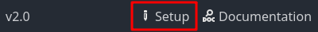
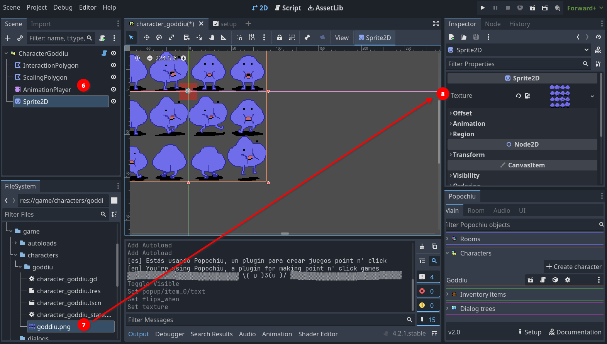
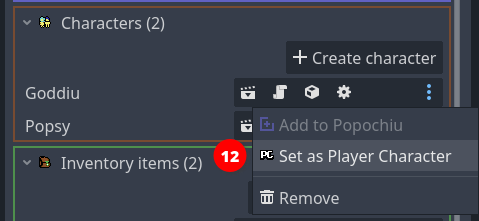
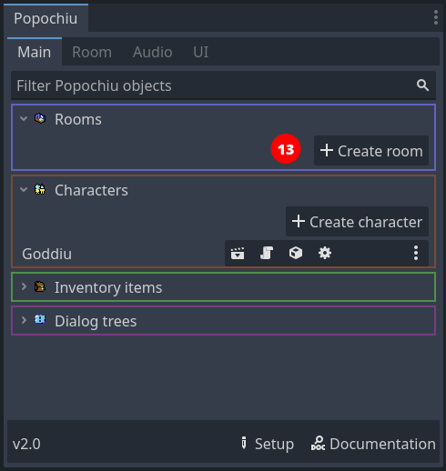
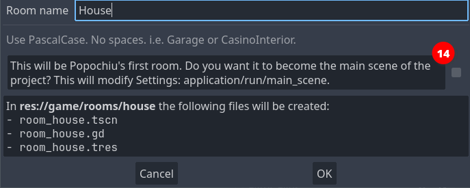
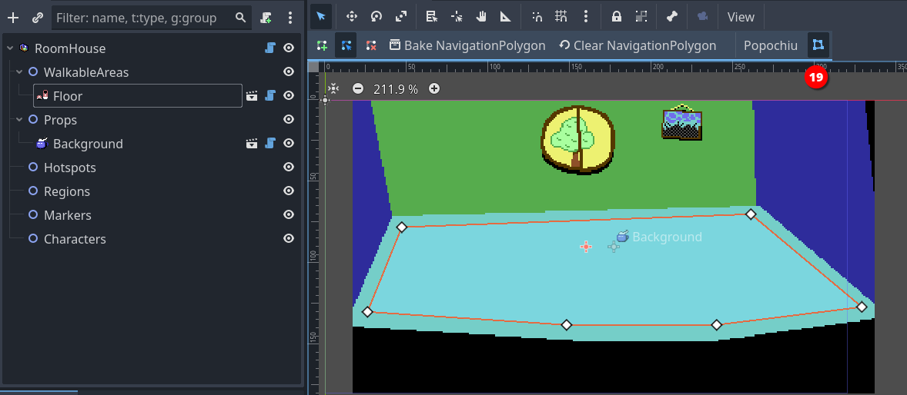

# Creating a game stub

This page will guide you through the process of creating a very small stub for a game.

You will set up a quick game with a single location, a couple interacting characters and items, plus dialogs and inventory.

You can use the resulting stub to experiment and tinker as you read the documentation. If you are already familiar with Popochiu and have already created your project, you can jump to the [Tutorials](/getting-started/tutorials) section to learn more about more advanced features.

!!! info
    If you are moving your first steps in Adventure Games development, or just evaluating if Popochiu is for you, you may want to download the [Example Game Assets Pack](/getting-started/example-resources#example-assets), that contains all the assets used in this tutorial.

    If you just want to tinker with Popochiu or experiment on a throw-away project, you can just clone the [Example Game](/getting-started/example-resources#example-game), that's already complete and ready to run.

## Table of contents

!!! warning
    To follow this introductory guide you must have already created a new Godot project and [installed Popochiu](/getting-started/installing-popochiu).  

To create our game stub we will:

1. [Setup a new adventure game in your Godot project](#game-setup)
2. [Select the game user interface](#select-game-gui)
3. [Create two Characters with static sprites](#create-characters)
4. [Set a character as a player character](#select-the-main-character)
5. Create a Room, that's a game location
6. Create key elements in the room: a Walkable Area, a Prop and an Hotspot
7. Make the Characters have a quick dialogue
8. Collect a prop and add it to the inventory

There is more to Popochiu, but this will showcase the foundamental building blocks of how the engine works.

Let's start!

## Game setup

When you first start your project, you are greated with the **Setup** popup, where you can define the base paramenters of your game.

Using this window will take care of configuring Godot project with a coherent preset of paramenters so that your game looks good in all situations.  
Also, it will preconfigure the Game User Interface (GUI) of your choice, so that you don't have to.

### Set game resolution

The **Native game resolution** (_1_) is the actual resolution of your assets (i.e. background). This resolution will be scaled up or down to match the actual display resolution (see below). Usually you want to set this to the size of a full-game background tha fills the entire "screen".

For example, if you plan to create a retro-vibes pixel-art adventure game like the early ones by Sierra or LucasArts, you may want to keep this resolution down to `320x200`, that was the native resolution of VGA displays back then.  
If you want to create a high-res game like the modern Deponia series, with beautifully painted art, you may want to bring this up to `1920x1080`, that's a modern Full-HD display resolution.

!!! tip
    If you plan to develop a pixel-art game for widescreen displays, these are commond resolutions that can work on a modern PC:

    * `320x180`: vertically very small, good to emulate pioneering 80s games like Sierra's _King's Quest_ or similar.
    * `356x200`: more vertical space, this is a "widescreen" version of the 320x200 that games like _The Secret of Monkey Island_ or _King's Quest V_ had on an IBM PC or Amiga, back then.
    * `384x216`: there were no games back then featuring this resolution, but it can be used if you want to have a bit more vertical space for higher sprites, or for a bulky interface like the 9-verbs one, without ruining the _retro-vibe_.

Some prefer not to play adventure games in full-screen so, once you've set the native resolution for you game, you may use the **Playing window resolution** (_2_) values to set the size your game will have when played in windowed mode. For low-res games, you want to provide a larger window than the native resolution, or on most modern displays, it will be very tiny.  

!!! note
    The provided default is a good fit for most Full-HD displays, and the player will be able to resize the window anyway.Probably it's worth adjusting the window size only if you know your game will be played in specific contexts.

Finally, the **Game type** (_3_) select box will set a bunch of project settings that are better kept coherent, from sprite importing, to scaling algorithms, etc. The options are:

* **Custom**: This does nothing, leaving all the settings to the developer.
* **2D**: Chose this for high-res games, that may benefit from anti-aliasing when scaled up or down.
* **Pixel**: Chose this for low-res and pixel-art games, so that you graphics remain crisp when scaled up or down.

!!! info "Under the hood"
    For the more technical readers, what the **Game type** options do is pre-configuring **Stretch mode** to `canvas_item` and **Stretch aspect** to `keep` for you. The `Pixel` mode also sets textures use the `Nearest` filter, so that no anti-alias or blurring happens when the game is scaled.

!!! note
    Nowadays there are so many different display aspect ratios, that doing assumptions on how your game will be played is futile. Nonetheless, the vast majority of devices out there (mobile or PCs) have displays close enough to `16:9` that you will probably end up keeping this ratio into consideration. That's the reason why Popochiu default values are set to `320x180`: it is an old-style resolution, with the aspect ratio of a modern display.

### Select game GUI

Since version 2.0, Popochiu comes with a preset of different GUI templates, and a set of features to create your own custom one.  
GUI templates will contain everything you need, from assets to logic, to mimic one of the most common game interfaces of the Adventure genre.

In the **GUI Template** (_4_) section of the Setup popup, you can click on a GUI icon to select which template to apply:

* **Custom**: select this if you want to create your own GUI. That's basically the "No template, please" option.
* **9 Verbs**: inspired by the original SCUMM interface, first seen in _Monkey Island 2: LeChuck's Revenge_.
* **Sierra**: inspired by the early 90s SCI interface, common to _King's Quest_ and _Space Quest_ games in early 90s.
* **2-Click Context-sensitive**: the most basic interface for an Adventure Game, common to many modern titles like _Deponia_ - left-click to walk and interact, right-click to examine.

!!! warning
    You can change your mind and apply a different template later during the development of your game, but mind that doing this will **replace** your GUI (and all the custom logic or graphics) with a new template.

    Also, keep in mind that some GUIs will take space on screen (like the 9 Verbs one), and this will impact your backgrounds.

!!! note
    You can go back and review your game setup choices at any moment, clicking the "Setup" button at the bottom of the [Popochiu Main Dock](#TODO).

    

## Create characters

Characters are one of the basic elements of Popochiu, being the bread and butter of every adventure game.

Let's start creating the player character. In the Popochiu main dock, click the **Create character** button (_1_).

A popup will apper, asking for the character name. This is the machine name of your character, not the one the player will see in game, and it needs to be written in `PascalCase`, with no spaces in it.  
Once you entered the name, click the **OK** button (_2_).

As you can see the editor is giving you a preview of the files and assets that will be created. If everything went well, your editor should look like this now:

The new character appears in the main dock list (_3_) and the related scene is open in the editor (_4_).

Now click on the scene's root node (it should be named `Character<YourCharacterName>`) to access the character's properties in the inspector:

Set the **Flips when** parameter (_5_) to `Looking Left`, and leave the rest untouched.

!!! warning
    The suggested value is based on the example sprite direction (right). If you are using a self-made sprite for your character and it's facing left, you should set this property to `Looking right` instead.

The character scene shows nothing. That's because we've set no sprite for our character. Popochiu characters support a full set of standard and custom animations, but since we are only stubbing the game, we'll just set a static sprite for now.

If you don't have a spritesheet ready for your character, you can download [this one](https://github.com/carenalgas/popochiu_2-sample_project/blob/16fc323f1c63388e6b97a30d678aa71e6e1d9db9/game/characters/goddiu/goddiu.png) from the demo game.  
Save it into your project, in the `game/characters/<your character name>/` folder, and rename it as you see fit.

!!! tip
    You can actually save the spritesheet anywhere in your project, but keeping it in the Character folder makes the project structure more tidy and maintainable. You may want to create subfolders to organize assets, but we strongly advice to start simple and reorganize only when it's necessary.

To set the character sprite, go back to your editor and select the **Sprite2D** node in you character's scene (_6_), then locate your spritesheet filename in your file manager (_7_). Select and drag it to the **Texture** property in the inspector (_8_).

You can see from the screenshot that the entire image is now visible in the Character scene. Of course we want to select just a single sprite from the spritesheet. For that, head to the **Animation** section in the inspector and set **Hframes** and **Vframes** value to match the number of sprites in the spritesheet, like this (_9_):

Now the sprite on the scene should be OK, showing your character in the standing position. We just miss a little change to make things work as intended: when a new character is created, its sprite is centered on the scene origin:

This is a problem, because the scene origin point is the one that the engine will check to understand if the character is still inside a walking area, or if it reached a certain position when moving around the scene. In short, the scene origin should be where the character's feet are.  
Fixing this is as simple as selecting the **Sprite2D** node in the character scene (_10_), and move it so that the origin is in between the two feet, like in the image below.

!!! tip "Tips for great character sprite positioning"
    Most game characters' idle position is depicted in a three-quarter view. In this type of shots, the foot facing the camera will be slightly lower than the foot pointing to the side of the sprite (look at Goddiu above). To achieve perfect results when positioning your sprite, you should position the side-facing foot on the zero line, and the camera-facing foot toe should be a bit lower.

    In case of floating characters (ghosts, fairies, anti-gravity-powered mad scientists, etc), you should leave some vertical space between the scene's center and your character. Try to envision the scene line as the "floor" and decide how high above the floor the character should float.

The last thing to do is to position the place where the dialog text will be shown for the talking character. Popochiu can be customized to show dialog lines in many different positions or fashions, but it's default is to show the dialogue lines somewhere above the character's head. Since the engine doesn't know how high your sprite is (see "Under the hood" note below), that's for you to decide.

Just select the **DialogPos** node in the scene tree (_11_). A small cross will be highlighted in the scene's origin. Drag it somewhere above the character's head (or wherever makes sense to you).

This may require a bit of experimentation, but for now, this will do.

!!! info "Under the hood"
    You may be wondering how exactly the text is located in relation to the position of the **DialogPos** node. Here is an explanation on how Popochiu decides how your text is rendered.

    1. The baseline of the text will always match the vertical position of **DialogPos**, so the text will be rendered vertically **right above** that point.
    2. The dialog line length is calculated and the text is centered on the horizontal position of **DialogPos**, so the text will be rendered horizontally **around** that point.
    3. If the text spans multiple line, Popochiu will expand it **towards the top**, so that it doesn't cover your character (this means if you want your text under the character for some reason, multiple lines will cover your character).
    4. If the character is near the window or screen border, the text will be repositioned so that it will be entirely visible, so you don't have to worry about it becoming unreadable. This is true both for horizontal and vertical coordinates.

### Add another character

We are almost done creating our player character. Before moving on, follow [the same steps](#create-characters) to create another one, to keep our main character company and test some interaction.

!!! tip
    In the example game, the second character is named _Popsy_ and [its sprite can be found here](https://github.com/carenalgas/popochiu_2-sample_project/blob/16fc323f1c63388e6b97a30d678aa71e6e1d9db9/game/characters/popsy/popsy.png).

### Select the main character

Now that we have two characters, it's time to tell Popochiu which one will be our main character. That's the one that will be used by the player.  
To do this, locate the first character you have created in Popochiu main dock (in our example it was _Goddiu_), open the drop-down menu, and select `Set as Player Character` (_12_).

!!! info "Multiple character games"
    Even if we are not going to cover this detail, Popochiu supports multiple player character in the style of _Maniac Mansion_ or _Day of the Tentacle_. It's as easy as programmatically change a variable from your scripts.

Pat yourself a shoulder! You have succesfully created your first characters.

## Create the first room

Now that we have two characters, it's time to create a location for them to interact with.

In Popochiu, game locations are referred to as _rooms_. More broadly, a room can serve as any game screen, including splash screens, menus, or close-ups. Not all rooms need to feature characters, and the main character may be rendered invisible in specific rooms.

To create our first room, just click the **Create room** button in Popochiu's main dock (_13_).

A popup will appear, very similar to the one to create a new character. This time, an additional checkbox is available.
This allows us to set the newly created room as the main scene of the Godot project. Check it out so we don't have to do it later. This scene will also be the only room in this game stub.

Name the new room whatever you want. If you want to follow along, let's name this room "_House_" and make it the main scene.  
Popochiu will create the new room, open the room scene in the editor, and open the corresponding [Room tab](#TODO) in the plugin interface.

Much like a character, a room needs a sprite to represent the background of the location. We are going to use [this background](https://github.com/carenalgas/popochiu_2-sample_project/blob/16fc323f1c63388e6b97a30d678aa71e6e1d9db9/game/rooms/house/props/background/house_bg.png) from the example game.

But hey! The room has nothing like a sprite in it! Quite the opposite, the scene tree seem to be pretty empty:

Unlike other objects in Popochiu, rooms are basically containers for other more specialized objects, the most important of which are **Props**. Props are every visible part of a location, used to make the environment believable. They can go from a small collectable item, all the way to location backgrounds.

!!! info "Under the hood"
    Popochiu makes no distinction based on the prop function in the game, he knows little about that actually. You add as many as you want into a scene and interact with them via your game script.  
    The only thing the engine knows about props is their **visibility** and their **clickability**. By flagging those two properties on or off, you can switch objects in and out of a location, an make them interactive.

Armed with this knowledge, it's now clear we must create a prop to hold our background. That's easy. If you followed the steps above, Popochiu dock should be showing the **Home** room tab.

Click the **Create prop** button and as usual, a new window will pop up:

Name the new prop "_Background_" and leave the "Will have interaction?" option unchecked. You don't want all of your screen to react to clicks when you move around.

!!! note
    Moving around the screen doesn't require the background or anything else to be interactive. Popochiu will take care of moving the character for you when you click on a non-interactive area.  
    Go on to learn how to constraint character movement to the right zones.

Click OK and your prop will be created. You should see it in the scene tree, under the **Props** grouping node. The inspector should look something like this:

Now you can see the Prop has a **Texture** parameter. By this time you should be able to figure out what to do. Save the downloaded background sprite in the `game/rooms/house/props/background/` folder, then drag it from Godot Editor file manager to the field in the inspector.  
Your scene should now show the background image.

!!! success
    At this point you have a main character and a main scene defined. This is the minimum steps needed to run a Popochiu game. Treat yourself after all this effort, by hitting the **Run** button at the top right of the editor and seeing you game in action.

    If you did everything right, you should see your main character standing in the center of the room. Clicking on the screen will flip the character so that it faces the cursor coordinates.

### Add a Walkable Area

Our characters is standing there in the middle of the room, doing nothing. If we click on the screen we would expect it to walk to the clicked location, but that's not happening.

The reason is that we defined no areas in which the character is allowed to move. Popochiu refers to those elements as **Walkable Areas**. They are objects that can live only inside rooms, and each room can have more than one (see the box below for an explanation).

For now, let's create a single walkable area representing the room floor.

In the Room tab of Popochiu dock, click the **Create walkable area** button (_16_).

In the popup window, just name your new walkable area "_Floor_" (or whatever you find descriptive enough). Click **OK** and a new element will be added to the scene.

Selecting the **Perimeter** node in the scene tree (_17_) to highlight a squared polygon in the center of the scene. Now you have to adjust the vertices of that polygon (_18_) to whatever makes sense.

!!! tip
    To adjust the polygon, just click and drag the vertice handles around.  
    It's quite intuitive, but you can add vertices to the polygon by clicking anywhere along a segment.

When you have adjusted your walkable area, it should look something like this:

To finish the work, you must click the **Bake NavigationPolygon** button in the toolbar (_19_).

Save the project and run your game. You character should now be able to move around the room, without leaving the area you defined.

!!! tip
    You usually don't want your walkable area to cover the entire floor that you painted, or your character will be able to stand on the very border of it, too near the wall, creating a terrible effect.  
    Remember that Popochiu will stop the movement as soon as the origin point of your character scene will reach one of the walkable area borders.

!!! tip "Additional walkable areas"
    It may not be obvious but you may want (or need) a room to have more than a single walkable area. Here is some example cases:

    * A location with two areas separated by an obstacle (like a chasm), that the character can enter both sides.
    * A location with different levels, the character can climb to or reach depending on the game script or specific conditions.
    * A location with a large prop that can be removed (like a pile of fallen rocks): when the prop is removed a larger walkable area is used in place of the smaller one.

    Since you can define which walkable area is the active one for the character from your scripts, having multiple walkable areas actually unlocks a lot of possibilities for complex locations.

### Add an interactive prop

TODO

## Script your first interaction

TODO

That's it