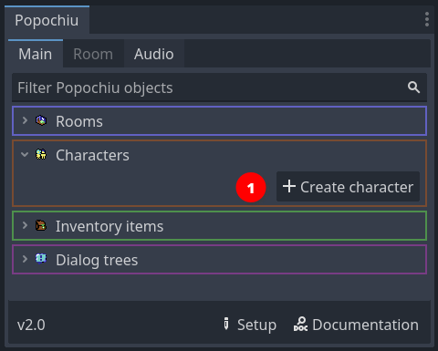

# Creating a game stub

This page will guide you through the process of creating a very small stub for a game.

You will set up a quick game with a single location, a couple interacting characters and items, plus dialogs and inventory.

You can use the resulting stub to experiment and tinker as you read the documentation. If you are already familiar with Popochiu and have already created your project, you can jump to the [Tutorials](/getting-started/tutorials) section to learn more about more advanced features.

!!! info
    If you are moving your first steps in Adventure Games development, or just evaluating if Popochiu is for you, you may want to download the [Example Game Assets Pack](/getting-started/example-resources#example-assets), that contains all the assets used in this tutorial.

    If you just want to tinker with Popochiu or experiment on a throw-away project, you can just clone the [Example Game](/getting-started/example-resources#example-game), that's already complete and ready to run.

## Table of contents

!!! warning
    To follow this introductory guide you must have already created a new Godot project and [installed Popochiu](/getting-started/installing-popochiu).  

To create our game stub we will:

1. [Setup a new adventure game in your Godot project](#game-setup)
2. [Select the game user interface](#select-game-gui)
3. Create two Characters with static sprites
4. Set a character as a player character
5. Create a Room, that's a game location
6. Create a couple of key room elements: a Prop and an Hotspot
7. Make the Characters have a quick dialogue
8. Collect a prop and add it to the inventory

There is more to Popochiu, but this will showcase the foundamental building blocks of how the engine works.

Let's start!

## Game setup

When you first start your project, you are greated with the **Setup** popup, where you can define the base paramenters of your game.

Using this window will take care of configuring Godot project with a coherent preset of paramenters so that your game looks good in all situations.  
Also, it will preconfigure the Game User Interface (GUI) of your choice, so that you don't have to.

### Set game resolution

The **Native game resolution** (_1_) is the actual resolution of your assets (i.e. background). This resolution will be scaled up or down to match the actual display resolution (see below). Usually you want to set this to the size of a full-game background tha fills the entire "screen".

For example, if you plan to create a retro-vibes pixel-art adventure game like the early ones by Sierra or LucasArts, you may want to keep this resolution down to `320x200`, that was the native resolution of VGA displays back then.  
If you want to create a high-res game like the modern Deponia series, with beautifully painted art, you may want to bring this up to `1920x1080`, that's a modern Full-HD display resolution.

!!! tip
    If you plan to develop a pixel-art game for widescreen displays, these are commond resolutions that can work on a modern PC:

    * `320x180`: vertically very small, good to emulate pioneering 80s games like Sierra's _King's Quest_ or similar.
    * `356x200`: more vertical space, this is a "widescreen" version of the 320x200 that games like _The Secret of Monkey Island_ or _King's Quest V_ had on an IBM PC or Amiga, back then.
    * `384x216`: there where no games back then sporting this resolution, but it can be used if you want to have a bit more vertical space for higher sprites, or for a bulky interface like the 9-verbs one, without ruining the _retro-vibe_.

Some prefer not to play adventure games in full-screen so, once you've set the native resolution for you game, you may use the **Playing window resolution** (_2_) values to set the size your game will have when played in windowed mode. For low-res games, you want to provide a larger window than the native resolution, or on most modern displays, it will be very tiny.  

!!! note
    The provided default is a good fit for most Full-HD displays, and the player will be able to resize the window anyway.Probably it's worth adjusting the window size only if you know your game will be played in specific contexts.

Finally, the **Game type** (_3_) select box will set a bunch of project settings that are better kept coherent, from sprite importing, to scaling algorithms, etc. The options are:

* **Custom**: TBD
* **2D**: Chose this for high-res games, that may benefit from anti-aliasing when scaled up or down.
* **Pixel**: Chose this for low-res and pixel-art games, so that you graphics remain crisp when scaled up or down.

!!! note
    Nowadays there are so many different display aspect ratios, that doing assumptions on how your game will be played is futile. Nonetheless, the vast majority of devices out there (mobile or PCs) have displays close enough to `16:9` that you will probably end up keeping this ratio into consideration. That's the reason why Popochiu default values are set to `320x180`: it has the same ratio of a widescreen display.

### Select game GUI

Since version 2.0, Popochiu comes with a preset of different GUI templates, and a set of features to create your own custom one.  
GUI templates will contain everything you need, from assets to logic, to mimic one of the most common game interfaces of the Adventure genre.

In the **GUI Template** (_4_) section of the Setup popup, you can click on a GUI icon to select which template to apply:

* **Custom**: select this if you want to create your own GUI. That's basically the "No template, please" option.
* **9 Verbs**: inspired by the original SCUMM interface, first seen in _Monkey Island 2: LeChuck's Revenge_.
* **Sierra**: inspired by the early 90s SCI interface, common to _King's Quest_ and _Space Quest_ games in early 90s.
* **2-Click Context-sensitive**: the most basic interface for an Adventure Game, common to many modern titles like _Deponia_ - left-click to walk and interact, right-click to examine.

!!! warning
    You can change your mind and apply a different template later during the development of your game, but mind that doing this will **replace** your GUI (and all the custom logic or graphics) with a new template.

    Also, keep in mind that some GUIs will take space on screen (like the 9 Verbs one), and this will impact your backgrounds.

!!! note
    You can go back and review your game setup choices at any moment, clicking the "Setup" button at the bottom of the [Popochiu Main Dock](#TBD).

    

## Create characters

Characters are one of the basic elements of Popochiu, being the bread and butter of every adventure game.

Let's start creating the player character. In the Popochiu main dock, click the **Create character** button (_1_).

A popup will apper, asking for the character name. This is the machine name of your character, not the one the player will see in game, and it needs to be written in `PascalCase`, with no spaces in it.  
Once you entered the name, click the **OK** button (_2_).

As you can see the editor is giving you a preview of the files and assets that will be created. If everything went well, your editor should look like this now:

The new character appears in the main dock list (_3_) and the related scene is open in the editor (_4_).

Now click on the scene's root node (it should be named `Character<YourCharacterName>`) to access the character's properties in the inspector:

Set the **Flips when** parameter (_5_) to `Looking Left`, and leave the rest untouched.

!!! warning
    The suggested value is based on the example sprite direction (right). If you are using a self-made sprite for your character and it's facing left, you should set this property to `Looking right` instead.

The character scene shows nothing. That's because we've set no sprite for our character. Popochiu characters support a full set of standard and custom animations, but since we are only stubbing the game, we'll just set a static sprite for now.

If you don't have a spritesheet ready for your character, you can download [this one](https://github.com/carenalgas/popochiu_2-sample_project/blob/16fc323f1c63388e6b97a30d678aa71e6e1d9db9/game/characters/goddiu/goddiu.png) from the demo game.  
Save it into your project, in the `game/characters/<your character name>/` folder, and rename it as you see fit.

!!! tip
    You can actually save the spritesheet anywhere in your project, but keeping it in the Character folder makes the project structure more tidy and maintainable. You may want to create subfolders to organize assets, but we strongly advice to start simple and reorganize only when it's necessary.

To set the character sprite, go back to your editor and select the **Sprite2D** node in you character's scene (_6_), then locate your spritesheet filename in your file manager (_7_). Select and drag it to the **Texture** property in the inspector (_8_).

You can see from the screenshot that the entire image is now visible in the Character scene. Of course we want to select just a single sprite from the spritesheet. For that, head to the **Animation** section in the inspector and set **Hframes** and **Vframes** value to match the number of sprites in the spritesheet, like this (_9_):

Now the sprite on the scene should be OK, showing your character in the standing position.

---

> `!!!!!!!!!!!!!!!!!!!! WIP !!!!!!!!!!!!!!!!!!!!!!`  
> `TODO: Configure baseline, text positioning etc.`  
> `!!!!!!!!!!!!!!!!!!!!!!!!!!!!!!!!!!!!!!!!!!!!!!!`

---

### Add another character

We are almost done creating our player character. Before moving on, follow [the same steps](#create-characters) to create another one, to keep our main character company and test some interaction.

!!! tip
    In the example game, the second character is named _Popsy_ and [its sprite can be found here](https://github.com/carenalgas/popochiu_2-sample_project/blob/16fc323f1c63388e6b97a30d678aa71e6e1d9db9/game/characters/popsy/popsy.png).

### Select the main character

Now that we have two characters, it's time to tell Popochiu which one will be our main character. That's the one that will be used by the player.  
To do this, locate the first character you have created in Popochiu main dock (in our example it was _Goddiu_), open the drop-down menu, and select `Set as Player Character` (_10_).

!!! info "Multiple character games
    Even if we are not going to cover this detail, Popochiu supports multiple player character in the style of _Maniac Mansion_ or _Day of the Tentacle_. It's as easy as programmatically change a variable from your scripts.

Pat yourself a shoulder! You have succesfully created your first characters.

## Create the first room

TODO

### Add an interactive prop

TODO

## Script your first interaction

TODO

That's it