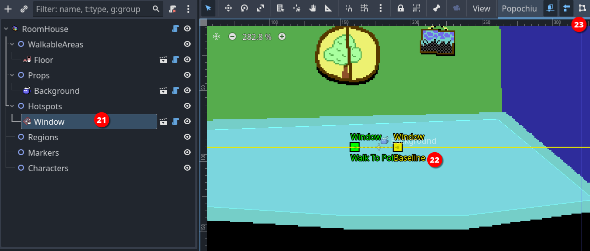

## Create the first room

Now that we have two characters, it's time to create a location for them to interact with.

In Popochiu, game locations are referred to as _rooms_. More broadly, a room can serve as any game screen, including splash screens, menus, or close-ups. Not all rooms need to feature characters, and the main character may be rendered invisible in specific rooms.

To create our first room, just click the **Create room** button in Popochiu's main dock (_13_).


A popup will appear, very similar to the one to create a new character. This time, an additional checkbox is available.
This allows us to set the newly created room as the main scene of the Godot project. Check it out so we don't have to do it later. This scene will also be the only room in this game stub.


Name the new room whatever you want. If you want to follow along, let's name this room "_House_" and make it the main scene.  
Popochiu will create the new room, open the room scene in the editor, and open the corresponding [Room tab](#TODO) in the plugin interface.

Much like a character, a room needs a sprite to represent the background of the location. We are going to use [this background](https://github.com/carenalgas/popochiu-sample-game/blob/16fc323f1c63388e6b97a30d678aa71e6e1d9db9/game/rooms/house/props/background/house_bg.png) from the example game.

But hey! The room has nothing like a sprite in it! Quite the opposite, the scene tree seems to be pretty empty:


<a name="intbkmk-props-explanation"></a>
Unlike other objects in Popochiu, rooms are containers for other more specialized objects, the most important of which are **Props**. Props are every visible part of a location, used to make the environment believable. They can go from a small collectable item, all the way to location backgrounds.

!!! info "Under the hood"
    Popochiu makes no distinction based on the prop function in the game, it knows little about that. You add as many as you want into a scene and interact with them via your game script.  
    The only thing the engine knows about props is their **visibility** and their **clickability**. By flagging those two properties on or off, you can switch objects in and out of a location, and make them interactive.

Armed with this knowledge, it's now clear we must create a prop to hold our background. That's easy. If you followed the steps above, Popochiu dock should be showing the **Home** room tab.


Click the **Create prop** button and as usual, a new window will pop up:


Name the new prop "_Background_" and leave the "Will have interaction?" option unchecked. You don't want all of your screen to react to clicks when you move around.

!!! note
    Moving around the screen doesn't require the background or anything else to be interactive. Popochiu will take care of moving the character for you when you click on a non-interactive area.  
    Go on to learn how to constraint character movement to the right zones.

Click OK and your prop will be created. You should see it in the scene tree, under the **Props** grouping node. The inspector should look something like this:


Now you can see the Prop has a **Texture** parameter. By this time you should be able to figure out what to do. Save the downloaded background sprite in the `game/rooms/house/props/background/` folder, then drag it from Godot Editor file manager to the field in the inspector.  
Your scene should now show the background image.

At this point you have a main character and a main scene defined. These are the minimum steps needed to run a Popochiu game. Treat yourself after all this effort, by hitting the **Run** button at the top right of the editor and seeing your game in action.

If you did everything right, you should see your main character standing in the center of the room. Clicking on the screen will flip the character so that it faces the cursor coordinates.

!!! note
    If you followed this tutorial from the start, when you run the game Popochiu will complain about not found animations. Don't worry about those errors, we didn't include animations to keep this introduction short.  
    Rest assured though that Popochiu has full animation support: it already manages standard animations (for an idle character, for walking and for talking), without having to write any code. A game dev can add a full set of custom animations to play during cutscenes or to support different emotions in dialogues, and so on.

    For those who work with [Aseprite](https://www.aseprite.org/), Popochiu also provides a powerful automated importer that will make creating rooms and characters a breeze and will enable a fast iterative development workflow.

    * Learn more about [animations](/how-to-develop-a-game/playing-animations).
    * Learn more about the [Aseprite importers](/the-editor-handbook/importers)

### Add a Walkable Area

Our character is standing there in the middle of the room, doing nothing. If we click on the screen we would expect it to walk to the clicked location, but that's not happening.

The reason is that we defined no areas in which the character is allowed to move. Popochiu refers to those elements as **Walkable Areas**. They are objects that can live only inside rooms, and each room can have more than one (see the box below for an explanation).

For now, let's create a single walkable area representing the room floor.

In the Room tab of Popochiu dock, click the **Create walkable area** button (_16_).


In the popup window, just name your new walkable area "_Floor_" (or whatever you find descriptive enough). Click **OK** and a new element will be added to the scene.


Selecting the **Perimeter** node in the scene tree (_17_) to highlight a squared polygon in the center of the scene. Now you have to adjust the vertices of that polygon (_18_) to whatever makes sense.

!!! tip
    To adjust the polygon, just click and drag the vertice handles around.  
    It's quite intuitive, but you can add vertices to the polygon by clicking anywhere along a segment.

When you have adjusted your walkable area, it should look something like this:


Save the project and run your game. Your character should now be able to move around the room, without leaving the area you defined.

!!! note
    If you aren't new to Godot, you may think we forgot to mention the **Bake** NavigationPolygon** button in the toolbar (_19_). That's not the case, Popochiu bakes the polygon for you.

!!! tip
    You usually don't want your walkable area to cover the entire floor that you painted, or your character will be able to stand on the very border of it, too near the wall, creating a terrible effect.  
    Remember that Popochiu will stop the movement as soon as the origin point of your character scene reaches one of the walkable area borders.

!!! info "Additional walkable areas"
    It may not be obvious but you may want (or need) a room to have more than a single walkable area. Here are some example cases:

    * A location with two areas separated by an obstacle (like a chasm), that the character can enter both sides.
    * A location with different levels, the character can climb to or reach depending on the game script or specific conditions.
    * A location with a large prop that can be removed (like a pile of fallen rocks): when the prop is removed a larger walkable area is used in place of the smaller one.

    Since you can define which walkable area is the active one for the character from your scripts, having multiple walkable areas unlocks a lot of possibilities for complex locations.

### Add a hotspot

Our character can now move around the room, but there is little it can do. It is time to add some interaction.

A **hotspot** is the most basic form of interaction you can have in a room. It is just an area of the screen, delimited by a polygon drawn at a specific position, that has a name and a script attached to it. It has no sprite of its own, it just sits there on top of other elements, waiting to react to the cursor.

By means of its script, it can react to events like mouse clicks. That's exactly what we're going to do.

Creating a hotspot is much like creating a walkable area. In the Room tab of Popochiu dock, click the **Create hotspot** button (_20_).


In the popup window, just name your new hotspot "_Window_" (or whatever you find descriptive enough). Click **OK** and a new element will be added to the scene.



When you select the new hotspot in the scene tree (_21_), a bunch of gizmos are shown in the scene preview (_22_). We are going to interactively edit two important properties of the hotspot (the _baseline_ and the _walk-to point_) by moving the gizmos on the screen. In addition, the dedicated button in the toolbar (_23_) will allow us to edit the hotspot's _interaction polygon_.

!!! info
    _Walk-to point_, _Baseline_ and _Interaction Polygon_ properties are all common to clickable objects like Hotspots, Props and Characters.

First of all, click the _Interaction Polygon_ button to show the handles of the standard square polygon for the hotspot. Basically, that's the same as the walkable area polygon but instead of limiting the character movements, this polygon will just react when the cursor hovers over it.  
Let's draw a shape around the window on the wall:


No need to be too precise or polished, rough edges won't be perceivable while playing your game. You just need to avoid, if possible, overlapping with other hotspots (see "_Baseline_" below, to understand how polygon overlapping works).

Another important property of the hotspot is the "_Walk to point", which is the coordinates that the character will reach when you click over the hotspot.  
You can set these coordinates interactively by clicking and dragging the "_Walk To point_" gizmo wherever you want in the room. You will see that the property with the same name in the inspector will update to reflect the coordinates.

For our example room, we'll set the following coordinates for the `Window` hotspot:

* `x`: `-30`
* `y`: `-10`

so that our main character will walk beside the window.

The last property that you want to set is the _Baseline_. The baseline is simply a coordinate on the `Y` axis, that represents a point in the imaginary space of the room. If the main character walks **above** the baseline (_above_ means the character's origin has a `Y` coordinate that's lower than the baseline value), it is considered **behind** the object (in this case the hotspot). If the character origin is **below** the baseline, it is considered **in front of** the object.  

!!! warning
    This becomes evident when you have a prop or a character in a room, and you want your main character to walk behind them when its feet are "farther away" from the camera, but a hotspot has no sprite to walk behind, so you may think setting the baseline is useless.  

    That's not the case at all. If you don't set your baseline the right way, the polygon-delimited area of the hotspot may remain clickable even when the character is in front of it; or the other way around, a hotspot that should always be in front of the scene, may be covered by your character, making it unreachable. So, **always** set your baseline.

Our window is in the back of the room and the main character has no way to be placed behind it, so just click the baseline gizmo handler (the square in the middle of the line) and drag it at the very top so that the baseline is "as high as the scene" (or more). The character has no way to walk so high.  

!!! info
    You can set the baseline even to negative values. This is what Popochiu automatically does when you name your prop `Background` or `bg`, to make sure your background is always at the very back of the scene. Keep this in mind too, if you change the baseline of other elements programmatically (via a script).

!!! info
    In the example we made, the hotspot is in the center of the screen. You may have noticed that by dragging its baseline upwards, we set its value in the inspector to `-90` or less (half the vertical size of the viewport in this case). That's because the baseline coordinates are always local to the clickable element.  
    Moving an element from the center position will also move its walk-to point, baseline and interaction polygon.

!!! tip
    If you need pixel-perfect precision, you can set the baseline and the hotspot's _Walk to point_ coordinates by inputting them in the inspector.

    

With the hotspot properly configured, we can now run a quick test. Start your game, move the cursor over the window and you should see the name of the hotspot in the action bar (_24_).


Clicking on the hotspot, the character will move to the point we defined and face the window.

!!! info "Under the hood"
    Remember that we set our character so that its origin is between its feet. When your character moves toward a point, Popochiu will make sure the origin of the character matches the destination point's coordinates.

    What if the destination coordinates lie outside of the walkable area? In this case, Popochiu will trace the path toward the coordinates but will stop the movement as soon as the character reaches the walkable area's borders. Despite this being a safe scenario, placing a _Walk-to point_ inside the walkable polygon always gives the best results, making the movement predictable. Keep this in mind.

### Script your first interaction

If you ran the game, you may have seen that, while the character moves towards the window, a message is printed on top of the scene: `Can't INTERACT with it`.  
That's because we didn't define what should happen when we interact with the window. Remember, in [the GUI we selected](/getting-started/creating-a-game-stub/game-setup#select-game-gui), clicking on an object will trigger an interaction while right-clicking on an object will trigger an examination.

We are now going to script our first interaction, using Godot **GDScript** language and the very convenient [engine API](/the-engine-handbook/scriting-overview) that Popochiu provides to make our life easier.

!!! info "Help! I'm not a developer!"
    "API" stands for "Application Programming Interface" and in our context, it's the set of objects and functions that makes it very easy to implement all those behaviors common to most adventure games (like making a character talk, or adding an item to the inventory), without knowing the ins and outs of the underlying Godot game engine.

In the room tab of the Popochiu dock, locate the "_Open Script_" icon for the `Window` hotspot (_25_):


This will open the GDScript connected to this hotspot in the Godot scripting editor (_26_):


!!! info "Under the hood"
    Every clickable object that Popochiu creates for you comes with an attached script. Those scripts do nothing by themselves but are based on commented templates that will make it easier to implement the desired behaviors, by editing and filling out some predefined functions.

We will now add some interaction to the script. So far it will be simple stuff: we'll make our main character say something meaningful when we examine the window, and - in the absence of other elements in the room - act a bit weird when we try to interact with the window.

Locate the `_on_click()` function in the script. It should read something like this:

```gdscript
# When the node is clicked
func _on_click() -> void:
	# Replace the call to E.command_fallback() with your code.
	E.command_fallback()
	# For example, you can make the player character walk to this hotspot, gaze at it, and then say
	# something:
#	await C.player.walk_to_clicked()
#	await C.player.face_clicked()
#	await C.player.say("What a nice view")
```

Popochiu automatically executes this function when you click over the `Window` hotspot. We just need to put something meaningful into it. Let's try something. Change the function so it looks like this:

```gdscript
# When the node is clicked
func _on_click() -> void:
	await C.player.walk_to_clicked()
	await C.player.face_clicked()
	await E.wait(0.5)
	for n in 3:
		await C.player.face_left()
		await E.wait(0.3)
		await C.player.face_right()
		await E.wait(0.3)
	await C.player.face_clicked()
	await C.player.say("I wanted to open the window but I can't find the handle")
```

Save the script (`ctrl/cmd + s`) and run your game.  
Now when you click the window, the character will walk to it, turn around three times like it is looking around for something, then face the window and say a phrase.

**Yay!** You reached an important milestone! Now your game feels more alive, isn't it?

Let's see what happened, breaking the function down to pieces. Ignore for a moment the `await` keyword.

```gdscript
    await C.player.walk_to_clicked()
	await C.player.face_clicked()
```

These two lines use the `C` Popochiu object. It holds a reference to every character in the game. Our character is called `Goddiu`, so `C.Goddiu` allows us to give commands to that character. But since Goddiu is also the character that the player controls, we can use the shortcut `C.player`.

This comes in very handy for those games that have more player-controlled characters, like _Maniac Mansion_, or _Day of the Tentacle_. You can change the active character as the game progresses but your scripts will point to the current active character, sparing you the effort to duplicate the code for each and every playable character.

```gdscript
	await E.wait(0.5)
	for n in 3:
		await C.player.face_left()
		await E.wait(0.3)
		await C.player.face_right()
		await E.wait(0.3)
```

Here we are literally waiting for some time to pass. `E` is the object representing the game engine (Popochiu!) and we are asking it to wait for half a second.
After that, we use the `for`` GDScript keyword to repeat the same code three times.

!!! info
    This is not a feature of Popochiu, it is standard Godot language. All Popochiu objects and functions are standard Godot functions.  
    As Popochiu matures, it will take care of more and more work in a standardized and simplified way. Stuff like translations, dynamic lightning and music, parallax, and more.  
    In the meantime, since its language is standard GDScript, you have all the power of Godot at your fingertips and you can customize your game the way you want.

The executed code just flips the character left and right after a small pause, as it is looking around.

```gdscript
	await C.player.face_clicked()
	await C.player.say("I wanted to open the window but I can't find the handle")
```

These last two lines make sure the character finally looks towards the window and says its line.

!!! info "Help! I'm not a developer!"
    As the `for` keyword, `await` is provided by Godot out of the box. Without going too deep into technical details, what it does is make sure that while the subsequent function is executed, no other things will happen. In our example, if we omitted the `await` keyword in every line, the character would have started walking to the window, while flipping frantically left and right and talking at the same time (but finishing printing the line in a strange way).

    There are times you want this to happen, like a character who talks in the background without "blocking" the game flow, but omitting `await` usually leads to strange, unexpected behaviors and should be done only on purpose.

Now let's provide an _examine_ interaction. Edit the `_on_right_click()` function you can find further down the script so it looks like this:

```gdscript
# When the node is right clicked
func _on_right_click() -> void:
	await C.player.face_clicked()
	await C.player.say("The weather is so nice today")
	await C.player.say("I may as well open that window!")
```

By this time, you should be able to figure out what will happen by yourself. Run the game and see your masterpiece in action.

### Add a prop

We already encountered props, when we [added our background](#intbkmk-props-explanation) to the game's first room. It's now time for a bit more information.

Props are arguably the most important elements in a room. Like hotspots, they can be interactive; they have a baseline and a _walk-to point_; the shape of the interaction area is represented by a polygon. Unlike hotspots they have their own **Sprite2D** node and an internal **AnimationPlayer**. Simply put, props can represent visible (an animated, if necessary) items on the scene. Since they have a baseline, characters can walk behind them, creating a deep, interesting gaming world.

But the real boon is that their visibility and "clickability" can be turned on and off by code, allowing you to articulate their presence or their function as the game progresses.

Enough talk, let's see them in action.

Since we already created a "_Background_" for our scene, you should know at this point how to create a new prop. Click on the **Create Prop** button in the tab room of the Popochiu dock, name it "_ToyCar_" and this time, check out the **Will have interaction** option (_27_).


!!! note
    If you forget to check this mark, don't worry. You can always make your prop interactive from the inspector.

Your new prop will be added to the scene tree as a child of the **Props** node (_28_). You should also notice a squared area in the center of the scene (_29_). That's the new prop's interaction polygon, set to the default squared shape.


Our prop is very much like a hotspot at the moment, since it has no texture. Let's add one.

If you don't have a sprite ready for your prop, you can download [this one](https://github.com/carenalgas/popochiu-sample-game/blob/801bdbb5cdc9139e05e496e7a703f5f4e37bc861/game/rooms/house/props/toy_car/toy_car.png) from the demo game.  
Save it into your project, in the `game/rooms/<your room name>/props/<your prop name>/toy_car.png` folder, and rename it as you see fit.

Now we can set the **Texture** property in the prop inspector, by dragging the image from the **FileSystem** in place (_30_).


Make sure your prop is selected in the scene tree and drag it somewhere to the left part of the walkable area. Then select the **Interaction Polygon** button in the toolbar, like you did for the hotspot and change the shape of the polygon so that it matches the one of the sprite.  
Your scene should look more or less like this:


Since the baseline is in the middle of the prop, it is already correctly positioned so the character can walk behind it. You can run the game and test that's the case.


!!! tip
    This prop is pretty small and it can be difficult to position your character's feet behind it, without triggering the script of the prop itself. One possible trick is to edit the polygon so that it stays out of the way if you click on the prop itself. But there is a simpler and less destructive way to achieve that. Locate the **PopochiuClickable** section in the prop inspector, and uncheck the **Clickable** property (_32_) for the toy car.

    

    This will render the prop non-interactive. The **Clickable** property can also be set on or off in a script, nice when the nature of the prop depends on your game's status.

    **Remember to turn on this property** to follow up with this tutorial!

Eventually, we want to enable our main character to pick up the toy car and add it to the inventory. For that though, we need some more elements, so we'll get back to that later.  
For the moment, we'll just script a simple "examine" interaction, but we'll seize the opportunity to learn something new.

Click the **Open in Script** icon that you can find on the prop line in the Popochiu dock to edit the prop script. If you skim through it, you will notice it's very similar to the script for a hotspot. This makes sense since the interaction part is mostly the same.

Our GUI dictates that the character examines the surroundings by clicking the right mouse button, so let's make our `_on_right_click()` function like this:

```gdscript
func _on_right_click() -> void:
	await C.player.face_clicked()
	await C.player.say("Popsy leaves his toys everywhere!")
	await C.player.say("I have to pay attention or I will step on it.")
```

At this point, you should be familiar with those instructions. Run the game and see how the main character comments on the mess left by its younger friend.  
This comment conveys some lore about the game world, telling the player something about Popsy's personality (we added Popsy as a second character earlier), but it's pretty long and we may want to put our accent on the second part: paying attention before stepping over it. This may be a signpost to suggest to the player that it's better to pick the toy car up.

To achieve our design goal, we'll add a bit of logic to our interaction, leveraging the power of GDScript.  
We will create a boolean property for the toy car  (boolean means the property can be either `true` or `false`, no other values are allowed), and will use it like a switch, to know if we already examined the prop at least one time. This way we'll make the main character say only the second line if the player examines the prop more than once.

It takes longer to say it than to do it. First of all, we'll add a property to the prop. Scroll up to the top of the script, and add the highlighted line to create a boolean variable, assigning it the `true` value.

```gdscript
@tool
extends PopochiuProp
# You can use E.queue([]) to trigger a sequence of events.
# Use await E.queue([]) if you want to pause the excecution of
# the function until the sequence of events finishes.

var first_time_seen := true   # <--- add this instruction

#region Virtual ####################################################################################
```

The assignment of the `true` value happens only when the prop is created, as soon as you start the game.

!!! tip
    You may be asking yourself if the name of the variable has to be exactly that one. That's not the case: this property is completely custom and Popochiu doesn't care about its name, and not even about its value actually, it doesn't even want you to use it.  
    You can name your variables whatever you want, but it's a best practice to have names that reflect their purpose. You don't want to end up with scripts full of `a`, `b`, `c`, `x` or `my_var`... they will be a mess to maintain!

Now that we have a way to know if it's the first time we examined the prop, let's change the `_on_right_click()` like this:

```gdscript
# When the node is right clicked
func _on_right_click() -> void:
	await C.player.face_clicked()
	if first_time_seen:
		await C.player.say("Popsy leaves his toys everywhere!")
		first_time_seen = false
	await C.player.say("I have to pay attention or I will step on it.")
```

You can see we are now testing the value by using an `if` statement. It almost reads like plain English, right? If it's the first time that we examine the prop, we say the first phrase, **then we change the value of the `first_time_seen` variable**.  
As long as we run the game, the value won't change back so the next time you examine the prop, the `if` statement is skipped and the execution will jump to the last line.

!!! info
    If the variable is reset to true every time the game is started, what happens when I restore a saved game?  
    Saving your game is not part of this introductory guide, but don't worry! Popochiu automatically saves the values of all custom properties and restores them for you when you load a saved game.

Run the game and test it.  
Done, we have a prop in the scene! It's now time to learn how to use the character's inventory.
