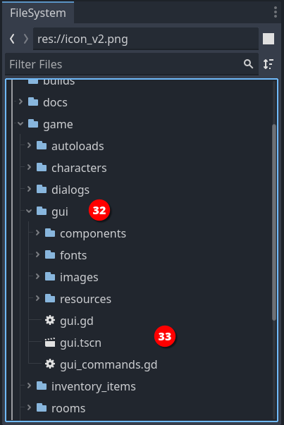

## Customize the Game UI

!!! warning "Disclaimer"
	GUIs are an important part of the player's experience and, among the many aspects that all adventure games have in common, it's the one that tends to get more customization and personal touches.

	The variety in the GUIs panorama makes them a complex topic, one that requires **dedicated effort** and some **solid Godot-related skills** to give good results.

	We will eventually provide a complete guide for custom GUIs that will cover every aspect, but this is out of the scope of this tutorial, at the moment.

Is that a wrap? Not yet! We are missing one very important bit: the User Interface for your game (GUI).

When you think about an adventure game, the first thing that comes to your mind are the elements of the story: interesting characters, challenging puzzles, the visual style... those are the things that every adventure game, from the seminal _King's Quest_ to the last _Syberia_ act, have in common.

But what differentiates your experience as a player beyond the game content, is how you interact with the game.

For this last chapter of our _Getting Started_ guide, we are going to explain the basic concepts and anatomy of a Popochiu game's interface and show you how to customize the appearance of one of the predefined GUIs.

!!! note
	As we noted back in the [Game Setup](/getting-started/game-setup) chapter, Popochiu provides different GUIs you can use in your game, and more will be added in the future.  
	The concepts we'll explore in the upcoming paragraphs apply to every current and future GUIs, but - per the considerations above - applying them to different GUIs may be non-straightforward and require a bit of fiddling and understanding. Be ready to roll your sleeves and don't forget to [ask for help in our community](getting-started/getting-help).

### Anatomy of a GUI in Popochiu

When you setup a new game, Popochiu creates a directory named `graphic_interface` under your `game` folder (_32_).

The content of this directory is a _configured copycat_ of a template that contains the base GUI, which sits in the `addons/popochiu/objects/graphic_inerface` and **must be left untouched**!

Everything you need to configure your GUI is in the `game/graphic_interface` directory.

The most important files (_33_) are:

1. `graphic_interface.gd`: this script contains the wiring logic for the interface. Usually the bulk of it is made by functions to process signals triggered by the UI element.
2. `graphic_inerface.tscn`: this scene holds all the interface elements and it's initialized by the engine when the game starts. The elements in the scene are put on a dedicated layer to make them accessible.
3. `commands.gd` script: this very important file holds the declaration of the GUI **commands**, a concept that Popochiu implements to make processing events coming from the GUI easier in the game scripts.

!!! info "A brief about Commands"
	This tutorial won't go deep into the topic of Commands. Also, the _2-Click Context Sensitive_ interface is very light on Commands implementation because of its very nature.  
	**Feel free to jump this info box if you just want to customize the interface appearence.**

	A quick way to understand commands is this: think of the Lucas 9-Verbs interface, the Sierra SCI interface, and the "Sam & Max" or "Broken Sword" icon-based interfaces. All are very **different in shape**, but they have in common that **you can select an action to perform** when you interact with a game object.  
	For example, you can _Pick up_ an item; you can _Examine_ or _Talk to_ a character; _Use_, _Push_ or _Give_ an object; _Walk_ around and so on.

	Commands are just this, **a set of valid actions** that are exposed by your interface, that can be attempted on every clickable game object (inventory items, props, characters, hotspots).
	
	Unlike almost every single Adventure Game Engines out there, Popochiu makes no assumption on those _valid actions_ but instead, gives you a framework to:

	* **Register** the Commands you need (you decide which ones)
	* **Activate** them by your GUI elements (you decide the wiring)
	* **Trigger** them by clicking on a game object
	* **Process** different logic in your game scripts, depending on the triggered command

	Granted, this requires a bit of work when you design the interface, but the lack of assumptions won't make you jump through hoops because of design choices made by the wrong people: _us_!

## The GUI scene

If you open the `graphical_interface.tscn` file (_34_), you will see the _2-Clicks Context Sensitive_ GUI's scene, that's made like this:

As mentioned, a single scene contains all of the GUI elements. You can see them arranged in the scene editor (_35_), and how they are organized in the scene tree (_36_).

### GUI Elements overview

The scene file, as well as the command and script ones, will differ a lot between different scene templates.

There is nothing that's inherently mandatory in every single interface, and this is both good and bad news. Good, in that you can go wild with every interface idea you can dream of. Bad in that there are little rules to follow when creating custom GUIs.

All the provided interfaces thou, share some common elements:

* The **Cursor** node is there to hold the animations for the actual cursor.

  	!!! warning
  		At the time of writing, this is NOT the actual cursor that will be shown by the engine. Popochiu will just rob this node of its animations but will ignore all the other properties. For example, changing the size or modulation of this node, won't affect the cursor at all.  
		We plan to change this in the future, for convenience.

* The **DialogText** is the element that will show what the characters say in the game. This node has its scene, that provides a configurable set of variations, like "above the head" text, to text panel, with or without a character portrait, to caption text displayed at a fixed position.
* The **DialogMenu** is the panel on which you select the dialog lines. This can be changed to an icon bar (as in "Sam & Max Hit the Road") or any other stuff, but it's pretty common in its basic form (scrollable list of phrases).
* The **Popups**: conveniently grouped under their control parent, are those windows for saving and loading the game, configuring settings, and showing messages to the user.

Other elements are specific to this interface, like the **InventoryBar** and **SettingsBar**, that appear on top of the screen when hovered with the cursor.

In the more "graphically explicit" interfaces, like Sierra and 9-Verbs, you can find more elements, arranged in different order. For example the verbs panel and the inventory grid are pretty complex elements in the 9-Verbs UI, while the inventory appears in a grid overlay in the Sierra one.

!!! info "Under the hood"
	To keep things decoupled, the GUI elements are wired to the rest of the game with signals. The logic to process those signals is in the `graphical_interface.gd` script.

	We are not going to detail this now, but those who are skilled in programming (or who feel more adventurous) should feel free to take a look.

### How to visually customize your GUI

Now that we have a broad idea of how a GUI is organized, it should be easy to recognize the various elements in the running game.

Now, say that you want to change the colors and font of the interface in your game. This is pretty simple because all the GUIs are based on a [Godot Theme](https://docs.godotengine.org/en/stable/tutorials/ui/gui_skinning.html#basics-of-themes) and can be changed with the standard [Theme Editor](https://docs.godotengine.org/en/stable/tutorials/ui/gui_using_theme_editor.html).

!!! tip
	We strongly suggest you take the time to learn about Godot theming and skinning concepts, as well as gain confidence with the theme editor to make the most out of this tutorial.  
	We won't go in too much details about the UI skinning techniques because it's something that may change with new versions of Godot, and because it's all well documented knowledge that don't need to be further detailed in this guide.

**TODO: complete this section**

**Congratulations! You've got to the end of this introductory guide!**
