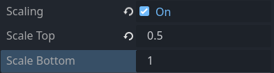

# Character Scaling

Having all characters of the same size at any point in the game is sometimes not desirable. Unless you develop an isometric game, you may need to make characters bigger or smaller in specific rooms or even change their size as they walk around a specific location.

It will apply in particular to:

* Rooms with background drawn with the use of linear perspective
* Shrinking and enlarging character like in the vortex scene from _Sam and Max: Hit the Road_.

Popochiu allows you to scale any character either from the inspector or from code, by assigning its scale factor directly. Although this may work for static resizing, from a developer perspective, there is a more convenient way: delegating to a room's [regions]() the task of scaling the character's sprites as they walk into them.

## Region-base scaling setup

Create a new region in the room and add a polygon to it. The polygon should be shaped in a way that covers the area of the background in which you want your character to scale.

Once you're done, select your region in the room's scene tree and flag the **Scaling** property on.  
Now you can set the **Scale Top** and **Scale Bottom** multipliers for the region.

Now Popochiu will scale the character linearly, from the bottom-most to the top-most points of the region.

If you need the character to be scaled the same across the whole region, just set the same value for **Scale Top** and **Scale Bottom**.

The Character's scaling and the region scaling factors are independent, so if your character's scale is different than `1`, you have to take it into account while setting the scale for a region, or the character will "snap" to a different size when it enters the region.

!!! tip
    Usually you don't want to **upscale** your character, because it gives bad results in almost every situation. This is particularly true for pixel art or low-resolution games.  
    There is nothing wrong in doing this if it works for you, but - if you want to play safe - design your game so that the largest scaling factor for a sprite is `1` in every location.

## Walking between regions

You can set more than one scaling region in the same room (for example, one for the foreground and another for a staircase, or a main region for the front of the scene and a single one that goes down a path, far towards the horizon).  
The region scales the characters as soon as they step into it. If a character exits the region, its default scale is restored, unless he entered another, overlapping scaling region.

Very complex perspectives, with paths going back and forth in a way that forces you to split the scaling region into multiple polygons then, will require some overlap between them and some tinkering with scaling factors to find the right behavior.

## Known issues and limitations

1. Scale can be set only on the vertical axis. So far, **Popochiu does not support horizontal scaling**.
2. In some scenarios, you can stumble onto odd behaviors. Follow these rules to avoid them:
    * If the region should stretch up to the borders of a walkable area, **make it a little wider** so the character won't accidentally step out of the region towards the borders, snapping back to its natural scale.
    * Avoid overlapping two regions in a way that allows the character to enter, then exit one region, while staying in the other one. It can trick the engine into thinking it exited both regions and restoring the character's default scale.
    * Avoid setting scaling regions perfectly contained into each other, for the same reason (it's a special case of the above, in fact).
    * If two adjacent scaling regions share their vertical borders, but different vertical sizes, your character will most likely snap to different scaling if it moves across the vertical border. It may require some trial and error to make them fit.
    * If [anti-glide animation](/popochiu/how-to-develop-a-game/advanced-techniques/character-anti-glide) is turned on, the character will change its size only when a frame if its walking animation is rendered. This is usually the desired behavior, but if you want to achieve a smooth, continuous visual effect, you may have to turn the anti-glide feature off.
