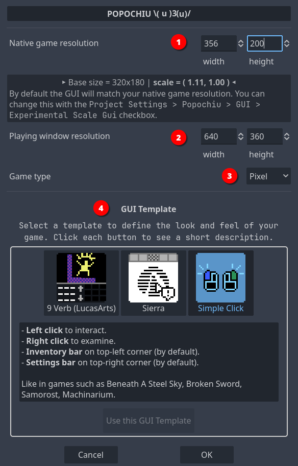

## Game setup

When you first start your project, you are greeted with the **Setup** popup, where you can define the base parameters of your game.

Using this window will take care of configuring Godot project with a coherent preset of parameters so that your game looks good in all situations.  
Also, it will preconfigure the Game User Interface (GUI) of your choice, so that you don't have to.
