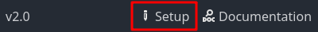

### Select game GUI

Since version 2.0, Popochiu comes with a preset of different GUI templates, and in the next version, it will provide a set of features to create your own custom one.  
Preset GUI templates will contain all the assets and logic thay you need to mimic some of the most common game interfaces of the Adventure genre.

In the **GUI Template** (_4_) section of the Setup popup, you can click on a GUI icon to select which template to apply:

* **9 Verbs**: inspired by the original SCUMM interface, first seen in _Maniac Mansion_, but getting its final form with _Monkey Island 2: LeChuck's Revenge_, and used by many games up to the recent _Thimbleweed Park_.
* **Sierra**: inspired by the early 90s SCI interface, common to _King's Quest_ and _Space Quest_ series. It took many forms, always specific to Sierra games. Very useful for projects that want to bring back that historical interaction patterns.
* **SimpleClick**: the most basic and straightforward interface for an Adventure Game, common to many modern titles like _Deponia_ - left-click to walk and interact, right-click to examine. This version is influenced by early PowerHoof productions.

!!! warning
    You can change your mind and apply a different template later during the development of your game, but doing this will **replace** your GUI (and all the custom logic or graphics) with a new template.

    Also, keep in mind that some GUIs will take up space on the screen (like the 9 Verbs one), so please, consider this when designing your backgrounds.

!!! note
    You can go back and review your game setup choices at any moment, by clicking the "Setup" button at the bottom of the Popochiu Main Dock.

    
