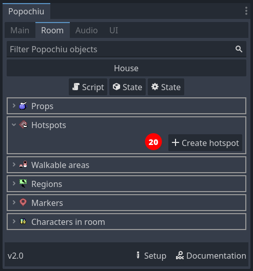
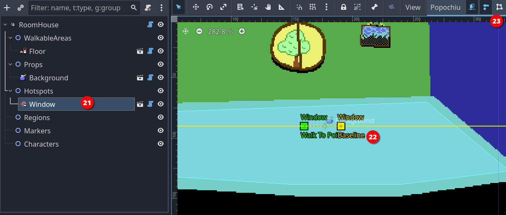
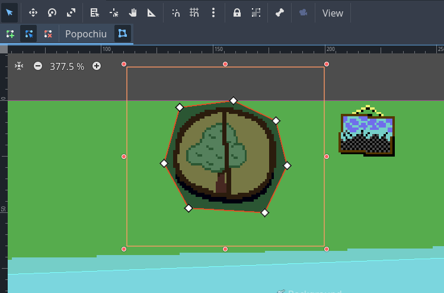
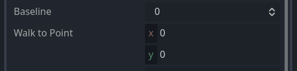
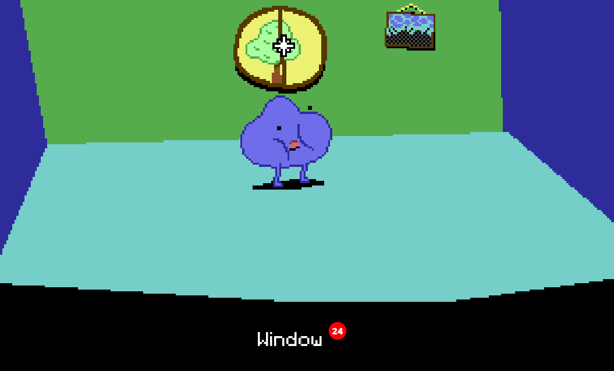

### Add a hotspot

Our character can now move around the room, but there is little it can do. It is time to add some interaction.

A **hotspot** is the most basic form of interaction you can have in a room. It is just an area of the screen, delimited by a polygon drawn at a specific position, that has a name and a script attached to it. It has no sprite of its own, it just sits there on top of other elements, waiting to react to the cursor.

By means of its script, it can react to events like mouse clicks. That's exactly what we're going to do.

Creating a hotspot is much like creating a walkable area. In the Room tab of Popochiu dock, click the **Create hotspot** button (_20_).

In the popup window, just name your new hotspot "_Window_" (or whatever you find descriptive enough). Click **OK** and a new element will be added to the scene.

When you select the new hotspot in the scene tree (_21_), a bunch of gizmos are shown in the scene preview (_22_). We are going to interactively edit two important properties of the hotspot (the _baseline_ and the _walk-to point_) by moving the gizmos on the screen. In addition, the dedicated button in the toolbar (_23_) will allow us to edit the hotspot's _interaction polygon_.

!!! info
    _Walk-to point_, _Baseline_ and _Interaction Polygon_ properties are all common to clickable objects like Hotspots, Props and Characters.

First of all, click the _Interaction Polygon_ button to show the handles of the standard square polygon for the hotspot. Basically, that's the same as the walkable area polygon but instead of limiting the character movements, this polygon will just react when the cursor hovers over it.  
Let's draw a shape around the window on the wall:

No need to be too precise or polished, rough edges won't be perceivable while playing your game. You just need to avoid, if possible, overlapping with other hotspots (see "_Baseline_" below, to understand how polygon overlapping works).

Another important property of the hotspot is the "_Walk to point_", which is the coordinates that the character will reach when you click over the hotspot.  
You can set these coordinates interactively by clicking and dragging the **Walk To Point** gizmo wherever you want in the room. You will see that the property with the same name in the inspector will update to reflect the coordinates.

For our example room, we'll set the following coordinates for the `Window` hotspot:

* `x`: `-30`
* `y`: `-10`

so that our main character will walk beside the window.

The last property that you want to set is the _Baseline_. The baseline is simply a coordinate on the `Y` axis, that represents a point in the imaginary space of the room. If the main character walks **above** the baseline (_above_ means the character's origin has a `Y` coordinate that's lower than the baseline value), it is considered **behind** the object (in this case the hotspot). If the character origin is **below** the baseline, it is considered **in front of** the object.  

!!! warning
    This becomes evident when you have a prop or a character in a room, and you want your main character to walk behind them when its feet are "farther away" from the camera, but a hotspot has no sprite to walk behind, so you may think setting the baseline is useless.  

    That's not the case at all. If you don't set your baseline the right way, the polygon-delimited area of the hotspot may remain clickable even when the character is in front of it; or the other way around, a hotspot that should always be in front of the scene, may be covered by your character, making it unreachable. So, **always** set your baseline.

Our window is in the back of the room and the main character has no way to be placed behind it, so just click the **Baseline** gizmo handler (the square in the middle of the line) and drag it at the very top so that the baseline is "as high as the scene" (or more). The character has no way to walk so high.  

!!! info
    You can set the baseline even to negative values. This is what Popochiu automatically does when you name your prop `Background` or `bg`, to make sure your background is always at the very back of the scene. Keep this in mind too, if you change the baseline of other elements programmatically (via a script).

!!! info
    In the example we made, the hotspot is in the center of the screen. You may have noticed that by dragging its baseline upwards, we set its value in the inspector to `-90` or less (half the vertical size of the viewport in this case). That's because the baseline coordinates are always local to the clickable element.  
    Moving an element from the center position will also move its walk-to point, baseline and interaction polygon.

!!! tip
    If you need pixel-perfect precision, you can set the baseline and the hotspot's _Walk to point_ coordinates by inputting them in the inspector.

    

With the hotspot properly configured, we can now run a quick test. Start your game, move the cursor over the window and you should see the name of the hotspot in the action bar (_24_).

Clicking on the hotspot, you'll get a message that you can't yet interact with it.
