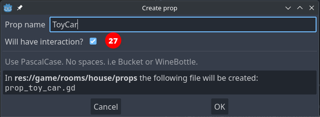
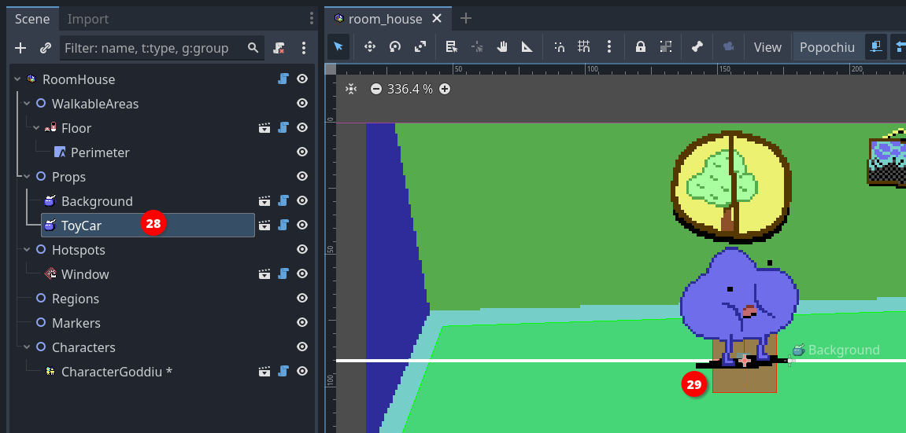
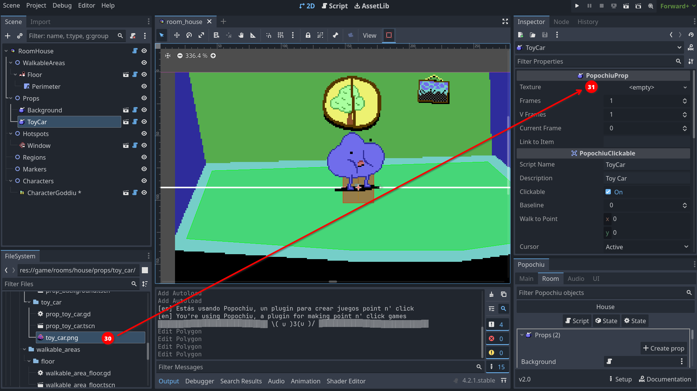
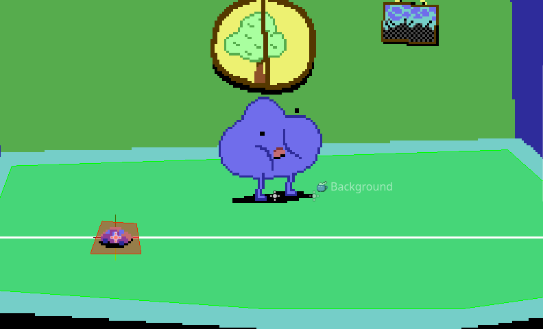
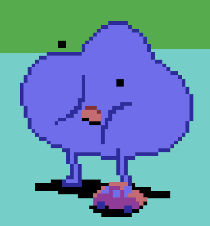
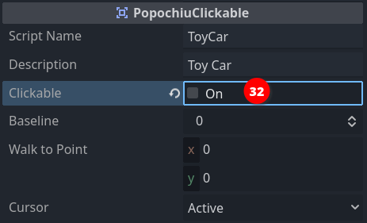

### Add a prop

We already encountered props, when we [added our background](index.md#intbkmk-props-explanation) to the game's first room. It's now time for a bit more information.

Props are arguably the most important elements in a room. Like hotspots, they can be interactive; they have a baseline and a _walk-to point_; the shape of the interaction area is represented by a polygon. Unlike hotspots they have their own **Sprite2D** node and an internal **AnimationPlayer**. Simply put, props can represent visible (an animated, if necessary) items on the scene. Since they have a baseline, characters can walk behind them, creating a deep, interesting gaming world.

But the real boon is that their visibility and "clickability" can be turned on and off by code, allowing you to articulate their presence or their function as the game progresses.

Enough talk, let's see them in action.

Since we already created a "_Background_" for our scene, you should know at this point how to create a new prop. Click on the **Create Prop** button in the tab room of the Popochiu dock, name it "_ToyCar_" and this time, check out the **Will have interaction** option (_27_).



!!! note
    If you forget to check this mark, don't worry. You can always make your prop interactive from the inspector.

Your new prop will be added to the scene tree as a child of the **Props** node (_28_). You should also notice a squared area in the center of the scene (_29_). That's the new prop's interaction polygon, set to the default squared shape.



Our prop is very much like a hotspot at the moment, since it has no texture. Let's add one.

If you don't have a sprite ready for your prop, you can download [this one](https://github.com/carenalgas/popochiu-sample-game/blob/801bdbb5cdc9139e05e496e7a703f5f4e37bc861/game/rooms/house/props/toy_car/toy_car.png) from the demo game.  
Save it into your project, in the `game/rooms/<your room name>/props/<your prop name>/toy_car.png` folder, and rename it as you see fit.

Now we can set the **Texture** property in the prop inspector, by dragging the image from the **FileSystem** in place (_30_).



Make sure your prop is selected in the scene tree and drag it somewhere to the left part of the walkable area. Then select the **Interaction Polygon** button in the toolbar, like you did for the hotspot and change the shape of the polygon so that it matches the one of the sprite.  
Your scene should look more or less like this:



Since the baseline is in the middle of the prop, it is already correctly positioned so the character can walk behind it. You can run the game and test that's the case.



!!! tip
    This prop is pretty small and it can be difficult to position your character's feet behind it, without triggering the script of the prop itself. One possible trick is to edit the polygon so that it stays out of the way if you click on the prop itself. But there is a simpler and less destructive way to achieve that. Locate the **PopochiuClickable** section in the prop inspector, and uncheck the **Clickable** property (_32_) for the toy car.

    

    This will render the prop non-interactive. The **Clickable** property can also be set on or off in a script, nice when the nature of the prop depends on your game's status.

    Make sure this property **is set to On** to follow the rest of this tutorial!

Eventually, we want to enable our main character to pick up the toy car and add it to the inventory. For that though, we need some more elements, so we'll get back to that later.  
For the moment, we'll just script a simple "examine" interaction, but we'll seize the opportunity to learn something new.

Click the **Open in Script** icon that you can find on the prop line in the Popochiu dock to edit the prop script. If you skim through it, you will notice it's very similar to the script for a hotspot. This makes sense since the interaction part is mostly the same.

Our GUI dictates that the character examines the surroundings by clicking the right mouse button, so let's make our `_on_right_click()` function like this:

```gdscript
func _on_right_click() -> void:
	await C.player.face_clicked()
	await C.player.say("Popsy leaves his toys everywhere!")
	await C.player.say("I have to pay attention or I will step on it.")
```

At this point, you should be familiar with those instructions. Run the game and see how the main character comments on the mess left by its younger friend.  
This comment conveys some lore about the game world, telling the player something about Popsy's personality (we added Popsy as a second character earlier), but it's pretty long and we may want to put our accent on the second part: paying attention before stepping over it. This may be a signpost to suggest to the player that it's better to pick the toy car up.

To achieve our design goal, we'll add a bit of logic to our interaction, leveraging the power of GDScript.  
We will create a boolean property for the toy car  (boolean means the property can be either `true` or `false`, no other values are allowed), and will use it like a switch, to know if we already examined the prop at least one time. This way we'll make the main character say only the second line if the player examines the prop more than once.

It takes longer to say it than to do it. First of all, we'll add a property to the prop. Scroll up to the top of the script, and add the highlighted line to create a boolean variable, assigning it the `true` value.

```gdscript
@tool
extends PopochiuProp
# You can use E.queue([]) to trigger a sequence of events.
# Use await E.queue([]) if you want to pause the execution of
# the function until the sequence of events finishes.

var first_time_seen := true   # <--- add this instruction

#region Virtual ####################################################################################
```

The assignment of the `true` value happens only when the prop is created, as soon as you start the game.

!!! tip
    You may be asking yourself if the name of the variable has to be exactly that one. That's not the case: this property is completely custom and Popochiu doesn't care about its name, and not even about its value actually, it doesn't even want you to use it.  
    You can name your variables whatever you want, but it's a best practice to have names that reflect their purpose. You don't want to end up with scripts full of `a`, `b`, `c`, `x` or `my_var`... they will be a mess to maintain!

Now that we have a way to know if it's the first time we examined the prop, let's change the `_on_right_click()` like this:

```gdscript
# When the node is right clicked
func _on_right_click() -> void:
	await C.player.face_clicked()
	if first_time_seen:
		await C.player.say("Popsy leaves his toys everywhere!")
		first_time_seen = false
	await C.player.say("I have to pay attention or I will step on it.")
```

You can see we are now testing the value by using an `if` statement. It almost reads like plain English, right? If it's the first time that we examine the prop, we say the first phrase, **then we change the value of the `first_time_seen` variable**.  
As long as we run the game, the value won't change back so the next time you examine the prop, the `if` statement is skipped and the execution will jump to the last line.

!!! info
    If the variable is reset to true every time the game is started, what happens when I restore a saved game?  
    Saving your game is not part of this introductory guide, but don't worry! Popochiu automatically saves the values of all custom properties and restores them for you when you load a saved game.

Run the game and test it.  
Done, we have a prop in the scene! It's now time to learn how to use the character's inventory.
