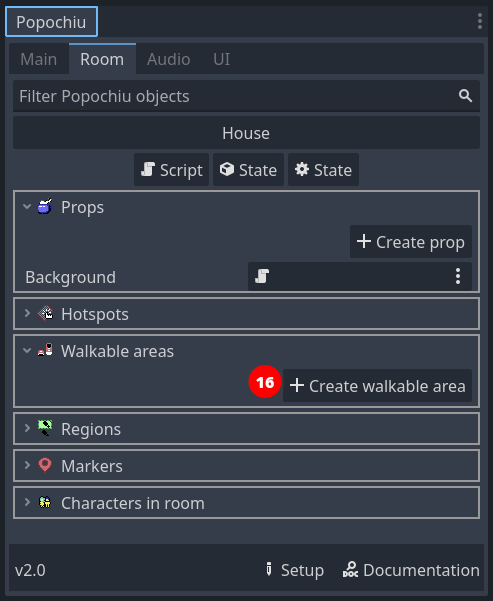
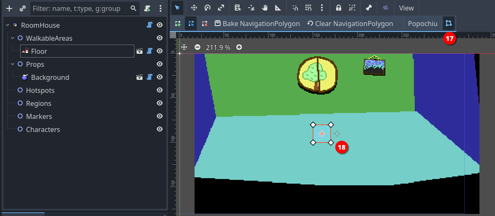

### Add a Walkable Area

Our character is standing there in the middle of the room, doing nothing. If we click on the screen we would expect it to walk to the clicked location, but that's not happening.

The reason is that we defined no areas in which the character is allowed to move. Popochiu refers to those elements as **Walkable Areas**. They are objects that can live only inside rooms, and each room can have more than one (see the box below for an explanation).

For now, let's create a single walkable area representing the room floor.

In the Room tab of Popochiu dock, click the **Create walkable area** button (_16_).

In the popup window, just name your new walkable area "_Floor_" (or whatever you find descriptive enough). Click **OK** and a new element will be added to the scene.

Click the **Edit Polygon** button in the toolbar (_17_) to highlight a squared polygon in the center of the scene. Now you have to adjust the vertices of that polygon (_18_) to whatever makes sense.

!!! tip
    To adjust the polygon, just click and drag the vertice handles around.  
    It's quite intuitive, but you can add vertices to the polygon by clicking anywhere along a segment. If it's not working, make sure your pointer is in [Select mode](https://docs.godotengine.org/en/stable/tutorials/2d/introduction_to_2d.html#main-toolbar) (press Q).

When you have adjusted your walkable area, it should look something like this:

Click the **Edit Polygon** button again (_19_) to stop editing the perimeter of the floor.

Save the project and run your game. Your character should now be able to move around the room, without leaving the area you defined.

!!! note
    If you aren't new to Godot, you may think we forgot to mention the **Bake NavigationPolygon** button in the toolbar (_19_). That's not the case, Popochiu bakes the polygon for you.

!!! tip
    You usually don't want your walkable area to cover the entire floor that you painted, or your character will be able to stand on the very border of it, too near the wall, creating a terrible effect.  
    Remember that Popochiu will stop the movement as soon as the origin point of your character scene reaches one of the walkable area borders.

!!! info "Additional walkable areas"
    It may not be obvious but you may want (or need) a room to have more than a single walkable area. Here are some example cases:

    * A location with two areas separated by an obstacle (like a chasm), that the character can enter both sides.
    * A location with different levels, the character can climb to or reach depending on the game script or specific conditions.
    * A location with a large prop that can be removed (like a pile of fallen rocks): when the prop is removed a larger walkable area is used in place of the smaller one.

    Since you can define which walkable area is the active one for the character from your scripts, having multiple walkable areas unlocks a lot of possibilities for complex locations.
