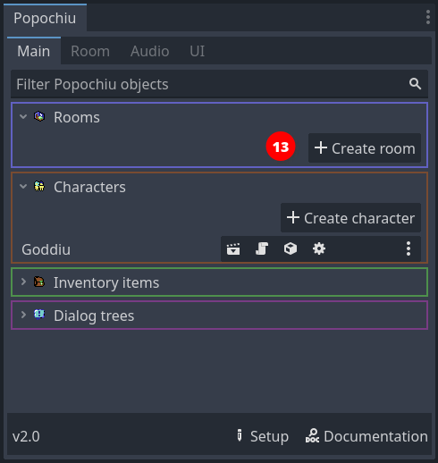
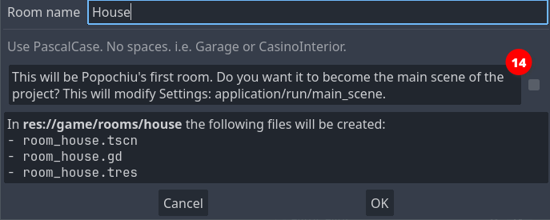
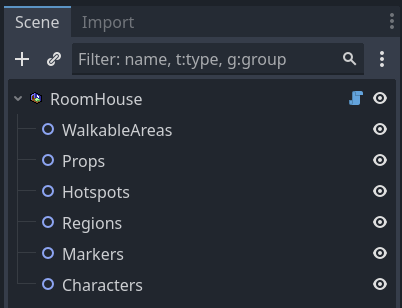
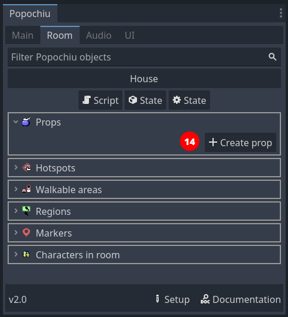
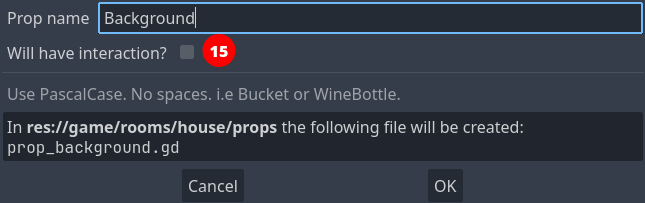
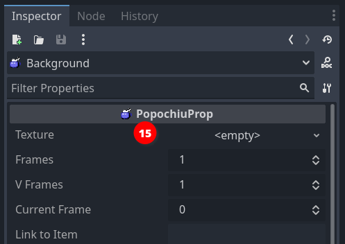

## Create the first room

Now that we have two characters, it's time to create a location for them to interact with.

In Popochiu, game locations are referred to as _rooms_. More broadly, a room can serve as any game screen, including splash screens, menus, or close-ups. Not all rooms need to feature characters, and the main character may be rendered invisible in specific rooms.

To create our first room, just click the **Create room** button in Popochiu's main dock (_13_).

A popup will appear, very similar to the one to create a new character. This time, an additional checkbox is available.
This allows us to set the newly created room as the main scene of the Godot project. Check it out so we don't have to do it later. (If you forget, you can set it from the three dots menu next to a room.) This scene will also be the only room in this game stub.

Name the new room whatever you want. If you want to follow along, let's name this room "_House_" and make it the main scene.  
Popochiu will create the new room, open the room scene in the editor, and open the corresponding [Room tab](#TODO) in the plugin interface.

Much like a character, a room needs a sprite to represent the background of the location. We are going to use [this background](https://github.com/carenalgas/popochiu-sample-game/blob/16fc323f1c63388e6b97a30d678aa71e6e1d9db9/game/rooms/house/props/background/house_bg.png) from the example game.

But hey! The room has nothing like a sprite in it! Quite the opposite, the scene tree seems to be pretty empty:

Unlike other objects in Popochiu, rooms are containers for other more specialized objects, the most important of which are **Props**. Props are every visible part of a location, used to make the environment believable. They can go from a small collectable item, all the way to location backgrounds.

!!! info "Under the hood"
    Popochiu makes no distinction based on the prop function in the game, it knows little about that. You add as many as you want into a scene and interact with them via your game script.  
    The only thing the engine knows about props is their **visibility** and their **clickability**. By flagging those two properties on or off, you can switch objects in and out of a location, and make them interactive.

Armed with this knowledge, it's now clear we must create a prop to hold our background. That's easy. If you followed the steps above, Popochiu dock should be showing the **Home** room tab.

Click the **Create prop** button and as usual, a new window will pop up:

Name the new prop "_Background_" and leave the "Will have interaction?" option unchecked. You don't want all of your screen to react to clicks when you move around.

!!! note
    Moving around the screen doesn't require the background or anything else to be interactive. Popochiu will take care of moving the character for you when you click on a non-interactive area.  
    Go on to learn how to constraint character movement to the right zones.

Click OK and your prop will be created. You should see it in the scene tree, under the **Props** grouping node. The inspector should look something like this:

Now you can see the Prop has a **Texture** parameter (_15_). By this time you should be able to figure out what to do: Save the downloaded background sprite in the `game/rooms/house/props/background/` folder, then drag it from Godot Editor file manager to the field in the inspector.  
Your scene should now show the background image.

At this point you have a main character and a main scene defined. These are the minimum steps needed to run a Popochiu game. Treat yourself after all this effort, by hitting the **Run** button at the top right of the editor and seeing your game in action.

If you did everything right, you should see your main character standing in the center of the room. Clicking on the screen will flip the character so that it faces the cursor coordinates.

!!! note
    If you followed this tutorial from the start, when you run the game Popochiu will complain about not found animations. Don't worry about those errors, we didn't include animations to keep this introduction short.  
    Rest assured though that Popochiu has full animation support: it already manages standard animations (for an idle character, for walking and for talking), without having to write any code. A game dev can add a full set of custom animations to play during cutscenes or to support different emotions in dialogues, and so on.

    For those who work with [Aseprite](https://www.aseprite.org/), Popochiu also provides a powerful automated importer that will make creating rooms and characters a breeze and will enable a fast iterative development workflow.

    * Learn more about the [Aseprite importers](../the-editor-handbook/importers.md)

