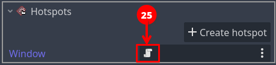
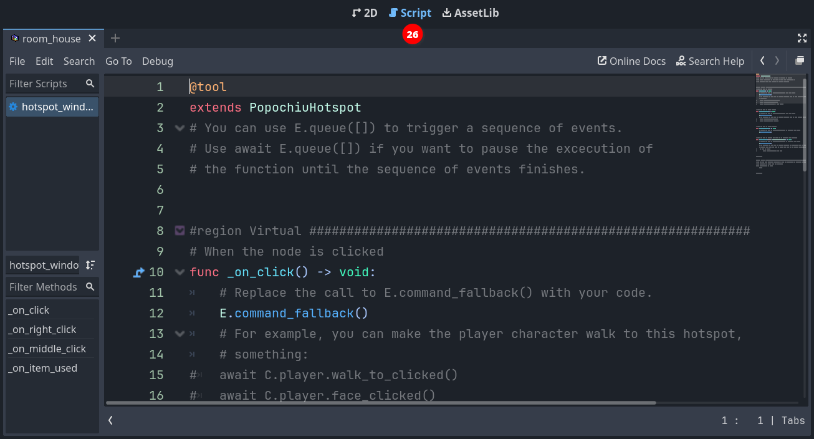

### Script your first interaction

If you ran the game, you may have seen that, while the character moves towards the window, a message is printed on top of the scene: `Can't INTERACT with it`.  
That's because we didn't define what should happen when we interact with the window. Remember, in [the GUI we selected](game-setup.md#select-game-gui), clicking on an object will trigger an interaction while right-clicking on an object will trigger an examination.

We are now going to script our first interaction, using Godot **GDScript** language and the very convenient [engine API](../the-engine-handbook/scripting-overview.md) that Popochiu provides to make our life easier.

!!! info "Help! I'm not a developer!"
    "API" stands for "Application Programming Interface" and in our context, it's the set of objects and functions that makes it very easy to implement all those behaviors common to most adventure games (like making a character talk, or adding an item to the inventory), without knowing the ins and outs of the underlying Godot game engine.

In the room tab of the Popochiu dock, locate the "_Open Script_" icon for the `Window` hotspot (_25_):



This will open the GDScript connected to this hotspot in the Godot scripting editor (_26_):



!!! info "Under the hood"
    Every clickable object that Popochiu creates for you comes with an attached script. Those scripts do nothing by themselves but are based on commented templates that will make it easier to implement the desired behaviors, by editing and filling out some predefined functions.

We will now add some interaction to the script. So far it will be simple stuff: we'll make our main character say something meaningful when we examine the window, and - in the absence of other elements in the room - act a bit weird when we try to interact with the window.

Locate the `_on_click()` function in the script. It should read something like this:

```gdscript
# When the node is clicked
func _on_click() -> void:
	# Replace the call to E.command_fallback() with your code.
	E.command_fallback()
	# For example, you can make the player character walk to this hotspot, gaze at it, and then say
	# something:
#	await C.player.walk_to_clicked()
#	await C.player.face_clicked()
#	await C.player.say("What a nice view")
```

Popochiu automatically executes this function when you click over the `Window` hotspot. We just need to put something meaningful into it. Let's try something. Change the function so it looks like this:

```gdscript
# When the node is clicked
func _on_click() -> void:
	await C.player.walk_to_clicked()
	await C.player.face_clicked()
	await E.wait(0.5)
	for n in 3:
		await C.player.face_left()
		await E.wait(0.3)
		await C.player.face_right()
		await E.wait(0.3)
	await C.player.face_clicked()
	await C.player.say("I wanted to open the window but I can't find the handle")
```

Save the script (`ctrl/cmd + s`) and run your game.  
Now when you click the window, the character will walk to it, turn around three times like it is looking around for something, then face the window and say a phrase.

**Yay!** You reached an important milestone! Now your game feels more alive, isn't it?

!!! info "Under the hood"
    Remember that we set our character so that its origin is between its feet. When your character moves toward a point, Popochiu will make sure the origin of the character matches the destination point's coordinates.

    What if the destination coordinates lie outside of the walkable area? In this case, Popochiu will trace the path toward the coordinates but will stop the movement as soon as the character reaches the walkable area's borders. Despite this being a safe scenario, placing a _Walk-to point_ inside the walkable polygon always gives the best results, making the movement predictable. Keep this in mind.


Let's see what happened, breaking the function down to pieces. Ignore for a moment the `await` keyword.

```gdscript
    await C.player.walk_to_clicked()
	await C.player.face_clicked()
```

These two lines use the `C` Popochiu object. It holds a reference to every character in the game. Our character is called `Goddiu`, so `C.Goddiu` allows us to give commands to that character. But since Goddiu is also the character that the player controls, we can use the shortcut `C.player`.

This comes in very handy for those games that have more player-controlled characters, like _Maniac Mansion_, or _Day of the Tentacle_. You can change the active character as the game progresses but your scripts will point to the current active character, sparing you the effort to duplicate the code for each and every playable character.

```gdscript
	await E.wait(0.5)
	for n in 3:
		await C.player.face_left()
		await E.wait(0.3)
		await C.player.face_right()
		await E.wait(0.3)
```

Here we are literally waiting for some time to pass. `E` is the object representing the game engine (Popochiu!) and we are asking it to wait for half a second.
After that, we use the `for` GDScript keyword to repeat the same code three times.

!!! info
    This is not a feature of Popochiu, it is standard Godot language. All Popochiu objects and functions are standard Godot functions.  
    As Popochiu matures, it will take care of more and more work in a standardized and simplified way. Stuff like translations, dynamic lightning and music, parallax, and more.  
    In the meantime, since its language is standard GDScript, you have all the power of Godot at your fingertips and you can customize your game the way you want.

The executed code just flips the character left and right after a small pause, as it is looking around.

```gdscript
	await C.player.face_clicked()
	await C.player.say("I wanted to open the window but I can't find the handle")
```

These last two lines make sure the character finally looks towards the window and says its line.

!!! info "Help! I'm not a developer!"
    As the `for` keyword, `await` is provided by Godot out of the box. Without going too deep into technical details, what it does is make sure that while the subsequent function is executed, no other things will happen. In our example, if we omitted the `await` keyword in every line, the character would have started walking to the window, while flipping frantically left and right and talking at the same time (but finishing printing the line in a strange way).

    There are times you want this to happen, like a character who talks in the background without "blocking" the game flow, but omitting `await` usually leads to strange, unexpected behaviors and should be done only on purpose.

Now let's provide an _examine_ interaction. Edit the `_on_right_click()` function you can find further down the script so it looks like this:

```gdscript
# When the node is right clicked
func _on_right_click() -> void:
	await C.player.face_clicked()
	await C.player.say("The weather is so nice today")
	await C.player.say("I may as well open that window!")
```

By this time, you should be able to figure out what will happen by yourself. Run the game and see your masterpiece in action.

!!! info
    These two functions used `C.player.face_clicked()` to make the player turn to face the hotspot. Popochiu uses the "Look At Point" position that you set on the hotspot to determine where in the room to face, just like it uses the "Walk To Point" to determine where in the room to walk.
 
