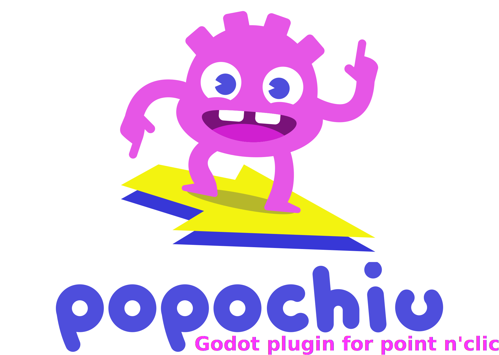

---

**Popochiu is the most developer-friendly addon for the creation of point-and-click adventure games in Godot.**

Inspired by [Adventure Game Studio](https://www.adventuregamestudio.co.uk/) and [PowerQuest](https://powerhoof.itch.io/powerquest) Unity plugin, it brings a bunch of innovations to the table.

**Popochiu's mission is to be the more developer-oriented and productive tool for the creation of point-and-click adventure games on free and open-Source technologies.**

---

## Features

* Works with Godot 3 and 4 (new development will happen for 4 only).
* Designed to offer a fast and easy-to-use workflow like Adventure Game Studio and PowerQuest.
* Provides a Godot Editor plugin, as well as the adventure game engine, specifically designed for adventure games.
* A powerful yet simple scripting API gives total control on characters, objects, inventory items, dialogues, etc.
* Autocomplete for scripting functions in Godot scripting editor.
* Suitable for high-resolution as well as retro-styled, classic games.
* Blends easily with Godot, allowing experienced devs to customize and extending the functions with ease.
* Easy management of animations, interactions, audio, game state, saves and load, and other commong game features.
* Additional tools for advanced workflows, like animation importers and the like.
* Very permissive [license](#license).

## Is Popochiu for me?

**Popochiu is for everyone, but it's particularly suitable for you if you**:

* are in search for a developer-friendly engine, with a powerful scripting language
* want to work on top of a state-of-the-art, general-purpose game engine with a great community and support (Godot)
* want to build your game on OS different than Windows (Linux or MacOSX)
* want to release your game on different platforms (PC, mobile and consoles)
* love Free/Open-Source Software
* want to join a cheerful and welcoming community of fellow developers

**Popochiu may not be your cup of tea if**:

* you are no coder and search for a visual editor like Adventure Creator
* you want to build games different from point-and-click adventures

Yes, that's it. We can't imagine for what other reasons you shouldn't at least give Popochiu a try! :)

## Made with Popochiu

* [The Maid Butcher Ritual](https://skarmuse.itch.io/the-maid-butcher-ritual) by [Skarmuse](https://skarmuse.itch.io) (Made for the **G**lobal **G**ame **J**am 2023)
* [Popochius Little Adventure (AdvJam 2022) (in-development)](https://mapedorr.itch.io/popochius) | source code [here](https://github.com/mapedorr/popochius_little_adventure)
* [Buggy Adventure (in-development)](https://agar3s.itch.io/unsolvedmysteries) | source code [here](https://github.com/TalesOfUnsolvedMysteries/game_client)
* [Pato & Lobo](https://perroviejo.itch.io/patolobo) | source code [here](https://github.com/Perro-Viejo/pato-and-lobo)

## People

Popochiu was created by **[Mateo _@carenalga_ Robayo Rodríguez](https://github.com/mapedorr)**, who is the project's main maintainer and benevolent dictator.

It is now co-maintained by **[Paolo _@stickgrinder_ Pustorino](https://github.com/stickgrinder)** and **[_Whyshchuck_](https://github.com/whyshchuck)** with contributions by our wonderful community members.

## License

Popochiu is released under the very permissive [MIT License](https://github.com/carenalgas/popochiu/blob/main/LICENSE), suitable for free and commercial projects, no strings attached.
