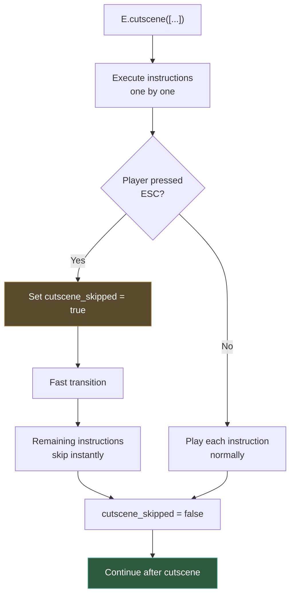

# Await and queue functions

Adventure games are inherently sequential: a character walks to a door, tries to open it, shakes their head, then says "It's locked." Each step must finish before the next one starts. In Popochiu, this sequencing is handled with two complementary tools: **`await`** for step-by-step control, and **`E.queue()`** for compact instruction lists.

This page explains both approaches, when to use each, how to create skippable cutscenes, and how to make your own custom methods work inside queues.

## Why await matters

Most methods in Popochiu that involve actions visible to the player (walking, talking, animating, transitioning) are **asynchronous**. They start an action and return immediately, while the action plays out over time.

If you call two async methods without `await`, they'll both try to run at the same time:

```gdscript
# BAD: both actions start simultaneously!
C.player.walk_to(Vector2(200, 100))
C.player.say("I'm walking and talking at the same time!")
```

Adding `await` makes each action complete before the next one starts:

```gdscript
# GOOD: walk finishes, then the character speaks
await C.player.walk_to(Vector2(200, 100))
await C.player.say("I made it!")
```

!!! warning
    Forgetting `await` is one of the most common mistakes in Popochiu scripting. If your character talks while walking, or actions seem to overlap, the first thing to check is whether you're missing an `await`.

### When to use await

Use `await` whenever a method needs to **complete** before the next line runs. As a rule of thumb:

- **Character actions** → always await: `walk_to()`, `say()`, `face_clicked()`, `idle()`
- **Transitions** → always await: `T.play_transition()`
- **System text** → await if you want to wait for the player to dismiss it: `G.show_system_text()`
- **Audio** → usually don't await (music plays in the background): `A.mx_theme.play()`
- **State changes** → no await needed: `Globals.found_clue = true`, `R.get_prop("Door").hide()`

### The await pattern in virtual functions

When you implement a virtual function like `_on_click()`, you'll almost always use `await`:

```gdscript
func _on_click() -> void:
	await C.player.walk_to_clicked()
	await C.player.face_clicked()
	await C.player.say("Interesting...")
```

The engine waits for your entire function to complete before it considers the interaction done and re-enables player input.

---

## The queue system

Writing many `await` lines works fine for simple sequences, but it can get verbose. The **queue system** lets you express the same sequences more compactly:

```gdscript
# With await (explicit)
await C.Will.say("Hey!")
await E.wait(0.5)
await C.Will.say("What's that over there?")
await C.Will.walk_to(Vector2(300, 120))
await C.Will.say("Hmm, nothing.")

# With queue (compact)
E.queue([
	"Will: Hey!",
	".",
	"Will: What's that over there?",
	C.Will.queue_walk_to(Vector2(300, 120)),
	"Will: Hmm, nothing.",
])
```

Both versions do exactly the same thing. The queue version is shorter and reads more like a script.

### How E.queue() works

`E.queue()` takes an array of **instructions** and executes them one by one. Each instruction must complete before the next one starts. Instructions can be:

**Callables**: `queue_` method variants that return a `Callable`:

```gdscript
E.queue([
	C.player.queue_walk_to(Vector2(200, 100)),
	C.player.queue_say("I'm here!"),
	G.queue_show_system_text("A mysterious note..."),
])
```

**Strings**: dialog shorthand with special syntax:
	"Will: Hello there!",              # Character speaks
	"Will(happy): Great to see you!",  # Character speaks with emotion
	"Will[3]: I'll wait 3 seconds.",   # Auto-continue after 3 seconds
	"...",                              # Pause (0.5 seconds)
	".",                                # Short pause (0.25 seconds)
	"This is a system message.",        # Plain text → shown as system text
])
```

!!! info "String instruction syntax"
    | Format | Effect |
    | :----- | :----- |
    | `"CharName: text"` | Character says the text |
    | `"CharName(emotion): text"` | Character says with a specific emotion |
    | `"CharName[seconds]: text"` | Character says, then auto-continues after N seconds |
    | `"."` | Pause for 0.25 seconds |
    | `".."` | Pause for 0.5 seconds |
    | `"..."` | Pause for 1 second |
    | `"plain text"` | Shown as system text via `G.show_system_text()` |

    Each additional dot doubles the pause duration: `"."` = 0.25s, `".."` = 0.5s, `"..."` = 1s, `"...."` = 2s.

### Mixing callables and strings

You can freely mix both types in the same queue:

```gdscript
E.queue([
	"Will: Let me check the door.",
	C.Will.queue_walk_to(R.get_marker_position("DoorPos")),
	C.Will.queue_face_right(),
	"Will: It's locked!",
	".",
	R.get_prop("Door").queue_disable(),
	"Will: Or maybe it just vanished.",
])
```

### Important: always await E.queue()

`E.queue()` is itself an async method. If you're calling it inside a virtual function and you want execution to pause until all instructions are done, use `await`:

```gdscript
func _on_room_transition_finished() -> void:
	await E.queue([
		"Will: Where am I?",
		"Will: This place is strange...",
	])
	# This runs only after the queue finishes
	Globals.intro_seen = true
```

!!! tip
    `E.queue()` blocks the GUI while instructions execute (it calls `G.block()` internally). Once the queue finishes, it calls `G.unblock()` so the player can interact again. If you want the GUI to stay blocked after the queue, pass `false` as the second argument: `E.queue([...], false)`.

---

## The `queue_` method pattern

You may have noticed that Popochiu methods come in pairs:

```gdscript
# The "immediate" version: call with await
await C.player.walk_to(Vector2(200, 100))

# The "queue" version: returns a Callable for use inside E.queue()
C.player.queue_walk_to(Vector2(200, 100))
```

The `queue_` variant doesn't execute anything. It wraps the call in a `Callable` and returns it. The queue system then calls it at the right time.

**Never use `queue_` methods outside of a queue.** They won't do anything on their own:

```gdscript
# BAD: this does nothing, it just creates a Callable and discards it
C.player.queue_say("Hello!")

# GOOD: use inside a queue
E.queue([
	C.player.queue_say("Hello!"),
])

# Or use the immediate version with await
await C.player.say("Hello!")
```

Here's a quick reference of common `queue_` methods:

| Immediate (use with `await`) | Queue variant (use inside `E.queue()`) |
| :--------------------------- | :------------------------------------- |
| `C.player.say("Hi")` | `C.player.queue_say("Hi")` |
| `C.player.walk_to(pos)` | `C.player.queue_walk_to(pos)` |
| `C.player.face_left()` | `C.player.queue_face_left()` |
| `E.wait(1.0)` | `E.queue_wait(1.0)` |
| `G.show_system_text("...")` | `G.queue_show_system_text("...")` |
| `T.play_transition(...)` | `T.queue_play_transition(...)` |

---

## Cutscenes

A **cutscene** is a queue that the player can skip. In Popochiu, `E.cutscene()` works exactly like `E.queue()`, but the player can press the **ESC** key (or the `popochiu-skip` input action) to jump past it.

```gdscript
func _on_room_transition_finished() -> void:
	await E.cutscene([
		"Will: I can't believe I'm here.",
		C.Will.queue_walk_to(Vector2(200, 120)),
		"..",
		"Will: The air feels different.",
		"Will: Almost... electric.",
	])
	# This runs after the cutscene finishes OR is skipped
```

### How skipping works

When the player presses ESC during a cutscene:

1. Popochiu sets `E.cutscene_skipped` to `true`
2. A fast transition plays (configured in `PopochiuSettings`)
3. All remaining instructions in the queue are still executed, but each one **checks the flag and returns immediately** instead of playing out

This means your game state stays consistent. If a cutscene was supposed to move a character or change a variable, those changes still happen. The player just doesn't see the animations.



### Cutscene vs. queue

| | `E.queue()` | `E.cutscene()` |
| :--- | :---------- | :------------- |
| Sequential execution | Yes | Yes |
| Blocks GUI | Yes | Yes |
| Player can skip | No | Yes (ESC key) |
| Use for | Essential sequences, puzzle interactions | Intro scenes, story moments, long animations |

!!! tip
    Use `E.cutscene()` for anything the player might want to skip: intro sequences, travel animations, flashbacks. Use `E.queue()` for important gameplay moments where the player needs to see every step.

---

## Making custom methods queueable

Sometimes you need to put your own custom methods inside a queue, such as a camera animation, a particle effect, or a complex multi-step interaction. Popochiu provides `E.queueable()` for this.

### Basic usage

`E.queueable()` wraps any method so it can be used inside `E.queue()`. It takes four arguments:

1. **node**: the object that owns the method
2. **method**: the method name as a string
3. **params**: an array of arguments to pass (optional)
4. **signal_name**: the signal to wait for before moving to the next instruction (optional)

```gdscript
# Example: play an AnimationPlayer animation inside a queue
E.queue([
	"Will: Watch this!",
	E.queueable($AnimationPlayer, "play", ["magic_trick"], "animation_finished"),
	"Will: Ta-da!",
])
```

In this example, the queue waits until `$AnimationPlayer.animation_finished` is emitted before moving on.

### Using with custom methods

You can wrap your own methods too:

```gdscript
func _on_room_transition_finished() -> void:
	await E.queue([
		"Will: Something strange is happening...",
		E.queueable(self, "_shake_and_flash", [], "completed"),
		"Will: What was that?!",
	])

func _shake_and_flash() -> void:
	E.camera.shake(2.0, 1.0)
	await E.wait(0.5)
	await T.play_transition("flash", 0.3, T.PLAY_MODE.PLAY_AND_REVERSE)
```

!!! note
    When using `"completed"` as the signal name, the queue waits for the method's own `await` chain to finish. This is the most common pattern for custom async methods.

### Custom signal example

If your method triggers something that completes asynchronously through a signal:

```gdscript
# A button that the player can click during a queue
signal button_clicked

func _show_popup() -> void:
	$PopupButton.show()
	# Don't await here: let the signal do the work

func _on_popup_button_pressed() -> void:
	$PopupButton.hide()
	button_clicked.emit()

# In the room script:
E.queue([
	"Will: I need to press that button.",
	E.queueable(popup_node, "_show_popup", [], "button_clicked"),
	"Will: Done!",
])
```

The queue pauses at the queueable instruction until `button_clicked` is emitted.

---

## The await_stopped sentinel

There's one more async tool worth knowing about: the `E.await_stopped` signal.

This is a signal that **is never emitted**. Awaiting it permanently suspends the current instruction chain. This is useful when you want to break out of the normal flow and let new player interactions take over.

```gdscript
func _on_click() -> void:
	C.player.walk_to_clicked()
	await E.await_stopped
	# This line is never reached: the player can click elsewhere
	# while the character is walking, starting a new interaction
```

The main use case is allowing the player to interrupt a walk-to action by clicking somewhere else. You generally won't need this in everyday scripting, but it's good to know it exists.

---

## Choosing the right approach

Here's a practical guide for deciding between `await`, `E.queue()`, and `E.cutscene()`:

| Situation | Approach |
| :-------- | :------- |
| Simple 2-3 step interaction (click → walk → say) | `await` |
| Longer sequence with dialog (5+ steps) | `E.queue()` |
| Intro scene or story moment the player should be able to skip | `E.cutscene()` |
| Sequence that includes custom methods or animations | `E.queue()` with `E.queueable()` |
| One-off dialog line | `await C.player.say("...")` or a string in `E.queue()` |

A pragmatic approach: **start with `await`**. If the sequence grows long or you find yourself writing many `await` lines in a row, refactor into a queue. If the sequence is non-essential to gameplay, wrap it in a cutscene.

```gdscript
# Simple interaction: await is fine
func _on_click() -> void:
	await C.player.walk_to_clicked()
	await C.player.say("Nice painting.")

# Longer sequence: queue is cleaner
func _on_click() -> void:
	await E.queue([
		C.player.queue_walk_to_clicked(),
		"Will: What a beautiful painting.",
		".",
		"Will: The eyes seem to follow me.",
		"Will: Creepy.",
	])

# Story moment: cutscene allows skipping
func _on_room_transition_finished() -> void:
	await E.cutscene([
		"Will: I remember this place.",
		C.Will.queue_walk_to(R.get_marker_position("Window")),
		"Will: The view hasn't changed.",
		"..",
		"Will: But everything else has.",
	])
```
