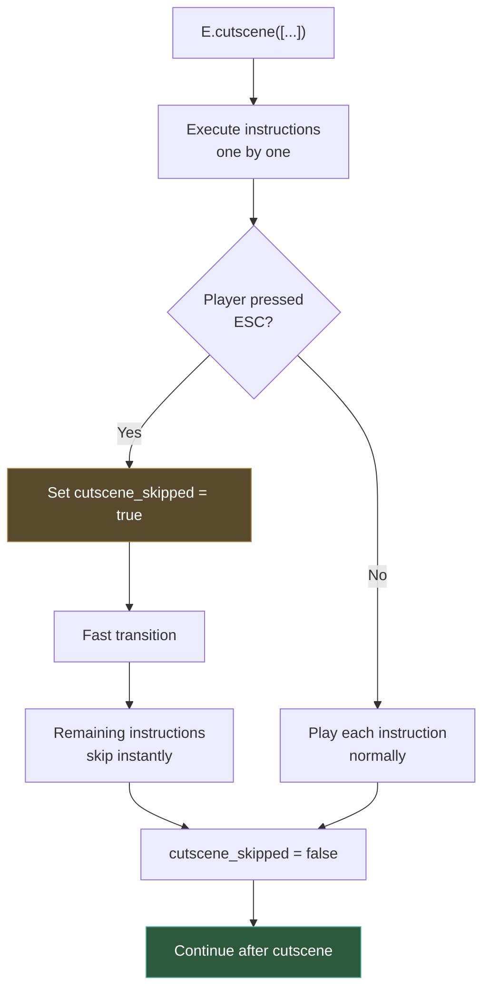

# Await and queue functions

Adventure games are inherently sequential: a character walks to a door, tries to open it, shakes their head, then says "It's locked." Each step must finish before the next one starts. In Popochiu, this sequencing is handled with two complementary tools: **`await`** for step-by-step control, and **`E.queue()`** for compact instruction lists.

This page explains both approaches, when to use each, how to create skippable cutscenes, and how to make your own custom methods work inside queues.

## Why await matters

Godot (as every other game engine) makes many things happen simultaneously. Think about a typical platform or 3D shooter: enemies move independently, projectiles fly through the air, and background music plays continuously. And that's true for Popochiu as well: while your character is walking, the player can click somewhere else to make them walk there instead, or open a menu; background music keeps playing while dialog is on screen or a sound effect is triggered; each character or prop play their own animations independently. That's the whole point of a game engine!

Being based on GDScript (Godot's native programming language), methods in Popochiu that involve actions visible to the player (walking, talking, animating, transitioning) are **asynchronous**. They start an action but don't wait for it to complete before giving up control to the next line of code. The action will continue to play out over time.

But this clashes with the sequential nature of adventure game scripting. You want the character to walk to the door, **then** say "It's locked." You write your script to call those methods one after another, but they will all start at the same time and run alongside each other, which is not what you want:

```gdscript
# BAD: both actions start simultaneously!
C.player.walk_to(Vector2(200, 100))
C.player.say("I'm walking and talking at the same time!")
```

That's why you need to use `await` to control the flow of your script. Adding `await` makes each action complete before the next one starts:

```gdscript
# GOOD: walk finishes, then the character speaks
await C.player.walk_to(Vector2(200, 100))
await C.player.say("I made it!")
```

!!! warning
    Forgetting `await` is one of the most common mistakes in Popochiu scripting. If your character talks while walking, or actions seem to overlap, the first thing to check is whether you're missing an `await`.

### When to use await

Use `await` whenever a method needs to **complete** before the next line runs. As a rule of thumb:

- **Character actions** → always await: `walk_to()`, `say()`, `face_clicked()`, `idle()`
- **Transitions** → always await: `T.play_transition()`
- **System text** → await if you want to wait for the player to dismiss it: `G.show_system_text()`
- **Audio** → usually don't await (music plays in the background): `A.mx_theme.play()`
- **State changes** → no await needed: `Globals.found_clue = true`, `R.get_prop("Door").hide()`, `I.Key.add()`

### The await pattern in virtual functions

When you implement a virtual function like `_on_click()`, you'll almost always use `await`:

```gdscript
func _on_click() -> void:
	await C.player.walk_to_clicked()
	await C.player.face_clicked()
	await C.player.say("Interesting...")
```

The engine also uses `await`: in fact it waits for your entire function to complete before it considers the interaction done and re-enables player input.

## Triggering background actions by omitting await

Sometimes having multiple things happen at once is exactly what you want. For example, you might have a non player character talking or walking in the background, or playing a specific animation in loop. In those cases, you can simply call the method without `await`:

```gdscript
# This sets an animation loop on the "TV" prop, without blocking the script
R.get_prop("TV").play_animation("static_loop")
```

---

## The queue system

The `await` keyword was introduced in Godot 4.0 / GDScript 2.0, and since Popochiu 2.0, it's the preferred way to control the flow of your scripts. However, it still has some limitations because you can't set cutscenes to be skipped by the player.

Popochiu provides a higher-level method of achieving sequential execution. It comes as a legacy tool from Popochiu 1.x, and allows you to write sequences of actions in a more compact and script-like way, and it also supports skippable cutscenes.

The **queue system** lets you express the same sequences more compactly:

```gdscript
# With await (explicit)
await C.Popsy.say("Hey!")
await E.wait(0.5)
await C.Popsy.say("What's that over there?")
await C.Popsy.walk_to(Vector2(300, 120))
await C.Popsy.say("Hmm, nothing.")

# With queue (compact)
E.queue([
	"Popsy: Hey!",
	".",
	"Popsy: What's that over there?",
	C.Popsy.queue_walk_to(Vector2(300, 120)),
	"Popsy: Hmm, nothing.",
])
```

Both versions do exactly the same thing. The queue version is shorter and reads more like an acting script.

### How E.queue() works

`E.queue()` takes an array of **instructions** and executes them one by one. Each instruction will complete before the next one starts. Instructions can be:

**Callables**: `queue_` method variants:

```gdscript
E.queue([
	C.player.queue_walk_to(Vector2(200, 100)),
	C.player.queue_say("I'm here!"),
	G.queue_show_system_text("A mysterious note..."),
])
```

**Strings**: dialog shorthand with special syntax:
```gdscript
E.queue([
	"Popsy: Hello there!",              # Character speaks
	"Popsy(happy): Great to see you!",  # Character speaks with emotion
	"Popsy[3]: I'll wait 3 seconds.",   # Auto-continue after 3 seconds
	"...",                              # Pause (1 second)
	".",                                # Short pause (0.25 seconds)
	"This is a system message.",        # Plain text → shown as system text
])
```

!!! info "String instruction syntax"
    | Format | Effect |
    | :----- | :----- |
    | `"CharName: text"` | Character says the text |
    | `"CharName(emotion): text"` | Character says with a specific emotion |
    | `"CharName[seconds]: text"` | Character says, then auto-continues after N seconds |
    | `"."` | Pause for 0.25 seconds |
    | `".."` | Pause for 0.5 seconds |
    | `"..."` | Pause for 1 second |
    | `"plain text"` | Shown as system text via `G.show_system_text()` |

    Each additional dot doubles the pause duration: `"."` = 0.25s, `".."` = 0.5s, `"..."` = 1s, `"...."` = 2s.

### Mixing callables and strings

You can freely mix both types in the same queue:

```gdscript
E.queue([
	"Popsy: Let me check the door.",
	C.Popsy.queue_walk_to(R.get_marker_position("DoorPos")),
	C.Popsy.queue_face_right(),
	"Popsy: It's locked!",
	".",
	R.get_prop("Door").queue_disable(),
	"Popsy: Or maybe it just vanished.",
])
```

### Important: always await E.queue()

`E.queue()` is itself an async method. If you're calling it inside a virtual function and you want execution to pause until all instructions are done, use `await`:

```gdscript
func _on_room_transition_finished() -> void:
	await E.queue([
		"Popsy: Where am I?",
		"Popsy: This place is strange...",
	])
	# This runs only after the queue finishes
	Globals.intro_seen = true
```

!!! tip
    `E.queue()` blocks the GUI while instructions execute (it calls `G.block()` internally). Once the queue finishes, it calls `G.unblock()` so the player can interact again. If you want the GUI to stay blocked after the queue, pass `false` as the second argument: `E.queue([...], false)`.

---

## The `queue_` method pattern

You may have noticed that Popochiu methods come in pairs:

```gdscript
# The "immediate" version: call with await
await C.player.walk_to(Vector2(200, 100))

# The "queue" version: returns a Callable for use inside E.queue()
C.player.queue_walk_to(Vector2(200, 100))
```

The `queue_` variant doesn't execute anything. It wraps the call in a `Callable` and returns it. The queue system then calls it at the right time.

**Never use `queue_` methods outside of a queue.** They won't do anything on their own:

```gdscript
# BAD: this does nothing, it just creates a Callable and discards it
C.player.queue_say("Hello!")

# GOOD: use inside a queue
E.queue([
	C.player.queue_say("Hello!"),
])

# Or use the immediate version with await
await C.player.say("Hello!")
```

Here's a quick reference of common `queue_` methods:

| Immediate (use with `await`) | Queue variant (use inside `E.queue()`) |
| :--------------------------- | :------------------------------------- |
| `C.player.say("Hi")` | `C.player.queue_say("Hi")` |
| `C.player.walk_to(pos)` | `C.player.queue_walk_to(pos)` |
| `C.player.face_left()` | `C.player.queue_face_left()` |
| `E.wait(1.0)` | `E.queue_wait(1.0)` |
| `G.show_system_text("...")` | `G.queue_show_system_text("...")` |
| `T.play_transition(...)` | `T.queue_play_transition(...)` |

---

## Cutscenes

A **cutscene** is a queue that the player can skip. In Popochiu, `E.cutscene()` works exactly like `E.queue()`, but the player can press the **ESC** key (or the `popochiu-skip` input action) to jump past it.

```gdscript
func _on_room_transition_finished() -> void:
	await E.cutscene([
		"Popsy: I can't believe I'm here.",
		C.Popsy.queue_walk_to(Vector2(200, 120)),
		"..",
		"Popsy: The air feels different.",
		"Popsy: Almost... electric.",
	])
	# This runs after the cutscene finishes OR is skipped
```

### How skipping works

When the player presses ESC during a cutscene:

1. Popochiu sets `E.cutscene_skipped` to `true`
2. A transition plays (configured in `PopochiuSettings`)
3. All remaining instructions in the queue are still executed, but each one **checks the flag and returns immediately** instead of playing out

This means your game state stays consistent. If a cutscene was supposed to move a character or change a variable, those changes still happen. The player just doesn't see the animations.



---

## Making custom methods queueable

Sometimes you need to put your own custom methods inside a queue, such as a camera animation, a particle effect, or a complex multi-step interaction. Popochiu provides `E.queueable()` for this.

### Basic usage

`E.queueable()` wraps any method so it can be used inside `E.queue()`. It takes four arguments:

1. **node**: the object that owns the method
2. **method**: the method name as a string
3. **params**: an array of arguments to pass (optional)
4. **signal_name**: the signal to wait for before moving to the next instruction (optional)

```gdscript
# Example: play an AnimationPlayer animation inside a queue
E.queue([
	"Popsy: Watch this!",
	E.queueable($AnimationPlayer, "play", ["magic_trick"], "animation_finished"),
	"Popsy: Ta-daaah!",
])
```

In this example, the queue waits until `$AnimationPlayer.animation_finished` is emitted before moving on.

### Using with custom methods

You can wrap your own methods too:

```gdscript
func _on_room_transition_finished() -> void:
	await E.queue([
		"Popsy: Something strange is happening...",
		E.queueable(self, "_shake_and_flash", [], "completed"),
		"Popsy: What was that?!",
	])

func _shake_and_flash() -> void:
	E.camera.shake(2.0, 1.0)
	await E.wait(0.5)
	await T.play_transition("flash", 0.3, T.PLAY_MODE.PLAY_AND_REVERSE)
```

!!! note
    When using `"completed"` as the signal name, the queue waits for the method's own `await` chain to finish. This is the most common pattern for custom async methods.

### Custom signal example

If your method triggers something that completes asynchronously through a specific signal, you need to specify that signal name in `E.queueable()`.

For example, if you have a button that the player needs to click during a queue, you can set it up like this:

```gdscript
# A button that the player can click during a queue
signal button_clicked

func _show_popup() -> void:
	$PopupButton.show()
	# Don't await here: let the signal do the work

func _on_popup_button_pressed() -> void:
	$PopupButton.hide()
	button_clicked.emit()

# In the room script:
E.queue([
	"Popsy: I need to press that button.",
	E.queueable(popup_node, "_show_popup", [], "button_clicked"),
	"Popsy: Done!",
])
```

The queue pauses at the queueable instruction until `button_clicked` is emitted.

!!! note "The await_stopped sentinel"
    The most nerdy developers might want to know about the `E.await_stopped` signal.

	This is a signal that **is never emitted**. Awaiting it permanently suspends the current instruction chain. This is useful when you want to break out of the normal flow and let new player interactions take over. 

	It is used internally by Popochiu to let the player interrupt a walk-to action by clicking somewhere else. You generally won't need this in everyday scripting, but it's good to know it exists.

---

## Wrapping up

The pragmatic approach is to **use `await` for most of your game scripts**.

If you're after writing convenience or readability, refactor into a queue. If you need a skippable cutscene you are bound to wrap the sequence in `E.cutscene()` for now.

```gdscript
# Usual game scripts, await is the Godot gold standard
func _on_click() -> void:
	await C.player.walk_to_clicked()
	await C.player.say("Nice painting.")

# Longer sequence: queue may make them more readable
func _on_click() -> void:
	await E.queue([
		C.player.queue_walk_to_clicked(),
		"Popsy: What a beautiful painting.",
		".",
		"Popsy: The eyes seem to follow me.",
		"Popsy: Creepy.",
	])

# Story moment, intros or long repeatable sequences: cutscene allows skipping
func _on_room_transition_finished() -> void:
	await E.cutscene([
		"Popsy: I remember this place.",
		C.Popsy.queue_walk_to(R.get_marker_position("Window")),
		"Popsy: The view hasn't changed.",
		"..",
		"Popsy: But everything else has.",
	])
```

!!! warning
	The queue system is a legacy tool and we're considering deprecating it in the future, as long as we find a strategy to support skippable cutscenes with `await`. We will ask extensively for feedback before making any decisions, so stick around and let us know if you rely on queues and what features you need from them!