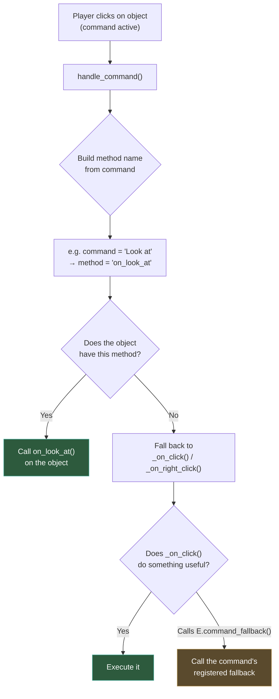
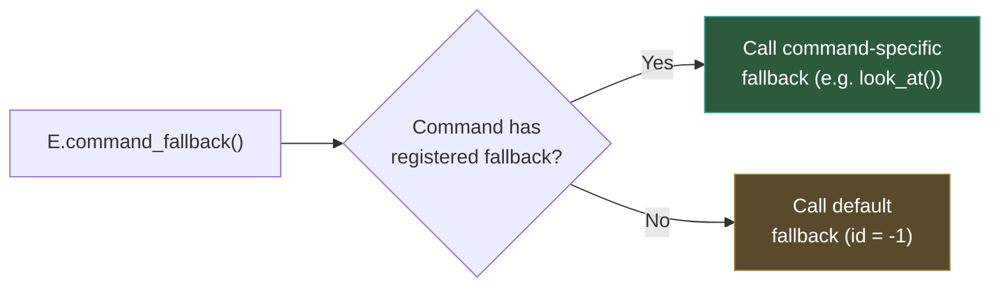

# GUI commands and fallbacks

In the previous section you learned that virtual functions like `_on_click()` are the primary way to react to player interactions. But in many classic adventure games, clicking on an object isn't just a click, it's a **command**: "_Look at_ the door", "_Pick up_ the key", "_Talk to_ the bartender".

Popochiu's **GUI command system** bridges the gap between the player's chosen verb and your game object's behavior. This page explains how that system works, how commands are dispatched, what happens when an object doesn't know how to handle a command, and how you can customize all of it.

## What is a GUI command?

A GUI command is a **verb**: an action the player wants to perform. Different GUI templates offer different sets of verbs:

| GUI Template | Commands | Inspired by |
| :----------- | :------- | :---------- |
| **9 Verbs** | Walk to, Open, Pick up, Push, Close, Look at, Pull, Give, Talk to, Use | The Secret of Monkey Island, Thimbleweed Park |
| **Sierra** | Walk, Look, Interact, Talk | King's Quest VI |
| **Simple Click** | No explicit commands (behavior depends on which mouse button is pressed) | Beneath a Steel Sky, Broken Sword |

The player selects a command (by clicking a verb button, cycling through cursors, etc.), then clicks on a game object. Popochiu takes it from there.

!!! note
    The Simple Click template is an interesting edge case: it has no explicit commands at all. Instead, it uses mouse button detection (left click vs. right click) to decide what to do. Everything flows through its `fallback()` method.

---

## How command dispatch works

When a player clicks on a game object with a command active, Popochiu follows a precise dispatch chain to decide which method to call. Here's the full picture:



Let's break this down step by step.

### Step 1: The method name is built from the command

When the active command is "Look at" and the player left-clicks, `handle_command()` converts the command name to snake_case and builds a method name:

- Command name: `"Look at"` → snake_case: `"look_at"`
- Method to look for: `on_look_at`

For right-clicks, the method would be `on_right_look_at`. For middle-clicks, `on_middle_look_at`.

### Step 2: Popochiu checks if the object has the method

If your prop script has a method called `on_look_at()`, it gets called:

```gdscript
extends PopochiuProp

# This method is called when the player uses "Look at" on this prop
func on_look_at() -> void:
	await C.player.face_clicked()
	await C.player.say("It's an old grandfather clock.")
```

### Step 3: If the method doesn't exist, fall back

If the object doesn't have `on_look_at()`, Popochiu falls back to the generic click handler (`_on_click()` for left clicks, `_on_right_click()` for right clicks, etc.).

If that handler calls `E.command_fallback()`, the system moves to the fallback chain described in the next section.

### The naming convention

The pattern is straightforward:

| Command | Left click method | Right click method |
| :------ | :---------------- | :----------------- |
| Walk to | `on_walk_to()` | `on_right_walk_to()` |
| Look at | `on_look_at()` | `on_right_look_at()` |
| Pick up | `on_pick_up()` | `on_right_pick_up()` |
| Talk to | `on_talk_to()` | `on_right_talk_to()` |
| Use | `on_use()` | `on_right_use()` |
| *(any custom)* | `on_<snake_case>()` | `on_right_<snake_case>()` |

!!! tip
    You only need to implement the command methods that make sense for each object. A door might have `on_open()` and `on_look_at()`, but not `on_talk_to()`. Unimplemented commands will fall back to the generic handler.

---

## The fallback chain

When a game object doesn't handle a command (either because it doesn't have the specific method, or because its `_on_click()` calls `E.command_fallback()`), the engine looks up the **fallback** registered for that command.

### How fallbacks are registered

Each GUI template registers its commands and their fallbacks when it initializes. Here's what the 9 Verbs template does:

```gdscript
# Inside NineVerbCommands._init()
E.register_command(Commands.WALK_TO, "Walk to", walk_to)
E.register_command(Commands.LOOK_AT, "Look at", look_at)
E.register_command(Commands.PICK_UP, "Pick up", pick_up)
# ... and so on for all 10 commands
```

Each `register_command()` call takes three arguments:

1. **id**: a numeric identifier (usually from an enum)
2. **command_name**: the display name (also used to build method names)
3. **fallback**: a `Callable` to run when no object-specific handler exists

### What fallbacks do by default

The built-in fallbacks provide generic responses so the game always says *something*:

```gdscript
# In NineVerbCommands, some default fallbacks:
func look_at() -> void:
	await C.player.say("I have nothing to say about that")

func pick_up() -> void:
	await C.player.say("Not picking that up")

func open() -> void:
	await C.player.say("Can't open that")

func talk_to() -> void:
	await C.player.say("Emmmm...")
```

The `fallback()` method itself is called when no command is active, and by default it triggers `walk_to()`:

```gdscript
func fallback() -> void:
	walk_to()
```

### The default fallback

There's also a **global default** fallback, registered with id `-1`. This is the last resort and it's called when the current command doesn't even have a registered fallback. In the base `PopochiuCommands` class, it just prints a warning.



---

## Customizing commands in your game

Every Popochiu project includes a file at `res://game/gui/gui_commands.gd`. This is your **game-level override** for the command system. It extends the template's command class (e.g. `NineVerbCommands`) and lets you change any fallback.

### Overriding a fallback

Say you want the "Look at" fallback to be more character-specific:

```gdscript
# res://game/gui/gui_commands.gd
extends NineVerbCommands

func look_at() -> void:
	if C.player == C.Will:
		await C.player.say("I don't see anything interesting.")
	else:
		await C.player.say("Nothing catches my eye.")
```

### Overriding the global fallback

The `fallback()` method is the catch-all. If you want the player to always walk to the clicked object when no specific command handler exists:

```gdscript
func fallback() -> void:
	C.walk_to_clicked()
	await C.player.movement_ended
```

Or if you want a custom animation:

```gdscript
func fallback() -> void:
	await C.player.say("I can't do that.")
```

!!! warning
    If you override `fallback()` without calling `super()`, you're replacing the entire default behavior. Make sure your implementation handles all the edge cases your GUI template expects.

### Template-specific patterns

Each GUI template has a different philosophy for how commands work:

**9 Verbs**: Each verb has its own fallback method. Override individual verbs for fine-grained control:

```gdscript
extends NineVerbCommands

func push() -> void:
	await C.player.say("I'd rather not push that.")

func pull() -> void:
	await C.player.say("I'd rather not pull that either.")
```

**Sierra**: Four broad commands. Fallbacks tend to use `G.show_system_text()` instead of character speech:

```gdscript
extends SierraCommands

func look() -> void:
	G.show_system_text("Nothing remarkable about that.")
```

**Simple Click**: No verb buttons. Override `click_clickable()`, `right_click_clickable()`, `click_inventory_item()`, and `right_click_inventory_item()`:

```gdscript
extends SimpleClickCommands

func click_clickable() -> void:
	if I.active:
		await G.show_system_text("Can't use that here.")
	else:
		await G.show_system_text("Nothing happens.")

func right_click_clickable() -> void:
	await G.show_system_text("You see nothing special.")
```

---

## Registering custom commands

If the built-in commands aren't enough, you can register your own:

```gdscript
# In gui_commands.gd _init()
func _init() -> void:
	super()
	E.register_command(100, "Smell", smell)

func smell() -> void:
	await C.player.say("I don't want to smell that.")
```

Now your game objects can implement `on_smell()`:

```gdscript
# In a prop script
func on_smell() -> void:
	await C.player.say("Mmm, fresh bread!")
```

There's also `E.register_command_without_id()` if you don't want to manage IDs manually. It auto-assigns the next available one and returns it:

```gdscript
var smell_id := E.register_command_without_id("Smell", smell)
```

---

## Putting it all together

Here's a complete example showing how a prop interacts with the command system in a 9-Verb GUI:

```gdscript
extends PopochiuProp

# Specific command handlers (called by name matching)
func on_look_at() -> void:
	await C.player.face_clicked()
	await C.player.say("It's a rusty old lock.")

func on_pick_up() -> void:
	await C.player.walk_to_clicked()
	await C.player.say("It's bolted to the door. I can't take it.")

func on_use() -> void:
	if I.active == I.Lockpick:
		await C.player.walk_to_clicked()
		await C.player.say("Let me try this...")
		# Unlock the door, etc.
	else:
		E.command_fallback()  # "I don't want to do that"

# Generic handlers (called when no command-specific method matches)
func _on_click() -> void:
	# Default left-click: walk to the clicked position
	E.command_fallback()

func _on_right_click() -> void:
	# Default right-click: look at the object
	await on_look_at()
```

The flow for this prop:

1. Player selects "Look at" and clicks → `on_look_at()` runs
2. Player selects "Pick up" and clicks → `on_pick_up()` runs
3. Player selects "Push" and clicks → no `on_push()` method → falls back to `_on_click()` → calls `E.command_fallback()` → the template's `push()` fallback says "I don't want to push that"
4. Player selects "Use" with a lockpick active → `on_use()` runs with custom logic

!!! info
    The `gui_commands.gd` file generated by Popochiu already contains all the override stubs commented out. Uncomment and modify the ones you need.
