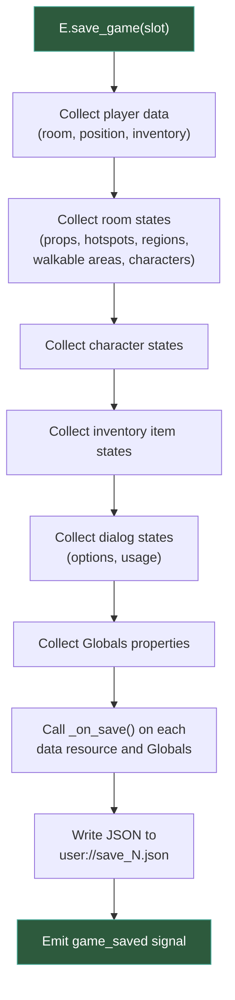
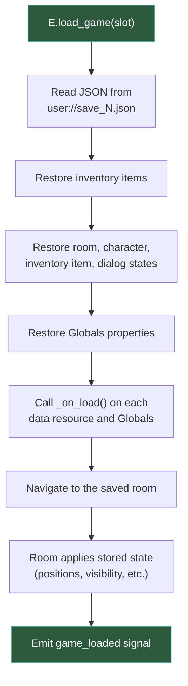

# Object state

In a point-and-click adventure, the world changes as the player interacts with it: doors get unlocked, items are collected, characters move between rooms, dialog options get exhausted. Popochiu needs to **remember** all of this, even when the player leaves a room and comes back, or saves and loads the game.

This page explains how Popochiu tracks object state, how you can add your own custom properties, and how the save/load system works.

## How state works in Popochiu

Every game object (rooms, characters, props, hotspots, inventory items, dialogs, regions, and walkable areas) has **state that persists** across room changes. When you leave a room, Popochiu stores the current state of everything in it. When you return, it restores that state.

This means:

- If you hide a prop, it stays hidden when the player comes back
- If you change a character's position, they'll be where you left them
- If you turn off a dialog option, it stays off

All of this happens **automatically** for built-in properties. You don't need to write any save/load code for standard stuff like visibility, position, or interaction counts.

### What's tracked automatically

Popochiu automatically persists these properties for room children (props, hotspots, walkable areas, regions):

- `position`
- `visible`
- `modulate` and `self_modulate`
- `clickable` (whether the object responds to clicks)
- `walk_to_point` and `look_at_point`
- `baseline`
- `interaction_polygon` and `interaction_polygon_position`
- Click counts (`times_clicked`, `times_right_clicked`, etc.)

For characters in a room, even more data is stored:

- `position` (x, y)
- Facing direction
- `visible`
- `modulate` and `self_modulate`
- `light_mask`
- `baseline`
- `walk_to_point`, `look_at_point`, `dialog_pos`
- Face/follow character settings

!!! info
    Rooms also track visit metadata: `visited` (whether the room has been visited at all), `visited_first_time` (true only on the first visit), and `visited_times` (how many times the room has been entered).

---

## Data resources: where state lives

Each game object has a corresponding **data resource**, a `.tres` file with a script that extends one of Popochiu's data classes:

| Object type | Data class | Example file |
| :---------- | :--------- | :----------- |
| Room | `PopochiuRoomData` | `room_living_room.tres` + `room_living_room_state.gd` |
| Character | `PopochiuCharacterData` | `character_will.tres` + `character_will_state.gd` |
| Inventory item | `PopochiuInventoryItemData` | `inventory_item_key.tres` + `inventory_item_key_state.gd` |

When Popochiu creates an object through the editor dock, it generates both the `.tres` resource and the `*_state.gd` script. The script extends the corresponding data class and is where you add custom properties.

Here's what a generated state script looks like:

```gdscript
# room_living_room_state.gd
extends PopochiuRoomData
```

And the room script loads it:

```gdscript
# room_living_room.gd
extends PopochiuRoom

const Data := preload("room_living_room_state.gd")
var state: Data = load("res://game/rooms/living_room/room_living_room.tres")
```

You access the state through the `state` property on the room.

---

## Adding custom properties

This is where things get interesting. To track your own game-specific data (whether a door is unlocked, how many clues the player has found in a room, which color a light is set to), you add properties to the state script.

### Example: tracking a locked door

```gdscript
# room_living_room_state.gd
extends PopochiuRoomData

var door_unlocked := false
var times_knocked := 0
```

Then use those properties in your room or prop scripts:

```gdscript
# In a hotspot script (the door)
func _on_click() -> void:
	if R.LivingRoom.state.door_unlocked:
		R.goto_room("Kitchen")
	else:
		await C.player.say("It's locked.")
		R.LivingRoom.state.times_knocked += 1
		if R.LivingRoom.state.times_knocked >= 3:
			await C.player.say("Maybe I should find a key.")
```

### Example: tracking character state

```gdscript
# character_will_state.gd
extends PopochiuCharacterData

var has_met_bartender := false
var mood := "neutral"  # "neutral", "happy", "angry"
```

```gdscript
# In a dialog script
func _on_start() -> void:
	if C.Will.state.has_met_bartender:
		await C.Bartender.say("Back again?")
	else:
		await C.Bartender.say("Welcome, stranger!")
		C.Will.state.has_met_bartender = true
```

### Example: tracking inventory item state

```gdscript
# inventory_item_key_state.gd
extends PopochiuInventoryItemData

var is_rusty := true
```

```gdscript
# In a prop script (a grindstone)
func _on_item_used(item: PopochiuInventoryItem) -> void:
	if item == I.Key and I.Key.state.is_rusty:
		await C.player.say("Let me clean this key up...")
		I.Key.state.is_rusty = false
		await C.player.say("Much better!")
```

!!! warning "JSON-safe types only"
    Custom state properties must be of types that can be serialized to JSON: `bool`, `int`, `float`, and `String`. Arrays and Dictionaries also work as long as their contents are JSON-safe. Don't use `Vector2`, `Color`, `Node`, or `Resource`. They won't be saved correctly.

---

## Custom save and load logic

For most cases, adding properties to the state script is enough: they're automatically serialized. But sometimes you need more control: maybe you want to save derived data, or your state involves complex structures.

Every data resource has two virtual methods for this:

```gdscript
## Called when the game is saved.
## Return a Dictionary with custom data (JSON-safe types only).
func _on_save() -> Dictionary:
	return {}

## Called when the game is loaded.
## The Dictionary matches what you returned in _on_save().
func _on_load(_data: Dictionary) -> void:
	pass
```

### Example: saving a list of discovered clues

```gdscript
# room_library_state.gd
extends PopochiuRoomData

var discovered_clue_ids: Array = []

func _on_save() -> Dictionary:
	return {
		"clues": discovered_clue_ids
	}

func _on_load(data: Dictionary) -> void:
	discovered_clue_ids = data.get("clues", [])
```

### Example: saving dialog-related state

```gdscript
# A dialog with custom tracking
extends PopochiuDialog

var _topics_discussed := []

func _on_save() -> Dictionary:
	return {
		"topics": _topics_discussed
	}

func _on_load(data: Dictionary) -> void:
	_topics_discussed = data.get("topics", [])
```

!!! note
    The `_on_save()` / `_on_load()` pattern is available on all data resources (`PopochiuRoomData`, `PopochiuCharacterData`, `PopochiuInventoryItemData`) **and** on `PopochiuDialog`. Use it when simple properties aren't enough.

---

## Globals: project-wide state

Not all state belongs to a specific room, character, or item. For cross-cutting data (things like the total score, difficulty level, story flags, or a game timer), use the `Globals` singleton.

`Globals` lives at `res://game/popochiu_globals.gd`:

```gdscript
# popochiu_globals.gd
extends Node

var total_score := 0
var difficulty := "normal"
var storm_happened := false
var clues_found := 0
```

These properties are accessible from anywhere:

```gdscript
# In any game script
Globals.total_score += 10
Globals.storm_happened = true

if Globals.clues_found >= 5:
	await C.player.say("I think I've figured it out!")
```

### Globals are automatically saved

Just like state properties on rooms and characters, `Globals` properties of valid types (`bool`, `int`, `float`, `String`) are **automatically saved and loaded**. You don't need to do anything special.

### Custom save/load on Globals

If you need to persist complex data on `Globals`, implement `on_save()` and `on_load()` methods (note: no underscore prefix here, unlike the data resources):

```gdscript
# popochiu_globals.gd
extends Node

var total_score := 0
var completed_puzzles: Array = []

func on_save() -> Dictionary:
	return {
		"puzzles": completed_puzzles
	}

func on_load(data: Dictionary) -> void:
	completed_puzzles = data.get("puzzles", [])
```

!!! tip
    Use `Globals` for any state that multiple rooms or objects need to read or write. It's the simplest place to put "game-wide" flags and counters.

---

## How saving and loading works

Now that you know where state lives, here's how it all comes together when the player saves or loads.

### Saving

When you call `E.save_game(slot, description)`:



### Loading

When you call `E.load_game(slot)`:



### Save slots

Popochiu supports up to **4 save slots** by default. Save files are stored as JSON at `user://save_1.json` through `user://save_4.json`.

The API is straightforward:

```gdscript
# Save in slot 1 with a description
E.save_game(1, "Before the final puzzle")

# Load from slot 1
E.load_game(1)

# Check if a save exists
if E.has_save():
	# At least one save file exists

# Get the number of saves
var count := E.saves_count()

# Get descriptions for all saves {slot_number: description}
var saves := E.get_saves_descriptions()
```

!!! info "Under the hood"
    The save file is a flat JSON dictionary. Room states include nested dictionaries for props, hotspots, walkable areas, regions, and characters within that room. Dialog states include the state of each dialog option (whether it's been used, how many times, whether it's turned off). Custom data from `_on_save()` is stored under a `custom_data` key.

---

## State across room changes (without saving)

An important distinction: **state persistence during gameplay** and **state persistence via save/load** are two different mechanisms, but they work together seamlessly.

When the player moves between rooms during a play session:

1. Before leaving, `PopochiuRoomData.save_children_states()` stores the state of all children (props, hotspots, etc.) in the data resource
2. The room is unloaded
3. When the player returns, the room loads and applies the stored state from the data resource

This means you can rely on state changes surviving room transitions even without explicitly saving the game:

```gdscript
# In Room A: hide a prop
R.get_prop("Vase").hide()

# Player goes to Room B, then comes back to Room A
# → The vase is still hidden, because the state was stored
```

Custom properties on state scripts also survive room changes, since they live on the data resource (which stays in memory), not on the room node (which gets unloaded).

---

## Summary

| Concept | How it works |
| :------ | :----------- |
| **Built-in state** | Properties like position, visibility, and click counts are tracked automatically for all game objects. |
| **Custom state** | Add properties to `*_state.gd` scripts. Use JSON-safe types (`bool`, `int`, `float`, `String`). |
| **Custom save/load** | Override `_on_save()` and `_on_load()` on data resources for complex persistence needs. |
| **Globals** | Use `res://game/popochiu_globals.gd` for project-wide state. Properties are auto-saved. |
| **Room transitions** | State survives room changes automatically, since the data resources stay in memory. |
| **Save/load** | `E.save_game()` / `E.load_game()` serialize everything to JSON files (up to 4 slots). |
