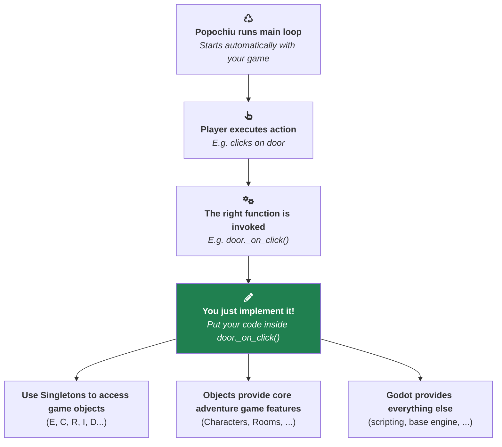

# Scripting overview

Welcome to the Engine Handbook! This section is for game developers who want to understand how to write their game's logic with Popochiu. If you've already followed the [Getting Started](../getting-started/creating-a-new-game.md) tutorial and know your way around the editor, this is where you learn how to create your game logic, how the engine works (even *under the hood*) and how to make the most of it.

## How Popochiu works

Popochiu is built around a simple idea: **you don't write game loops, you react to events**. When a player clicks on a door, picks up an item, or talks to a character, Popochiu calls a function on the relevant game object. Your job is to fill in those functions with the behavior you want.

If you have experience creating games with Godot (or other game engines), you might be used to writing code that runs every frame, checking for input and updating game state. With Popochiu, you don't need to worry about that. The engine handles all the low-level details of input handling, rendering, and game state management.  
**Your code will only define how the game world reacts to player actions or other events.**

Here's the mental model:

Popochiu handles the main loop, listens for player input, and automatically routes each action to the appropriate function on the relevant game object. You access game objects through **singletons** (always-available entry points like `C` for characters, `R` for rooms, `I` for inventory). You respond to player actions by implementing **virtual functions** on your game objects. And when you need multi-step sequences (walk here, say that, pick this up), you use **queues** or **await** to run instructions one after another.

Of course, you write all of your code in GDScript, and you can use all the features of the language to create complex game logic. But Popochiu engine and its predefined game objects provide all common functionalities for point-and-click adventure games, so you can focus on the unique aspects of your game rather than reinventing the wheel.

## What you'll find here

This handbook covers the core concepts you'll use every day when scripting a Popochiu game:

| Topic | What you'll learn |
| :---- | :---------------- |
| [Scripting principles](scripting-principles.md) | How to access game objects through singletons, where to put your code using virtual functions, and how to react to engine events with signals. |
| [GUI commands and fallbacks](gui-commands-and-fallbacks.md) | How the GUI command system works, how commands are dispatched to objects, and how to customize fallback responses. |
| [Await and queue functions](await-and-queue-functions.md) | How to write sequential game actions using `await`, compact them with `E.queue()`, and create skippable cutscenes. |
| [Working with game state](working-with-game-state.md) | How Popochiu tracks and persists object data across room changes and save/load cycles. |
| [Wrapping up](wrapping-up.md) | A closing note and pointers to where to go from here. |

!!! tip
    These articles are **explanations**, not step-by-step tutorials or API references. They help you understand *why* things work the way they do. For the full list of available methods and properties, check the [Scripting Reference](scripting-reference/index.md).
