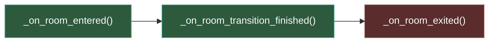
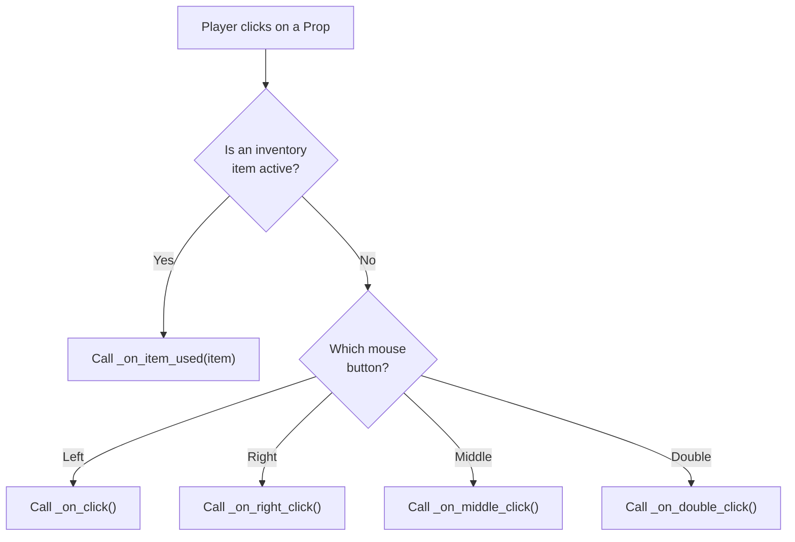

# Scripting principles

This page covers the three fundamental concepts you need to understand before writing any game logic in Popochiu: **singletons** (how you access game objects), **virtual functions** (where you put your code), and **signals** (how you react to engine events).

## Accessing game objects through singletons

Every Popochiu game has a set of **singletons**: globally available objects that act as entry points to your game's data. You don't need to look up nodes in the scene tree or wire references manually. Instead, you use short, memorable names to reach anything in your game.

Here's the full list:

| Singleton | Type | What it gives you access to |
| :-------: | :--- | :-------------------------- |
| **E** | Engine | Core engine features: camera, settings, queues, save/load, command registration. |
| **R** | Rooms | All rooms in your project, plus the current room's props, hotspots, markers, regions, and walkable areas. |
| **C** | Characters | All characters, including the player-controlled character (`C.player`). |
| **I** | Inventory | Inventory items and inventory state (what's collected, what's active). |
| **D** | Dialogs | Dialog trees and dialog flow control. |
| **A** | Audio | Audio cues (music and sound effects). |
| **G** | Graphic Interface | GUI control: showing text, blocking/unblocking input, hiding/showing the interface. |
| **T** | Transition Layer | Screen transitions (fade in/out, curtains, custom animations). |
| **Globals** | Game globals | Your own project-wide variables and methods, defined in `res://game/popochiu_globals.gd`. |
| **Cursor** | Cursor | Cursor appearance and behavior. |

### Typed access with autocomplete

When Popochiu creates a room, character, or inventory item through the editor, it also generates typed properties on the corresponding singleton. This means you get **full autocomplete** in the script editor.

For example, if your project has a character called "Will" and a room called "LivingRoom":

```gdscript
# Access a character by its typed property
C.Will.say("Hello there!")

# Access a room
R.LivingRoom

# Access the player-controlled character (always available)
C.player.walk_to(Vector2(100, 80))

# Access an inventory item
I.FirstOne.add()
```

These typed properties are generated in the autoload files under `res://game/autoloads/`. You don't need to edit those files, as Popochiu keeps them in sync when you create or remove game objects through the dock.

!!! info "Under the hood"
    Each autoload (e.g. `res://game/autoloads/c.gd`) extends the corresponding engine interface class (e.g. `PopochiuICharacter`). The generated typed properties use getter functions that fetch the runtime instance by script name. This is why `C.Will` gives you a fully typed `PCWill` reference with all its methods and properties.

### Accessing room objects

You can reach props, hotspots, markers, regions and walkable areas in the **current room** through `R`:

```gdscript
# Get a prop in the current room
R.get_prop("ToyCar")

# Get a hotspot
R.get_hotspot("Door")

# Get a marker position (useful for character placement)
R.get_marker_position("SpawnPoint")

# Get a region
R.get_region("DarkCorner")

# Get a walkable area
R.get_walkable_area("Floor")
```

### A few practical examples

Here's how singletons look in real game code:

```gdscript
# Navigate to another room
R.goto_room("Kitchen")

# Make a character say something
await C.Will.say("I should check the kitchen.")

# Play background music
A.mx_lazy_day.play()

# Show a system message through the GUI
G.show_system_text("The door is locked.")

# Play a screen transition
await T.play_transition("fade_in", 0.5, T.PLAY_MODE.PLAY)

# Save the game in slot 1
E.save_game(1, "Before the big puzzle")
```

!!! tip
    You'll notice that some calls use `await` and some don't. This is an important distinction: [Await and queue functions](await-and-queue-functions.md) explains when and why you need `await`.

---

## Reacting to events with virtual functions

Here's the most important thing to understand about scripting in Popochiu: **you don't write game loops**. You don't need `_process()` or `_physics_process()` to drive your game logic. Instead, you implement **virtual functions**: methods that Popochiu calls for you at the right moment.

When a player clicks on a prop, Popochiu calls `_on_click()` on that prop's script. When a room loads, Popochiu calls `_on_room_entered()` on the room script. Your job is to fill in those functions with what should happen.

Think of it like directing a play: you don't control the stage machinery. You just write what happens when the curtain rises, when an actor is spoken to, or when a prop is picked up.

### The room lifecycle

Every room has three key moments, each with its own virtual function:



| Function | When it's called | What to do here |
| :------- | :--------------- | :-------------- |
| `_on_room_entered()` | The room is loaded and in the tree, but **not visible** yet (the transition hasn't finished). | Set the stage: position characters, set facing directions, toggle prop visibility, choose the active walkable area, start background music. |
| `_on_room_transition_finished()` | The transition animation has finished and the room is **now visible**. | Start gameplay: trigger intro cutscenes, play sounds, begin timers. |
| `_on_room_exited()` | The room is about to be unloaded. It's **no longer visible** and characters have been removed. | Clean up: stop music, reset temporary state. |

Here's a concrete example:

```gdscript
extends PopochiuRoom

func _on_room_entered() -> void:
	# Set the stage before the player sees anything
	A.mx_lazy_day.play()
	if state.visited_first_time:
		C.player.teleport_to_marker("EnterPos")
	else:
		C.player.teleport_to_marker("StartingPos")
		C.player.face_left()

func _on_room_transition_finished() -> void:
	# The room is now visible: start gameplay
	if state.visited_first_time:
		await E.cutscene([
			"Will: Where am I?",
			"Will: This place looks familiar...",
		])

func _on_room_exited() -> void:
	# Clean up before leaving
	A.mx_lazy_day.stop()
```

!!! note
    `state.visited_first_time` is a built-in property that Popochiu sets to `true` only on the very first visit to a room. It's part of the [Object state](object-state.md) system.

### Clickable interactions

Props, hotspots, and characters all inherit from `PopochiuClickable`, which provides a consistent set of virtual functions for player interactions:

| Function | Trigger |
| :------- | :------ |
| `_on_click()` | Left click |
| `_on_double_click()` | Double click |
| `_on_right_click()` | Right click |
| `_on_middle_click()` | Middle click |
| `_on_item_used(item)` | Click while an inventory item is selected |

Here's an example prop script:

```gdscript
extends PopochiuProp

func _on_click() -> void:
	await C.player.walk_to_clicked()
	await C.player.say("It's an old trophy. Dusty but proud.")

func _on_right_click() -> void:
	await C.player.face_clicked()
	await C.player.say("I don't want to touch it.")

func _on_item_used(item: PopochiuInventoryItem) -> void:
	if item == I.Feather:
		await C.player.say("I dust it off with the feather.")
		# ...do something with the trophy
	else:
		await C.player.say("That won't work.")
```

And a hotspot script that acts as a door:

```gdscript
extends PopochiuHotspot

func _on_click() -> void:
	R.goto_room("Kitchen")

func _on_right_click() -> void:
	await C.player.face_clicked()
	await C.player.say("It leads to the kitchen.")
```

!!! info
    When you create a prop or hotspot through the Popochiu dock, the editor generates a script with all virtual functions stubbed out and the default `E.command_fallback()` call. You just replace those calls with your own logic.

### Inventory item events

Inventory items have their own set of virtual functions, since they live in the inventory bar rather than in a room:

| Function | Trigger |
| :------- | :------ |
| `_on_click()` | Item clicked in the inventory |
| `_on_right_click()` | Item right-clicked in the inventory |
| `_on_middle_click()` | Item middle-clicked in the inventory |
| `_on_item_used(item)` | Another inventory item used on this one |
| `_on_added_to_inventory()` | After this item is added to the inventory |
| `_on_discard()` | When this item is discarded |

```gdscript
extends PopochiuInventoryItem

func _on_click() -> void:
	await C.player.say("It's a shiny key.")

func _on_item_used(item: PopochiuInventoryItem) -> void:
	if item == I.Ring:
		await C.player.say("I thread the ring onto the keychain.")
		# Combine items, replace, etc.
```

### Dialog events

Dialog trees have two main virtual functions:

| Function | Trigger |
| :------- | :------ |
| `_on_start()` | When the dialog begins |
| `_option_selected(opt)` | When the player picks a dialog option |

```gdscript
extends PopochiuDialog

func _on_start() -> void:
	await C.Will.say("Hey there!")
	await C.Bartender.say("What can I get you?")

func _option_selected(opt: PopochiuDialogOption) -> void:
	match opt.id:
		"AskForBeer":
			await C.Bartender.say("Coming right up!")
			turn_off_options(["AskForBeer"])
		"AskAboutTreasure":
			await C.Bartender.say("I don't know what you're talking about...")
			await D.say_selected()  # Shows the dialog text the player chose
		"Bye":
			await C.Will.say("See you later!")
			D.finish_dialog()
```

### Region events

Regions trigger events when characters walk into or out of them:

| Function | Trigger |
| :------- | :------ |
| `_on_character_entered(chr)` | A character enters the region |
| `_on_character_exited(chr)` | A character exits the region |

By default, regions apply a color tint when a character enters and reset it when they exit. You can override this:

```gdscript
extends PopochiuRegion

func _on_character_entered(chr: PopochiuCharacter) -> void:
	# Apply a dark tint when entering the shadow
	chr.modulate = Color(0.4, 0.4, 0.5)

func _on_character_exited(chr: PopochiuCharacter) -> void:
	chr.modulate = Color.WHITE
```

### Movement events

Props, hotspots, and characters also have movement-related virtual functions:

| Function | Trigger |
| :------- | :------ |
| `_on_movement_started()` | The object starts moving (via `move_to()`) |
| `_on_movement_ended()` | The object finishes moving |

These are useful for triggering side effects when objects move programmatically.

### How dispatch works

When a player clicks on a game object, here's what happens behind the scenes:



!!! info
    This is a simplified view. When a GUI template with commands is active (like the 9-Verb GUI), the dispatch logic is more complex. It maps commands to method names. That's covered in [GUI commands and fallbacks](gui-commands-and-fallbacks.md).

---

## Writing non-reactive code

Not everything in your game is a reaction to a player click. Sometimes you need helper functions, utility methods, or logic that runs across multiple objects. There are two good places for this:

### Helper methods on game objects

You can add any method to any game object script. These aren't virtual functions, they're your own helpers:

```gdscript
extends PopochiuRoom

func _on_room_transition_finished() -> void:
	if _should_trigger_storm():
		await _play_storm_sequence()

func _should_trigger_storm() -> bool:
	return state.visited_times > 2 and not Globals.storm_happened

func _play_storm_sequence() -> void:
	await E.cutscene([
		C.player.queue_say("What's that rumbling?"),
		E.queue_wait(0.5),
		C.player.queue_say("Thunder!"),
	])
	Globals.storm_happened = true
```

### The Globals singleton

For variables and methods that don't belong to any specific room, character, or item, use `Globals`. This singleton lives at `res://game/popochiu_globals.gd` and is accessible from anywhere:

```gdscript
# res://game/popochiu_globals.gd
extends Node

var storm_happened := false
var total_clues_found := 0
var difficulty := "normal"

func is_puzzle_complete() -> bool:
	return total_clues_found >= 5
```

Then in any game script:

```gdscript
# In a prop script
func _on_click() -> void:
	Globals.total_clues_found += 1
	if Globals.is_puzzle_complete():
		await C.player.say("I've found all the clues!")
```

!!! tip
    `Globals` properties are automatically saved and loaded with the game. See [Object state](object-state.md) for details on how persistence works.

---

## Signals: reacting to engine events

Virtual functions let you respond to **player actions** (clicks, item use, room changes). But sometimes you need to react to things that happen inside the engine itself: a character finished talking, an item was added to the inventory, a transition completed.

That's what **signals** are for.

### When to use signals

Use signals when you need to:

- React to something that happens **elsewhere** in the engine (not directly on the current object)
- Coordinate behavior between objects that don't have a parent-child relationship
- Track engine state changes (like the GUI being blocked or unblocked)

### Common signal patterns

Here are some signals you'll use most often:

**Character signals** (on the `C` singleton):

```gdscript
# React when any character finishes speaking
C.character_spoke.connect(_on_any_character_spoke)

func _on_any_character_spoke(character: PopochiuCharacter, message: String) -> void:
	print("%s said: %s" % [character.script_name, message])
```

**Inventory signals** (on the `I` singleton):

```gdscript
# React when an item is added to the inventory
I.item_added.connect(_on_item_collected)

func _on_item_collected(item: PopochiuInventoryItem, _animate: bool) -> void:
	if item == I.GoldenKey:
		await C.player.say("This could open something important...")
```

**GUI signals** (on the `G` singleton):

```gdscript
# React when the interface is blocked (e.g. during a cutscene)
G.blocked.connect(func(): print("GUI blocked"))
G.unblocked.connect(func(): print("GUI unblocked"))
```

**Transition signals** (on the `T` singleton):

```gdscript
# React when a screen transition finishes
T.transition_finished.connect(func(name): print("Transition done: " + name))
```

**Individual object signals** (on characters, props, etc.):

```gdscript
# React when a specific character stops walking
C.Will.stopped_walk.connect(_on_will_stopped)

func _on_will_stopped() -> void:
	# Will reached his destination
	await C.Will.say("I'm here!")
```

### Signals vs. virtual functions

A good rule of thumb:

| Use... | When... |
| :----- | :------ |
| **Virtual functions** | You're writing behavior for *this specific object* in response to a player action. |
| **Signals** | You need to react to something that happens on *another object* or inside the *engine*. |

For example, if you want a prop to react when the player clicks on it, use `_on_click()`. But if you want a prop to react when a character reaches a certain position, connect to that character's `stopped_walk` signal.

!!! info
    For the complete list of signals available on each class, check the [Scripting Reference](scripting-reference/index.md). The signals listed here are just the most commonly used ones.

---

## Summary

These three concepts (singletons, virtual functions, and signals) form the foundation of all Popochiu scripting:

1. **Singletons** (`E`, `R`, `C`, `I`, `D`, `A`, `G`, `T`, `Globals`, `Cursor`) give you access to everything in your game.
2. **Virtual functions** (`_on_click()`, `_on_room_entered()`, etc.) are where you write your game logic in response to player actions.
3. **Signals** let you react to engine events that happen outside your current object.

With these tools, you can build the vast majority of your game's interactive behavior. The next pages cover more specialized topics: how [GUI commands](gui-commands-and-fallbacks.md) route player intent to your objects, how [await and queues](await-and-queue-functions.md) let you choreograph sequences, and how [object state](object-state.md) keeps track of everything across room changes and save files.
